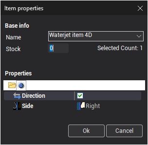

# 4D job assignment item properties

Each element of the job assignment has a set of properties.

To view or edit the properties of 4D job assignment item select the item and click the **Properties** button, or double-click the item.

This is the item properties dialog:

All properties are the same as the [2D job assignment item properties](10230.md).

Use the second tab of the dialog to set direction and side of machining for each job assignment item.

**Direction** and **Side** properties are the same as the [2D job assignment item properties](10230.md).

- **Swap chains** – swaps the top and bottom levels.
- **Inverse bottom chain** – inverses the direction of the bottom level contour.
- **Inverse top chain** – inverses the direction of the top level contour.
