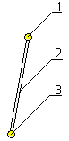
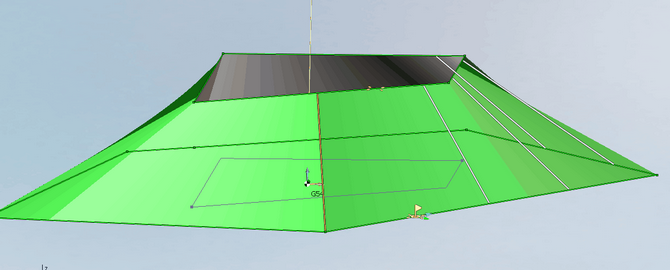
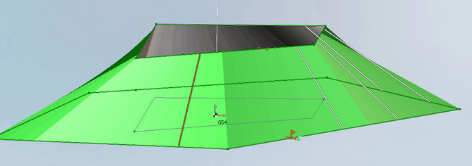

# Synchronization lines

In the [Wire EDM 2d Contouring](10246.md) operation synchronization lines are shown as two points connected by a line. Synchronization lines can be used to [define taper angle](10230.md).

In the [Wire EDM 4d Contouring](10247.md) operation in addition to moving synchronization lines line points positioning can be changed. To move the line position the mouse pointer at the middle of the line(2), and to move the points position the mouse at the point itself (1 or 3).

Synchronization lines can be copied and deleted in the graphic window.

To copy select the item and holding the [Ctrl] and left mouse button drag the item to desired position.

To delete an item select it by clicking it and press the [Del] button.

To create a new synchronization line position the mouse pointer over a fracture in the job assignment element and drag the created line to desired position.

