# Approaches/returns

Lead-in and lead-out are the parts of the tool path, defined at the start and the end of each contour tool path. These are used for the correct machining at the start and end of a contour. These moves are used to enable various interpolation functions such as compensation, taper, multi axial interpolation, etc. To enable these features, it's needed to include one or two additional moves.

Approach to start point has these steps:

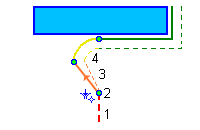

1. Approach at rapid feed to wire load point.
2. Wire loading, setup mode of cut and mode of correction and interpolation.
3. First part of lead-in – linear move from wire load point. On this step enabled modes are turned on.
4. Second part of lead-in – move to the start point of machining contour. It is necessary for composite lead-in, for example, "line and arc" lead-in.

Retract from end point does the sequence in reverse:

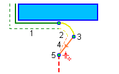

1. Move to end point of machining contour.
2. First step of lead-out – non-linear move. It is necessary for composite lead-out, for example, for "line and arc" lead-out.
3. Turn off correction and interpolation.
4. Second step of lead-out – linear move.
5. Wire break point.

The lead-in/lead-out parameters are defined in the graphics window.

Approach\returns markers are available for each element of the job assignment and becomes available after the calculation of the operation. After changing the parameters it is necessary to recalculate the operation. The approach is green, return is yellow.

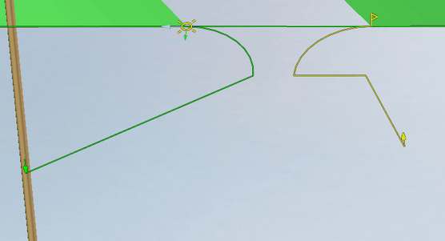

Approaches\returns markers are fully interactive. It is possible to move them and specify dimensions. Dimensions can be set as relative to other elements, as well as relative to the coordinate system.

It is possible to select lead mode in the pop-up panel:

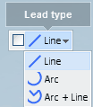

`Lead-type` – this panel is used to setup the lead type. There are several available lead types in the drop-down list:

- **Line** – linear motion from wire load point to start point of machining contour. The length of the linear move is determined by the position of the wire load point.

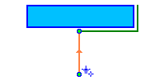

- **Arc** – lead-in has a linear motion from the wire load point to an arc start point. The arc move is tangent to the start of the machining contour.

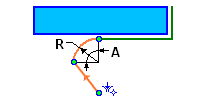

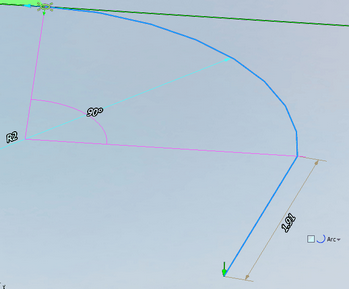

- **Line and arc** – the first linear motion moves from the wire load point to the arc center point, then to the arc start point. Then the arc moves tangent to the start point on the contour.

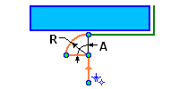

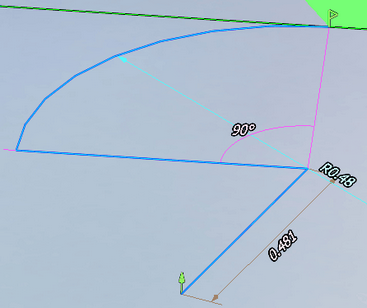

<em>Attention: All wire load or wire break points that are used when an operation is calculated, can be viewed on the **Technology** panel **Holes**. Also, you can export this list of points to use in another CAM system project or other application. The export command is accessed from the [main menu](51.md) of CAM system or from the context menu of hole list `Export selected in DXF...`.</em>

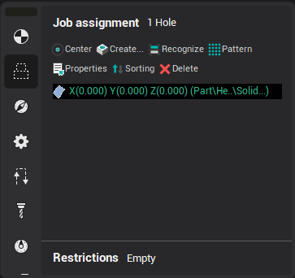

Wire radius compensation options

CAM system can calculate, view and simulate wire motion using compensation for the wire radius. When compensation is used, there are commands to turn [compensation](10238.md) on and turn off included in the CLData. These are usually `G41`, `G42`, `G40` codes with a compensation number. CAM system will draw the path of the wire motion and can simulate the machining with compensation of the wire radius.

Different NC machines can use different methods for applying / canceling compensation. CAM system have several options which can be used to 'tune' CAM system's wire radius compensation so that it matches those used by the machine control. These options are available in the `Machine:... Parameters` window on the **Machines** tab. There is a node called **Control parameters** –> **Radius compensation** a property editor, the properties are used for tuning the CAM system simulation of radius compensation.

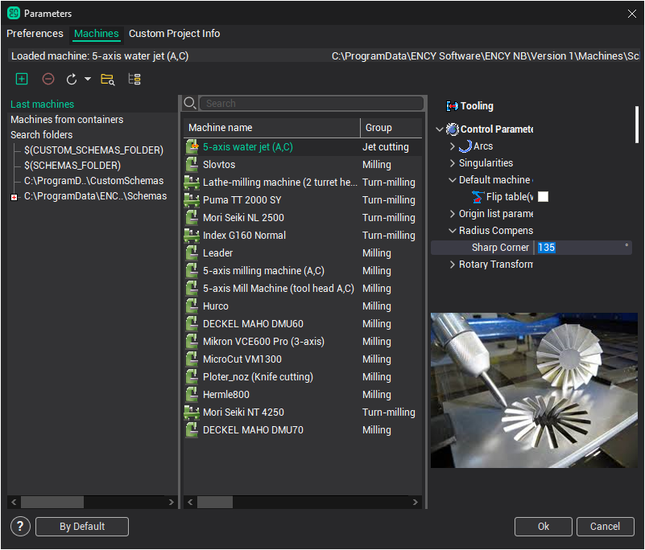

Use these properties:

- **Normal approach** – used for tuning the motion on approach and retract.

| When **Normal approach** is on. Start and end machining point stay on normal to contour. | When **Normal approach** is off. Start and end machining points are shifted by radius compensation value. |
|---|---|
| 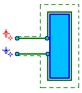 | 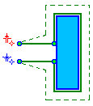 |

- **Sharp corner** – this value defines the method of rounding a corner. If the angle between the moves is greater than this value then the motion will be extended to intersect. Otherwise, if the angle is less, then each motion will extended by the value of the radius compensation and connected by a linear move. In the drawing below are shown an example where the "left" corner is greater than the sharp corner value, but the one on the "right" is less.

