# アプローチ／リターン

進入と退出は、各輪郭のツールパスの開始点と終了点に定義されるツールパスの一部です。これらは、輪郭の開始点と終了点で正しい加工を行うために使用されます。これらの動作は、補正、テーパー、多軸補間などのさまざまな補間機能を有効にするために使用されます。これらの機能を有効にするには、1つまたは2つの追加動作を含める必要があります。

開始点へのアプローチは、次のような手順で行われます。

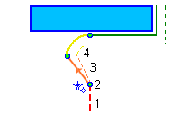

1. ワイヤーロード点への早送りによるアプローチ
2. ワイヤーをセットし、切削モード、補正モード、および補間モードを設定します
3. 進入の最初の部分-ワイヤーロード点から直線移動します。この段階で、有効化されたモードがオンになります。
4. 進入の第2段階 -加工輪郭の開始点まで移動します。複合進入（例：直線＋円弧）を使用する場合に必要な動作です。

終了点からの退避は、この順番を逆順で実行します。

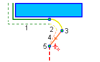

1. 加工する輪郭の終了点まで移動します。
2. 退出の最初のステップ ― 非直線移動を行います。複合退出（例：直線＋アーク）を使用する場合に必要な動作です。
3. 補正および補間をオフにします。
4. 退出の第2ステップ ― 直線移動を行います。
5. ワイヤー切断点

進入／退出のパラメーターは、グラフィックウィンドウで定義します。

アプローチ／リターンのマーカーは、ジョブ割り当て内の各要素に対して利用可能であり、オペレーションの計算後に使用できるようになります。パラメータを変更した後は、オペレーションを再計算する必要があります。アプローチは緑色、リターンは黄色で表示されます。

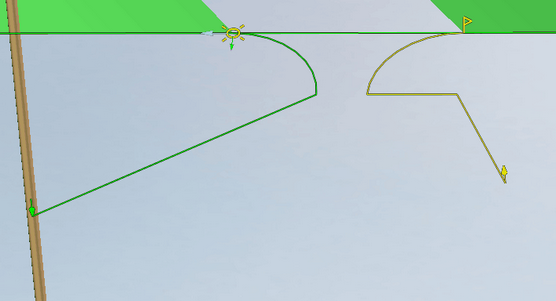

アプローチ／リターンのマーカーは、完全にインタラクティブです。マーカーを移動したり寸法を指定したりできます。寸法は、座標系に対する相対値としてだけでなく、他の要素に対する相対値としても設定できます。

ポップアップパネルでリードモードを選択することができます。

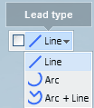

`Lead-type` – このパネルでは、リードタイプを設定します。ドロップダウンリストでは、次のリードタイプを使用できます。

- 直線 – ワイヤーロード点から加工輪郭の開始点まで直線移動します。直線移動の長さは、ワイヤーロード点の位置によって決まります。

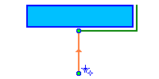

- 円弧 –進入は、ワイヤロード点から円弧開始点まで直線移動します。円弧移動は、加工する輪郭の開始点に接するように行われます。

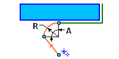

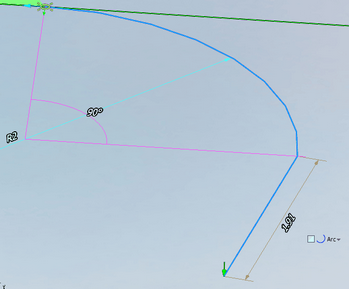

- 直線と円弧 – 最初にワイヤロード点から円弧中心点まで直線移動し、次に円弧開始点まで移動します。その後、輪郭上の開始点に接するように円弧移動します。

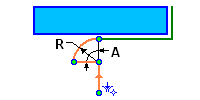

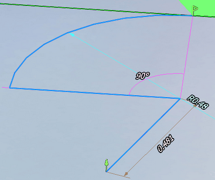

<em>注意：オペレーションの計算時に使用したワイヤー挿入点とワイヤー切断点は、**加工**パネルの**穴**で確認できます。この点の一覧をエクスポートし、別のCAMシステムのプロジェクトや他のアプリケーションで使用することもできます。エクスポートコマンドは、CAMシステムの[メインメニュー](51.md)、または穴の一覧のコンテキストメニューにある`Export selected in DXF...`から実行できます。</em>

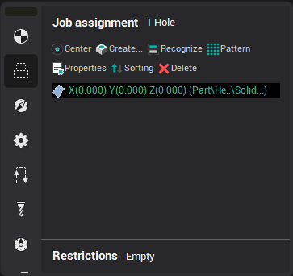

ワイヤー径補正オプション

CAMシステムは、ワイヤー半径補正を使用してワイヤーの動きを計算、表示、およびシミュレーションすることができます。補正を使用する場合、CLDataには [補正](10238.md)のオン／オフを指示するコマンドが含まれます。通常、これらは補正番号を伴う `G41`, `G42`, `G40` コードです。CAMシステムはワイヤーの移動パスを描画し、ワイヤー半径を補正した加工をシミュレーションできます。

NC工作機械によって、補正の適用／解除方法は異なります。CAMシステムには、ワイヤー半径補正を機械の制御装置の動作に合わせて調整するためのオプションがあります。これらは、**マシン**タブの`Machine:... Parameters`ウィンドウで使用できます。**制御パラメータ** → **半径補正**ノードにはプロパティエディターがあり、CAMシステムでの半径補正シミュレーションを調整できます。

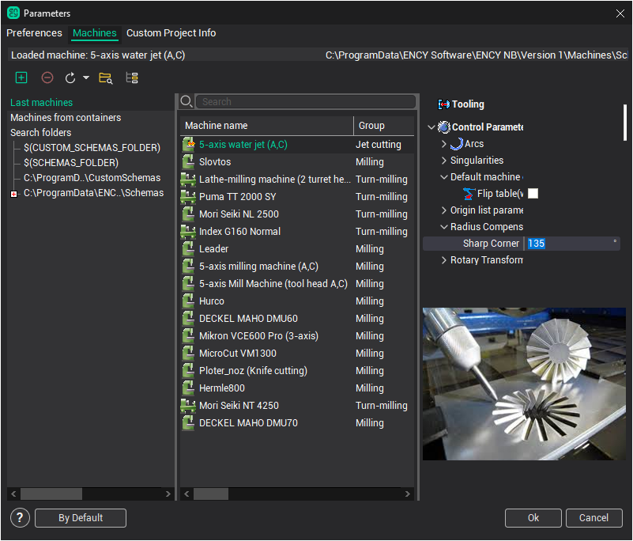

以下のプロパティを使用します。

- ノーマルアプローチ – アプローチおよび退避時の動作を調整するために使用します。

| ノーマルアプローチ がオンの場合 加工開始点と加工終了点は、輪郭に対する法線上にあります。 | ノーマルアプローチがオフの場合 加工開始点と加工終了点は、半径補正値分だけシフトします。 |
|---|---|
| 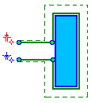 | 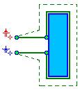 |

- シャープコーナー – この値は、コーナーを丸める方法を定義します。動作間の角度がこの値より大きい場合、それぞれの動作を交差する位置まで延長します。一方、角度がこの値より小さい場合は、それぞれの動作を半径補正値分だけ延長し、その後、直線移動で接続します。下図の例では、“左側”のコーナー角度はシャープコーナーの値より大きく、“右側”のコーナー角度はその値より小さくなっています。

