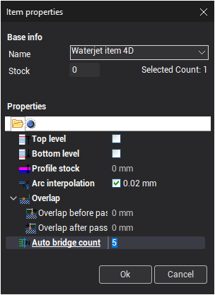
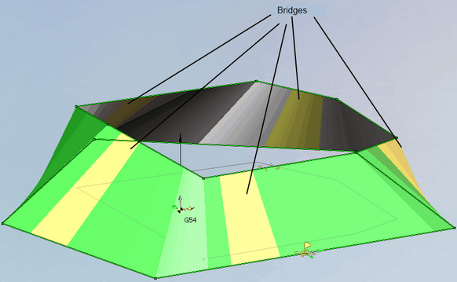
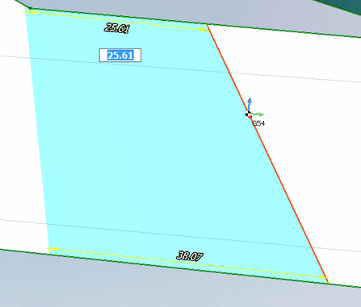

# Bridges

**Bridges** are parts of contour that should be cut after the contour itself.

Bridges can be either disabled or set automatically. Use the **Auto bridge count** property to change the number of bridges.

Auto bridges are placed at equal distance from each other. Change the parameters of bridges in the graphics window.

Click a bridge and drag it to a desired position.

The size of bridge can be set by the dimension line, either by dragging the edge of the bridges on the required distance. The edges of the bridge are synchronization lines.

Synchronization lines can be copied and deleted in the graphic window.

To copy select the item and holding the [Ctrl] and left mouse button drag the item to desired position.

To delete an item select it by clicking it and press the [Del] button. It is also possible to use button on the pop-up panel:

It is possible to [select several bridges with several parameters](10235.md).
