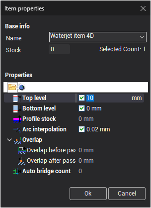

# Multiselect feature

Use the floating actionbar to select items that have common attributes. Select any item and activate the activate the multiselect option.

Pop-up panel will show properties of the selected item. Use checkboxes to filter selection based on the values of properties of selected element. If a property is checked only items with equal value of that property are selected. For example to check all items that have stock of 0mm select one such item and check the **Profile stock** property.
