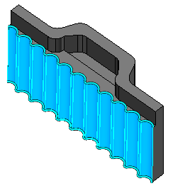
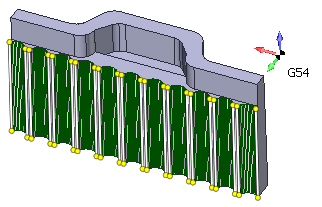

# Wire EDM feature

Wire EDM feature is a chain of ruled surfaces with top and bottom edges lying in horizontal planes. CAM system automatically recognizes top and bottom curves of the element, also it places synchronization lines in appropriate parts of contours.

 

For a convenient and rapid creation of new Wire EDM operation to machine a 3D model select any of faces belonging t constructive elements you want to machine and create a new operation by selecting it in the drop-down list of the **New** button. CAM system auto detects constructive elements you marked, adds them to the job assignment and setups properties of the operation according to parameters of constructive elements.

To add a constructive element to existing operation select a surface belonging to the constructive element in the graphic window and press one of buttons **Add cap** or **Add hole**. CAM system will setup operation parameters according to the constructive element properties if the job assignment was empty.
