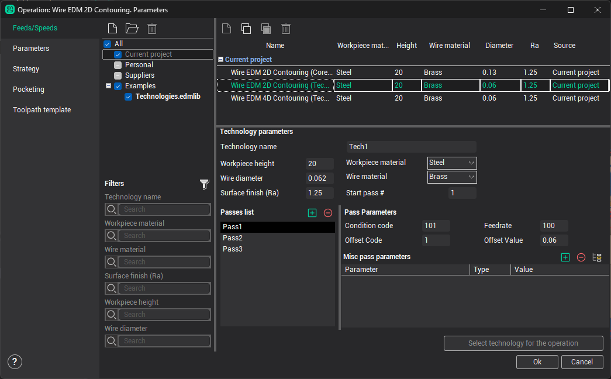
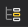
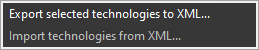
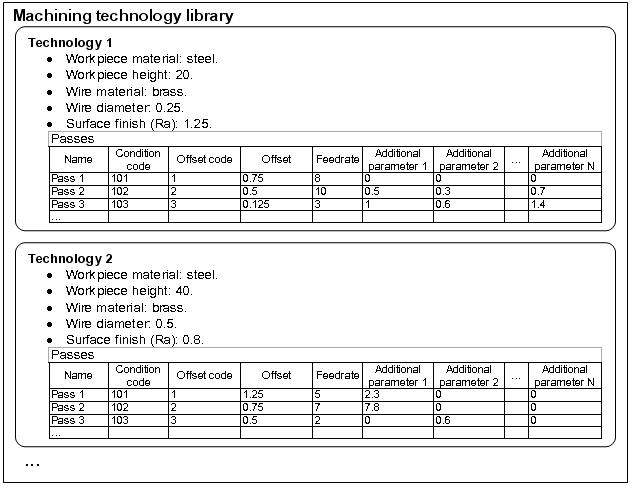

# Machining conditions of EDM and Jet cutting 4D operations

The Feeds/Speeds page of the operation parameters window can be used to specify machining conditions of the Wire EDM operation. It also allows you to work with condition libraries.

The left panel of the Feeds/speeds page shows the list of storages for edm libraries. The storage is either a library file (<strong>*.edmlib</strong>) or the <strong>Current project</strong>.

The storages grouped to folders. There is a checkbox next to each item. It toggles the visibility of this storage in the right panel.

The top toolbar contains the following buttons.

-  New library> – creates a new library. It will shows save file dialog where you should point a path and name for new *.edmlib file. You should place your libraries outside Examples or Suppliers folder, otherwise they will be read only.
-  Open library – add existing library to the list. It will show standard file open dialog where you should select one *.edmlib file. All *.edmlib files placed inside standard folder ($(COMMON_APPDATA)\Libraries\WireEDM) will be added to the list automatically.
-  <strong>Remove library</strong> – removes selected library from the list. It will not be deleted from the hard drive physically.

Present days NC-controls can to support various assignments of machining conditions, but many of them is using following algorithm. At the same time many parameters is exists and they defines specific machining conditions. Definite power characteristics (frequency, current strength, generator operating regime, etc), wire feed speed and wire offset can be assigned in subject to height and material of workpiece, diameter and material of wire and surface roughness. Usually equipment producers puts in NC-controls already defined table of process parameters or gives means to infill this table. Every set of parameters is named by definite code. Then in corresponding registers easily puts this codes when G-code is builds. NC-control compares codes with specific process parameters automatically.

A specific set of machining conditions (power, frequency, current strength, generator operating regime, offsets, etc.) associated with defined workpiece and equipment parameters (workpiece material, height, wire material and diameter) we call <strong>Machining technology</strong>.

Right top part of the window displays machining technologies list for storages selected on the left panel. Right bottom part contains parameters of selected machining technology. Each library contains the list of machining technologies. The project contains the list of operations, but each operation contains single machining technology. So both of technologies from libraries and operations can be shown in one list. The current operation in the technology list is shown in green.

To apply selected technology for the current opeartion there is as big button at the right bottom corner of the window. It will copy all content from the selected technology into the technology of current operation.

You can use buttons on the top middle toolbar of the window to manipulate technologies.

-  New technology – adds new technology to the list. It can be unuvailable if read-only storages selected in the list (Current project or library from Examples folder). Create your own library in custom folder to be possible to edit it.
-  Copy technology to clipboard – copies technology to clipboard to be possible to paste it to any other library.
-  <strong>Paste technology from clipboard</strong> - allows to paste thechnology from clipboard to selected library. The library should not be read only.
-  Delete selected technology – deletes active technology from the list.

Each machining technology contains following properties:

- Technology name – unique text identifier of process technology.
- Workpiece height – height of processed workpiece.
- Wire diameter – diameter of wire for selected technology.
- Surface finish (Ra) – roughness of surface, that will be provided by the selected technology.
- Workpiece material – material of workpiece, for which selected technology is assigned.
- Wire material – material of wire, whereby machining is does.
- <strong>Start pass #</strong> - the number of the pass from which machining should start. Default value is 1. However, cases can appears, when necessary to do machining by selected technology, but not from the very outset. For example, this necessity can arise in case of cutting separation of one part section to some operations. In that case in the strategy of first operation the number of passes is defined less then technology has. In the next operation the starting pass is defined different from 1. Closest sequence of passes with its numbers is shown on the [Passes display list](10238.md) info panel on the **Strategy** tab of operation parameters window.
- Pass list / Pass Parameters – list of passes with process parameters for every pass.

The Pass term is one pass, that wire is does along the contour. You can use  buttons to add or remove passes. Following list of parameters is assigned for each pass.

- Condition code – is a value, that is specific for every machine and it is corresponding to number of register in NC-control. Its code defines process conditions. Usually registers C, E, S is used. For more information about the codes of process conditions see manual of used machine.
- Offset Code – is a number of wire offset register (number of compensation radius). For more information see manual of used machine.
- Offset Value – is a wire offset value for selected offset code. The value takes into account wire radius, overburning value and special stock for every pass. The value is send to postprocessor and can be used for initialization of registers, which is responsible for wire offset. Usually this registers is H and D. The offset value is used for [compensation](10238.md) modeling with general stock jointly.

- Feedrate – is a rate of wire feeding. The value is measured in mm per minute or inch per minute subject to [system settings](22.md). Many of wire EDM machines is not use feedrate, but the value is available if its will be needed for specific NC-control. This value is used also by system for cutting time calculation.

- Misc pass parameters – is an array of additional parameters of the pass. Every parameter is presented by line like Parameter – Type – Value. There Parameter is text description of it. Type is a type of parameter, it can to be Integer or Float. Value is a numerical value of the parameter. This parameters array and other parameters of the pass is sent to the postprocessor with PPFUN WEDMConditions(56) command and can be used for specific purposes in each specific case. Input of names and values is performed by mouse click on corresponding cell.

-  **Add parameter** – adds a new line to the table of additional parameters of selected pass.
-  **Remove parameter** – removes active line from additional parameters table.
-  – copies additional parameters table of selected pass to all passes of active technology.

It is possible to import technologies from external sources and export them outside the CAM system. To do this just select desired techologies in the list and the click <strong>Export selected technologies to XML</strong> popup menu item on right mouse button. XML is structured textual format that can be changed by any text editor or processed by any other program. After that you can import this XML to the system again using corresponding popup menu.

