# Strategy of EDM and Jet cutting 4D operations

Alteration of the many available parameters for the machining strategy are made in the **Parameters** –> **Strategy** window. This window is accessed by clicking the **Parameters** button which is located in the **Machining** mode. On the **Strategy** tab there are many panels with input fields and explanatory images. The composition of these panels are determined by the type of current operation.

Wire EDM machining operation of contours includes the following set of parameters:

- **Compensation type** – determines the way in which the offset of the wire is performed on a given contour.

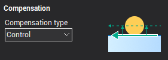

The following compensation types are available:

- **Computer** – the system itself calculates the corrected wire toolpath and the codes to enable compensation are not output in the G-code. In the registers responsible for compensation, the values of the offset are not added.
- **Control** – the system outputs into the G-code the codes to enable compensation, and does not offset the wire. The registers responsible for the value of compensation, record the values of the offset for each pass. Compensation is calculated by the CNC control.
- **Both** – the system outputs into the G-code the toolpath with provision for offsets already, but into G-code are outputted codes enable of compensation also. Registers that are responsible for the value of the compensation aren't filled.
- **Reverse Both** – correction is calculated similarly in the **Both** regime, but the direction of the compensation changes to the opposite.
- **Off** – wire offset values entered for the contour are not produced. Codes for compensation into the G-code are not output. Registers that are responsible for the amount of the compensation system are not used.

The value of compensation for each pass is defined as an [Offset value](10237.md), in the `Feeds/Speeds` tab, plus the stock value of the operation. For the compensation types **Computer**, **Both** and **Reverse Both** the value is used to construct an equidistant path, and for the **Control** type the value is entered into the register with a number equal to the [Offset code](10237.md), specified for the corresponding pass in the `Feeds/Speeds` tab.

The direction of compensation can be set for each contour individually within the [Job assignment](10229.md) of an operation.

- **Reverse machining direction** – if you enable this option, the system will choose the direction for the pass, which provides the smallest length of the toolpath. If the option is disabled, then the direction of the pass will always correspond to that specified in the [Job assignment](10230.md) for the contour.

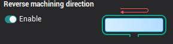

- **Optimize order** – this strategy determines the order of contours passes when the job assignment has more than one contour. The length of transitions between the contours will be minimal if the **Optimize order** option is enabled. If this option is disabled, then the order of the passes would be consistent with the order of the contours in the [Job assignment](10229.md).

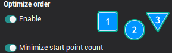

- **Passes before bridges** this panel determine the number of passes that will be performed for each contour of the job assignment, to trim bridges. If the formation of the bridges is disabled, then these parameters determine the total number of passes for each contour. If the option **Perform rough pass** is included, then one rough pass for each contour will be executed, as well as the number of passes as defined in the **Finish pass count** field. When you turn this option off, rough and finish cuts to trim the bridges are not made. Approximate sequence of passes, depending on the set parameters displayed on **Passes display list**.

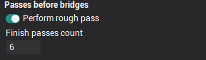

- **Bridges**. In some cases, for example, if the job assignment is a series of closed contours, passage of the full contour details may lead to an undesirable deposition of parts of the workpiece. The system provides a set of parameters that allow to keep the special sections without machining on the workpiece, these are called bridges. When the wire approaches such zones, the system can be add a **Stop command position**, to allow additional steps to fix certain parts of the workpiece, then the bridges can be automatically trimmed. Location of the bridges can be specified for each contour individually in the [Job assignment](10234.md) section. In the **Bridges** section it is possible to configure the number of passes for cutting bridges, the number of passes for cleaning the contour after clipping of the bridges, and the parameters determining the sequence of these passes. If the **Enabled** is not selected then no bridges are cut and no clean cut after cutting bridges is available, accordingly, all fields on the panel are unavailable.

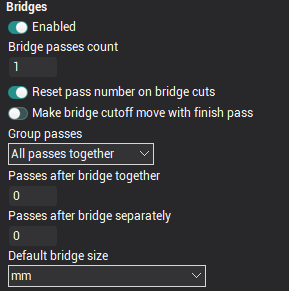

The **Bridge pass count** field sets the number of passes which will be performed for each bridge cutting on each contour. W hen the option **Reset pass number on bridge cuts** is enabled, then the count rates for the passes that define the cutting conditions for the bridge cutting moves are reset to the start value, ie from the value that is set on the `Feeds/Speeds` tab in the [Start pass #](10237.md) field, otherwise, the count rates of the bridge cut passes will continue. For example: if the last contour pass prior to the bridge cutting was #2, the first bridge cutting pass would be #3 and the next #4 etc.

If the option `Make bridge сutoff move with finish pass` is enabled, then the bridge(s) will be cut on the final pass followed by the lead out move, then, if the bridge pass count is greater than one, the subsequent bridge cuts will be performed. If `Make bridge сutoff move with finish pass` is disabled, on the last contour pass, the lead out move will be performed leaving the bridge, and then the bridge cutting move will be preformed.

The fields **Passes after bridge together** and **Passes after bridge separately** together determine the number of finishing passes after bridge trimming that will be performed along the length of each contour as a 'clean up' pass. The difference between these two options is only affected if there is more than 1 contour feature. Example sequences for both types of final passes are shown in the pictures below:

| The sequence of execution of "together" passages: | The sequence of execution of "separate" passes: |
|---|---|
| 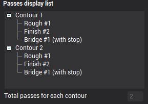 | 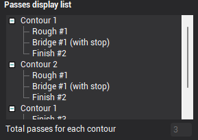 |

In the drop-down **Group passes** menu You can choose the way of grouping different types of passes for when working with several contours.The following options are available:

- **All passes together** – all roughing passes, bridge cutting passes and finish passes are performed for each contour, only when completed is the next contour started.
- **Bridges and finish together** – all rough passes for all contours are performed, then all bridge cutting and finish passes are performed together for each contour.
- `Rough, bridges and finish separately` – first, all contours rough passes are run without bridge cutting, then the bridge cutting is performed for all contours without finishing, and finally, the finish cuts for all contours are performed.

The approximate sequence of the passes, depending on the selected parameters, are displayed in the **Passes display list**.

- **Passes display list**. On the **Strategy** tab for the Wire EDM operation there are many available options for contour machining that control the manner and the order of processing for the contours of the job assignment. To better understand the impact of a particular parameter on the machining sequence, there is an information panel available called **Passes display list**. When you change a value or parameter which influences the strategy process, this also changes the contents of this information panel. The main area of the panel takes the form of two-level tree type display. In this tree, the top-level displays the contours, and the lower level displays the types of and number of passes that defines the cutting conditions. In the bottom of the panel is a box that display the total number of passes which are made for each contour using the current settings.

<em>Note: The information panel **Passes display list** only displays information and all of the fields are read-only. Alteration of the information displayed can only be made using the parameter options that are available in the main window. The information shown in the panel is approximate and may not correspond to the exact sequence of machining since its formation does not take into account the actual geometry of the contours that are in the job assignment of operations. By default, the list always contains two abstract contours.</em>

*Note: When specifying the number of passes in the strategy, these should be closely monitored so that the number of passes in the field **Total passes for each contour** coincides with the number of passes defined for the cutting conditions on the [Feeds/Speeds](10237.md)tab. If there is a discrepancy in the number of passes, then the machined contours may have material remaining upon completion.*

- **Stop command position**. The options located on this panel allow control over the output of the stop commands in the G-code for the bridge cutting passes. The stop commands are only output into the G-code when the **Enabled** option is selected. The next two parameters define the time of output for the stop command. The **Before bridges** option enables the stop command which will be output after the bridge approach move, prior to its cutting. The **After bridge** option enables the stop command which will be output after the cutting of the bridge but before the lead out move from the endpoint to the wire cut point. These parameters operate independently, ie they can be set simultaneously.

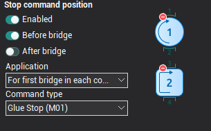

The drop-down list **Application** determines how the bridges should use the technological stops. The options include:

- **For every bridge** – stop command will be output for the bridge cutting move for every bridge specified in the operation.
- **For first bridge in each contour** – stop command will be output only for the first bridge of each contour.
- **For first bridge in operation** – stop command output only when cutting the first bridge of the operation.

**Command type** this parameter defines a specific type of output stop command, and can take one of two values:

- `Glue stop (M01)` – the "optional" or "additional" stop allows, in contrast to the usual stop command (M00), when the switch on the CNC control panel is selected, it allows the operator to decide whether the process should stop. Typically, this command corresponds to the auxiliary code `M01`.
- `Stop (M00)` – this command causes an unconditional interruption of the G-code execution. Usually, it corresponds to the auxiliary code `M00`.

- **Correct degenerate frames** this feature is available in the [Wire EDM 4D Contouring](10247.md) operation. Sometimes parts of a given contour can equate to a near zero or zero length. In the example below, the arcs in the left hand figure on the lower contour cause the geometry on the upper contour to degenerate to zero. Often a CNC control cannot handle such cases because they lack the geometric information required in the degenerated frame to be able to calculate for example an offset path, therefore, these cases should be avoided. This is achieved either by manually specifying correspondences in the [job assignment](10229.md), or, by using the correcting function for degenerate frames. In the latter case, the system automatically detects on a contour any very small lengths and "extends" them by an optional amount, as shown in the figure below right.

| Contour with degenerate frames: | Contour with a corrected frame: |
|---|---|
| 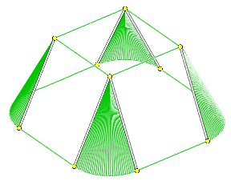 | 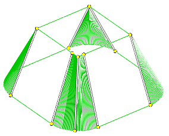 |

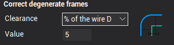

In the **Correct degenerate frames** section you can enable or disable the function and enter the amount on which to extend the degenerated elements. In the **Clearance** dropdown the following items are available:

- **Off** – when you select this item, the correction degenerated frames is disabled.
- **Distance** – this enables the function. The fixed amount of the required extension is entered into the **Value** field. The value relates to the currently selected units (millimeters or inches).
- `% of the wire D` – this enables the function. The amount of the required extension is entered into the **Value** field as a percentage of the current wire diameter. The value relates to the currently selected units (millimeters or inches).
