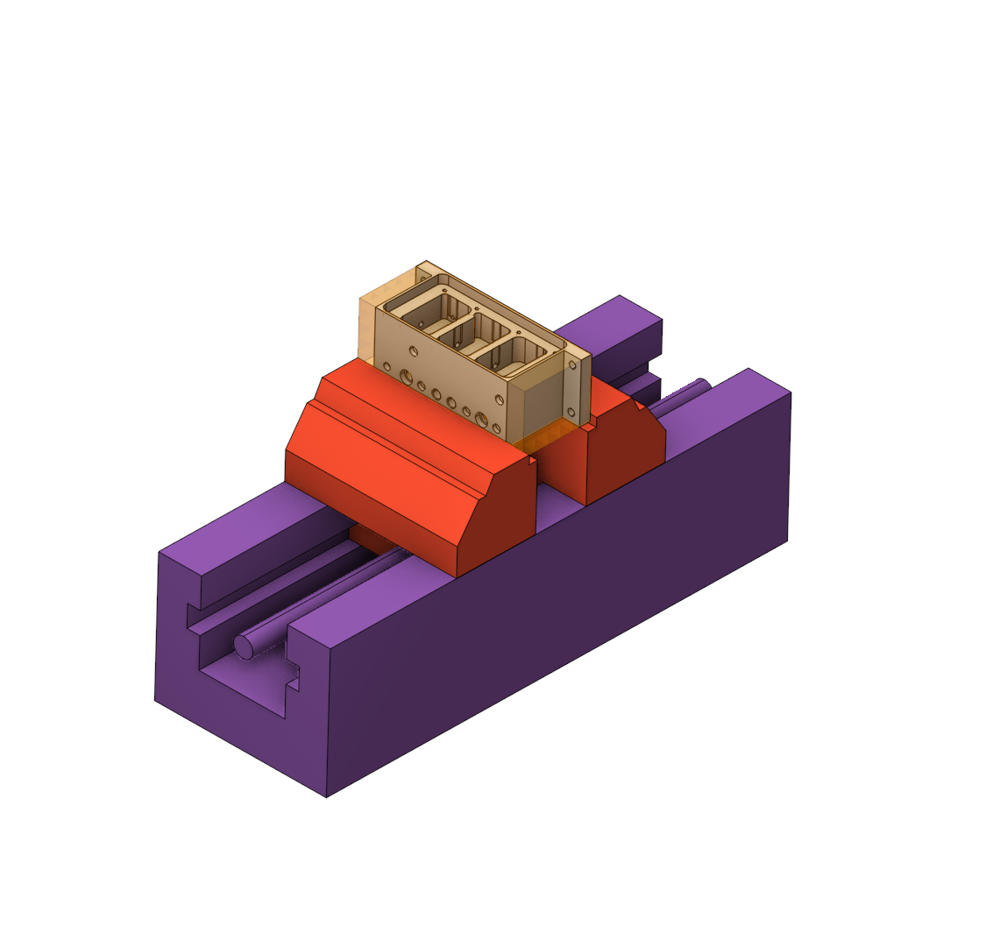
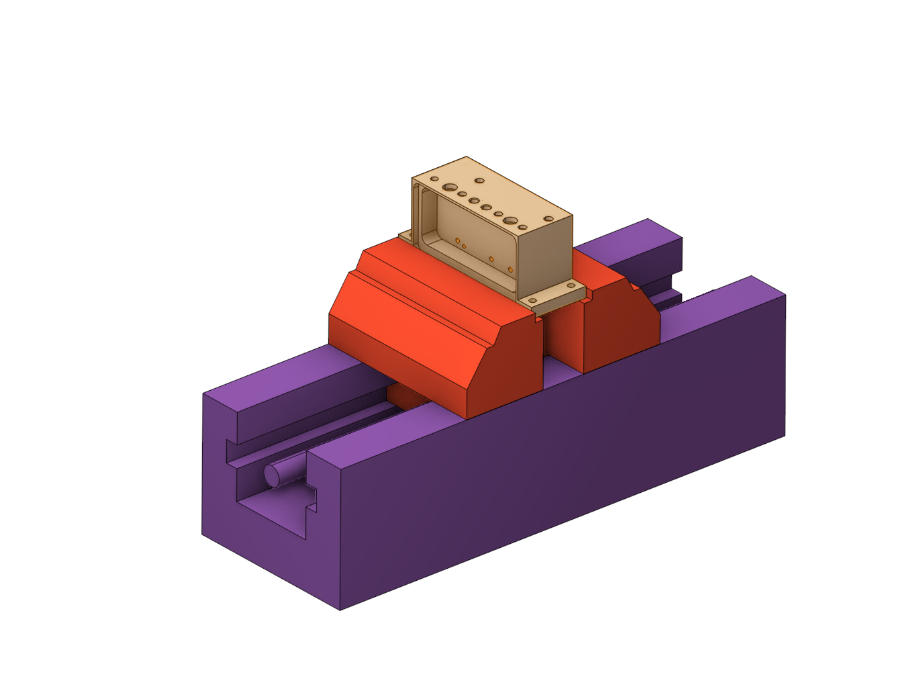

# Setup stage

 

## Application area:

This group is necessary to define the Setup. This group allows the part to be processed from different sides, and the previous setup does not interfere with the subsequent ones due to the hiding of the part, workpiece, and other previous setups.

In this group, you can add tooling that will be taken into account in the subgroups (Part, Copy of part).

## Setup:

The <strong>Setup</strong> tab is used to configure the primary parameters of the project. This can involve the positioning of the part on the equipment, the coordinate system of the part, and more. [Details](1022.md)

## Transformations:

Parameter's kit of operation, which allow to execute converting of coordinates for calculated within operation the trajectory of the tool. [Details](10168.md)
