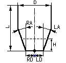

# Cutting tool - "knife"

The knife dimensions are defined by 7 parameters:

<strong>RD</strong> - distance from the tool tip to the right cutting edge <strong>LD</strong> - distance from the tool tip to the left cutting edge <strong>RA</strong> - inclination angle of the right cutting edge <strong>LA</strong> - inclination angle of the left cutting edge <strong>D</strong> - blade width <strong>L</strong> - blade length <strong>H</strong>- the depth of cutting by default. This value is constant for every knife tool, so it's saved in the tools database.

Knife thickness is not used while calculation. It is calculated automatically for the visualization purposes.
