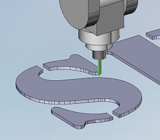

# 2D knife cutting

Operation "knife cutting 2D" is designed for the programming of sheet workpiece cutting. It is based on the "[2D contouring](404.md)".

The "[way of definition of the machining profiles](707.md)" and other parameters, which are not described in this chapter, is written in the description of the operation [2D contouring](404.md).

The [knife](10240.md) usage adds the additional requirements for the machine. The machine has to have, except the Linear X,Y,Z-axes, the additional rotary axis that rotates the tool around. This axis must be defined in the machine schema. If it is absent, then the generated tool path will be incorrect.

The knife behavior in the sharp corners are defined by parameter "[corner retraction](10243.md)".
