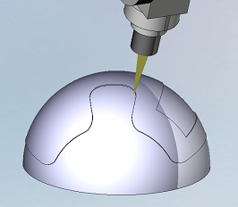

# 6D Knife cutting

Operation "Knife cutting 6D" is designed for the carving on the shaped spatial surfaces. It is based on the operation "[5D contouring](10129.md)".

The "[way of definition of the machining profiles](10132.md)" and other parameters, which are not described in this chapter, is written in the description of the operation [5D contouring](10129.md).

In the every point of tool path the knife blade must be directed along the motion. It requires all 6 degrees of freedom. So active machine must have a minimum of three linear and three rotary axes. Very often the industrial robots are used for the knife cutting. If the machine schema doesn't support all degrees of freedom, then the generated tool path will be incorrect.

The knife behavior in the sharp corners are defined by parameter "[corner retraction](10243.md)".
