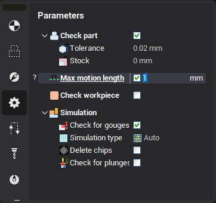

# Knife corner retraction

In every point of tool path the knife blade is rotated to be directed along the motion. The maximal rotation in one cut is limited by "max motion rotation". The maximal transition is also limited by "max motion length". (see picture below)

If the motion needs more rotation then few blocks will be generated to rotate the tool in the point.
