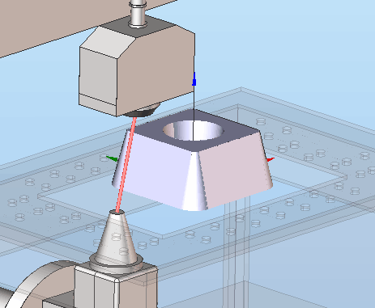

# Wire EDM machining

The main principle of wire EDM cutting is the application of electrical discharges (sparks) on a part, that are generated as a result of pulsating current passing between a charged wire and the workpiece (electrodes) at a frequency ranging from 50 hertz to hundreds of kilohertz. The workpiece and wire are separated by a dielectric liquid. As result of the electrical discharges, microparticles are removed from the wire and workpiece and carried from the spark gap by the dielectrics stream. Moreover, the dielectric is a decomposition catalyst, under the high temperature of a discharge, the dielectric liquid is gasified around the spark gap and these vapour's that cannot immediately escape cause a complementary 'micro explosion'.

From a physical chemistry point of view, the high thermal temperatures destroy the crystal lattice of the workpiece, and the metal ions then lose contact with surface. When viewed, this process looks like the charged wire is eroding the metal and slowly sinks into the workpiece. The brass wire creates an opening in the workpiece which creates the required contour.

Wire EDM machining is used when traditional machining is difficult or uneconomic because of wastage or difficult to machine (hardened) metals.

CNC Wire EDM machines are used for cutting sheet metals by electro-erosion. Machines are available with 2 or 4 axes that can cut curvilinear contours with either vertical or tapered sides.

CAM system can to create NC-programs for wire EDM machines with either 2 or 4 axes:

- [Wire EDM 2d Contouring](10246.md),
- [Wire EDM 4d Contouring](10247.md).

Contouring operations are used for the wire path generation utilising a 2D contour for 2 axis contouring or simultaneously along two contours: upper and lower, for 4 axis contouring. it is possible to process several contours in one operation. The list of contours that are required for machining are selected in the [Job assignment](10229.md). In job assignment, the user can also specify the required machining direction. The compensation direction is calculated automatically depending on the contour type and the machining direction. For every contour it is possible to define start and stop points for machining, load and part wire points and draft angles, etc.

For the start and finish points of every contour, it is possible to create additional approach and retraction moves. Use of these additional moves helps ensure the correct machining of the start and finish points. The Approach and Retraction methods and their parameters are defined on the [Lead In/Lead Out](10233.md) page of the operation parameters window.

To ensure a good surface finish, it is sometimes necessary to do several passes along a contour. CAM system allows various different methods for these passes: rough, finish, bridges, cutoff, etc. Enabling and disabling of these passes and defining of their additional parameters are made on the [Strategy](10238.md) page in the operation parameters window. There are various options available for this purpose: optimised path direction, selected compensation type, etc.

Most modern Wire EDM NC-systems allow the loading into the CNC-control of a table of predetermined cutting modes for each pass along a contour. During the machining process one of these table sets is selected by including in the g-code a special instruction for that cutting mode. CAM system supports this method for cutting mode assignment in Wire EDM operations. Modification of these machining conditions tables is made in the [Feeds/Speeds](10237.md) page on the operation parameters window. On this page it is possible to edit the machining conditions for each pass including the wire offset value and several other parameters: the height and material of the workpiece, the diameter and material of the wire, and the required surface finish. The tables of machining conditions can to be selected from machining technology libraries or defined in every operation manually. Working with machining technology libraries is undertaken in the same window on a separate tab.

Specific properties for each operation are defined on the **Parameters** page of the operation parameters window. As a consequence, this windows looks different for [Wire EDM 2d Contouring](10246.md) and [Wire EDM 4d Contouring](10247.md).

When machining the part with repeated items (holes of the same type, grooves, etc.) it is advisable to use **Transformation**, this reduces calculation time and decreases the time needed for NC data debugging. The function is available in the operation parameters window.
