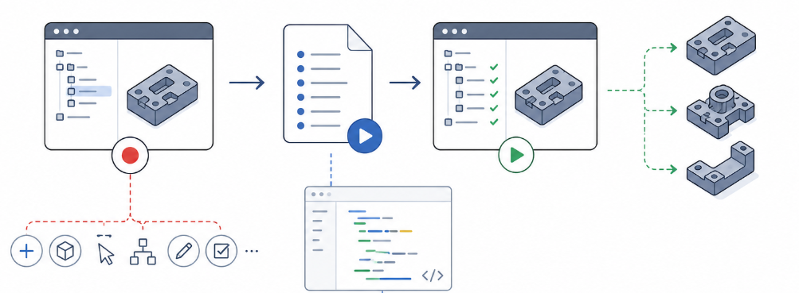
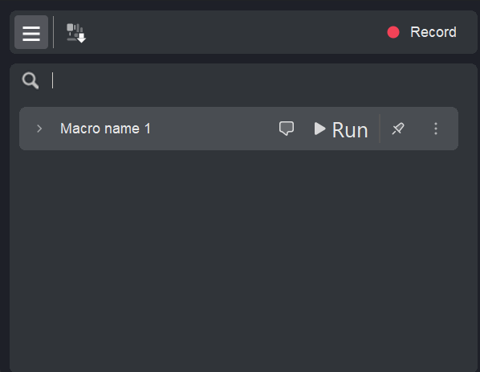

# Macro

## 

## Application area:

A <strong>macro</strong> is intended for recording a sequence of actions performed on a project and replaying it on demand. A sequence recorded once — creating operations, assigning geometry, selecting items in the model tree, editing properties — is converted by the system into a small, runnable extension that reproduces those actions whenever required. <strong>A macro is also the fastest way to create a custom extension</strong>: a working source code is generated from the recorded macro and serves as a template for further development.

<strong>Macros are launched</strong> from the <strong>Utilities button on the main panel</strong>.

Macros are used wherever the same work is performed repeatedly:

- applying a standard sequence of operations to similar parts;

- re-creating a typical machine, workpiece, and strategy setup at the start of a project;

- assigning the same geometry — faces, zones, curves, holes — in a uniform manner;

- sharing a repeatable procedure with other members of the team.

### The Macro panel:

The Macro panel contains the saved macros and the tools for recording new ones. The panel is divided into three zones (top to bottom): a <strong>toolbar</strong> with the recording controls, a <strong>Search</strong> field, and the <strong>list of saved macros</strong>.

<strong>Toolbar buttons.</strong>

<strong>List toggle (≡)</strong>. Shows or hides the list of saved macros.

<strong>Project state</strong>. Determines which parts of the current project — machine setup, workpiece and stock, strategy parameters — are captured by the macro at the start of recording.

<strong>Record.</strong> Starts recording a new macro; pressing it again stops the recording. [Details](102457.md)

<strong>Search field.</strong> It allows you to find a macro in the list.

<strong>The macro list.</strong>

<strong>Name.</strong> The macro name.

<strong>Comment icon.</strong> Displays the macro description on hover.

<strong>Run.</strong> Plays the macro. [Details](102460.md)

<strong>Pin.</strong> Keeps the macro at the top of the list.

<strong>"…" menu</strong>. Per-macro actions:

- <strong> Open in editor.</strong> Opens the generated source code of the macro for reading or manual extension. [Details](102462.md)

- <strong> Edit.</strong> Re-opens the macro steps with the full set of editing controls; saving the changes rebuilds the macro. [Details](102458.md)

- <strong>Export.</strong>

- <strong> Pin to top.</strong> Pins the macro to the top of the list, above the separator line; selecting it again unpins the macro.

- <strong> Delete.</strong> Removes the macro and its files. Unavailable while any macro is running.

<strong>→</strong>. Reveals the individual steps of the macro.

> ##### Macro storage
>
> Each macro is placed in its own folder inside the personal CAM system folder, under `macros`. The folder contains the generated source code and a human-readable list of the macro steps, which allows the macro to be copied together with that folder.
