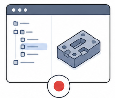
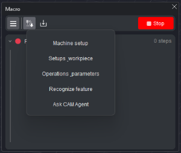
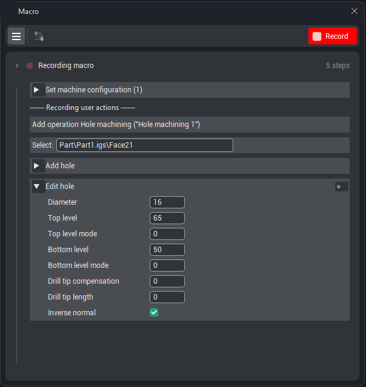

# Recording a macro

## Application area:

Starts recording a new macro; pressing it again stops the recording. A recording is bound to the project active at the moment it is started. When the project is switched during recording, the recording is terminated automatically. Recording and editing an existing macro are mutually exclusive: a new recording cannot be started while a macro is open for editing, and vice versa.

### Capturing the project state

A macro may begin by re-creating the current project setup, ensuring that a later run reproduces the same starting conditions. The set of data to be captured is determined before the <strong>Record</strong> button is pressed.

1. Open the <strong>Project state</strong> drop-down on the toolbar. 2. Select the necessary items: <strong>Machine setup</strong>, <strong>Setups workpiece</strong>, <strong>Operations parameters, Recognize feature, Ask CAM Agent</strong>.

### Recording the actions

1. Press <strong>Record.</strong> The button takes the form of a stop icon, the panel header displays <strong>Recording macro</strong>, and the step count is set to <strong>0 steps</strong>. 2. Perform the required actions in the project. Each recognized action is added to the list as a step, and the step count updates in real time. The following actions are recorded, in particular:

- creating an operation;

- selecting an operation in the operations tree;

- setting up the workpiece — adding and editing workpiece primitives (box, cylinder, casting, prism, and so on) and their stock;

- adding fixtures — chucks, vises, clamps, supports — and editing their stock, color, and name;

- assigning geometry to an operation — faces, job and restricted zones, curves, holes, drive faces, areas;

- selecting items in the 3D model; editing item properties.

3. Press the same button, now in the form of a <strong>Stop</strong> button, to finish the recording. The header takes the value <strong>Recording complete</strong>.

When the recording is stopped, the system fills in a suggested macro name (for example, <strong>Macro name 1</strong>) and opens the <strong>Save</strong> panel. Before saving, the recorded steps may be reviewed and refined. [Details](102458.md)
