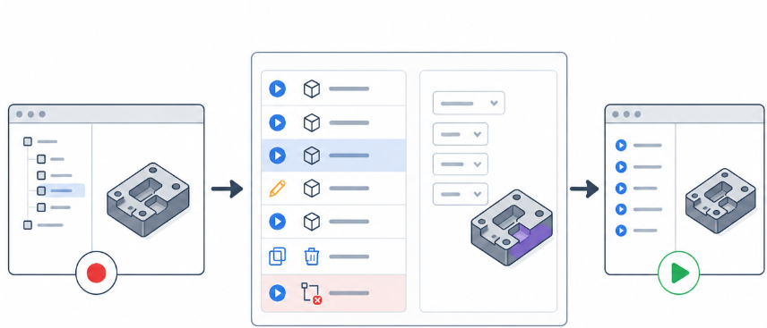
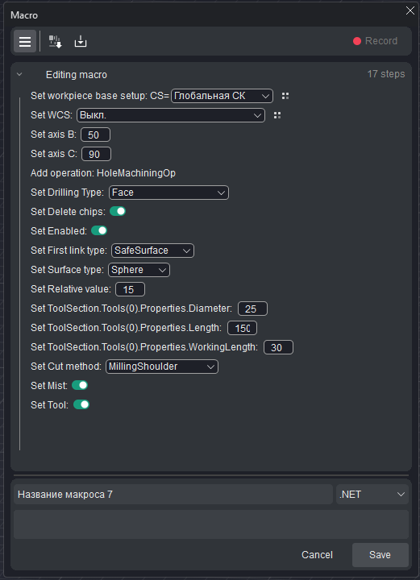
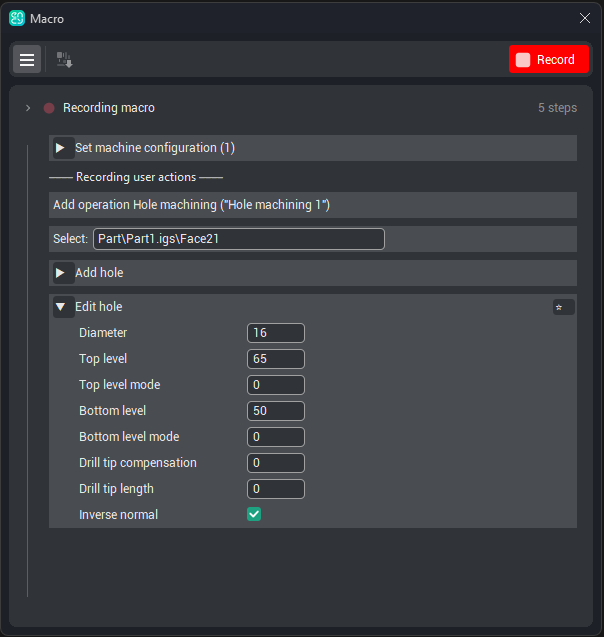

# Editing steps

## Application area:

Most step-editing operations are available during the <strong>recording</strong> of a macro or when it is opened for <strong>editing</strong>. A saved macro may also be adjusted for a single run.

### The step list

Each recorded action is represented by a step row containing:

- <strong>Status dot.</strong> Located on the left of the row; also used to set a breakpoint

- <strong>Caption</strong>. Describes the purpose of the step.

- <strong>Editable parameters.</strong> Where present, one or more drop-downs or text fields.

### Changing a parameter value

For a drop-down, the required value is selected; for a text field, the value is typed. The new value is retained with the step.

### Marking a field as an input

Recording captures the values actually used. To convert a fixed value into an <strong>input</strong> supplied on each run of the macro, its field is marked as <strong>required</strong>:

1. With the cursor over the step, press the  next to the field.
2. The field becomes an input (t<em>he field will be highlighted</em>): the macro cannot be run until a value is supplied.

This mechanism is applied to values that change from part to part — a diameter, a level, an allowance.

### Re-targeting a geometry item

Steps that reference an item in the model — a face, curve, hole, and so on — display that item as a field that allows re-selection:

1. Click the field (t<em>he field will be highlighted</em>).
2. Select the new item in the 3D model.

The step updates to the selected item. The mechanism operates both during editing and for a saved macro before a run, which allows a single macro to be targeted at different geometry.

### Removing a step

During recording or editing, with the cursor over the step, pressing the <strong>×</strong> at the end of the row removes the step from the macro.

### Grouped steps

Related steps are folded under a <strong>group header</strong> that displays the group name — for example, <strong>Edit hole (5)</strong>. Clicking the chevron on the header expands or collapses the group. Grouping simplifies the review of a lengthy macro.

