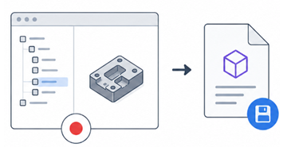
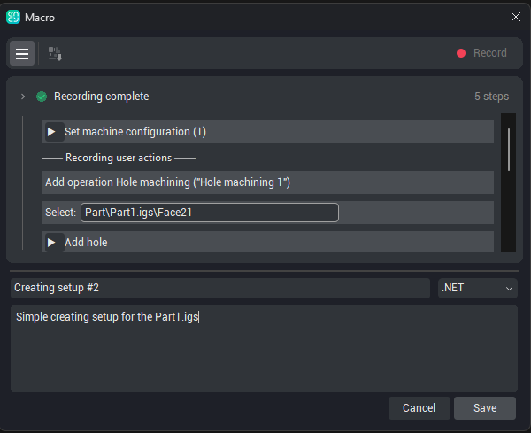

# Saving a macro

## Application area:

Starting a run, supplying required inputs, monitoring progress, pausing, stopping at breakpoints, and overriding values for a single execution instance.

### The Save panel

When you stop recording (or finish editing), the <strong>Save</strong> panel appears with three fields:

- <strong>Name</strong> — pre-filled with a suggestion such as <em>Macro name 1</em>. Change it to something you will recognize in the list.

- <strong>Language</strong> — the language the macro is built in: <strong>.NET</strong> or <strong>Spr</strong>.

- <strong>Comment</strong> —an optional description, displayed on hover over the comment icon in the macro row. The comment becomes the macro's description. It is shown when you hover the comment icon on the macro's row in the list, so a short note about what the macro does — and on what kind of part — pays off later.

### Choosing the language

- <strong>.NET</strong> — the macro is built as a.NET extension.

- <strong>Spr</strong> — the macro is built in <strong>Spr</strong>, ENCY's built-in scripting language.

Both options produce a macro run in the same manner. The choice of language is significant mainly when the macro source is subsequently opened for development [Details](102462.md)

### The build-environment check

When the Save panel is opened and on every change of language, a check is performed to confirm that all components required to build the selected language are present. If the required components are absent:

- The message <strong>Macro build environment is not ready</strong> is displayed, and the <strong>Save</strong> button becomes unavailable.

- Clicking the message and confirming the <strong>Try to fix it?</strong> prompt initiates the setup of the environment by the system.

A re-check is performed afterwards; once the environment is ready, the <strong>Save</strong> button becomes available again.

### Saving or cancelling

<strong>Save</strong>. Builds the macro and adds it to the list, ready to run. Macros are stored in the personal ENCY folder, under `macros`.

<strong>Cancel.</strong> Discards the recording without saving.
