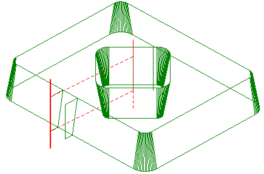
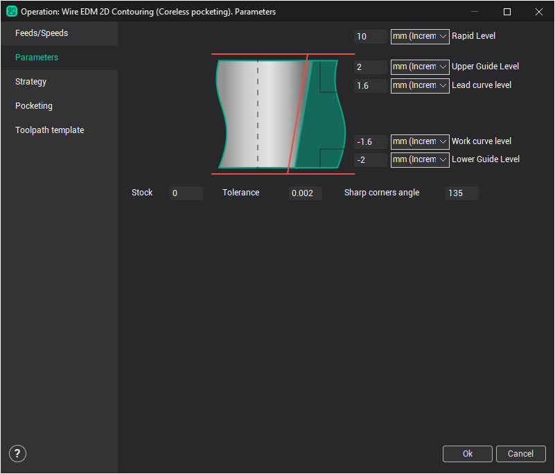

# Wire EDM 2d Contouring

The `Wire EDM 2d Contouring` operation is designed for wire path generation along flat contours as well as along flat contours with wire slope angle (taper) or 3d contouring. The resulting wire path is based on contours that lie on a single plane, unlike with the [4d contouring](10247.md) operation where contours must be selected for the lower plane (working contours plane XY) and the upper plane (leading contours plane UV).

Specific options for every operation are defined in the operation parameters window on the **Parameters** page.

There are the following operation properties available:

- **Working levels**:

- **Rapid level** – defines the Z level where the rapid moves are performed. Its must be positioned above all working levels so that the rapid moves are performed at a height that is clear of fixtures etc.
- **Upper Guide** – defines the Z level for the upper guide of the wire EDM machine.
- **Lead curve level** – For 4d-machining this defines the Z level of the upper leading (UV) contour. For 2d-machining it defines the height at which the "virtual" upper contour will be produced.
- **Work Curve level** – Usually the Z level of the working (program) contour.
- **Lower Guide level** – defines Z level for the lower guide of the wire EDM machine

- **Stock** – value of the additional remaining stock that is to be used for all contours in operation. Calculation method for the value is dependant on the selected [Compensation type](10238.md) from the **Strategy** page. Compensation value for each pass is the sum of [Offset Value](10237.md) from `Feeds/Speeds` page and the **Stock** value. The system will create an equidistant curve based on this value in the [Computer](10238.md), [Both](10238.md) and [Reverse Both](10238.md) compensation types. In [Control](10238.md) type the value will placed in the register with the [Offset Code](10237.md) number from `Feeds/Speeds` page.
- **Tolerance** is a calculation tolerance that defines the maximum deviation of the wires approximate path from the ideal. If the tolerance is set too high, then the calculation time could be excessive, conversely, if the tolerance is set too low, then unacceptable gouges may start to appear on the part.

- **Sharp corners angle** permits the determination of which corners are sharp. If the modulus of an angle is greater than defined value, then it is defined as obtuse and will not be rolled.
