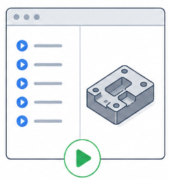
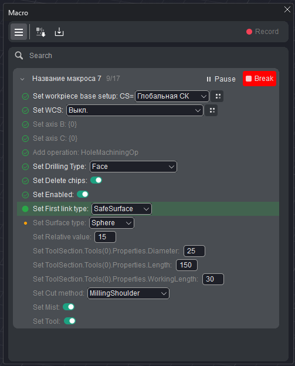

# Running a macro

## Application area:

This chapter explains how to play a saved macro: starting a run, supplying any required inputs, following progress, pausing, stopping at breakpoints, and overriding values for a single run.

### Running a macro

- Locate the macro in the list (for a lengthy list, <strong>Search</strong> is used).

- If necessary, expand the macro and adjust the values for the current run.

- Press <strong>Run</strong>. The macro plays its steps in order against the current project.

### Required inputs before a run

If the macro has empty fields marked as inputs (required), the run is not performed. The macro is expanded automatically, and the first empty input field is outlined in red. Once the field is filled in — a value is typed or the geometry is re-selected — the <strong>Run</strong> button is pressed.

### Following progress

During the run of a macro:

- The <strong>current step</strong> is marked with an green dot.

- <strong>Completed</strong> steps are marked with a green check; steps <strong>not yet reached</strong> are dimmed.

- A counter next to the macro name displays progress in the format <strong>current / total</strong> — for example, <strong>9/17</strong>.

### Pausing and continuing

During playback, the <strong>Run</strong> button changes function: pressing it places the run into the <strong>Pause</strong> state after the current step; in the paused state the button displays <strong>Continue</strong> to resume the run. You can also stop the macro by clicking the <strong>Break</strong> button.

### Stopping at a breakpoint

To stop a macro at a particular step, a breakpoint is set on that step:

1. Click the <strong>status dot</strong> on the left of the step (clicking again clears the breakpoint). A breakpoint cannot be set on the step currently running.

2. When the breakpoint is reached, playback is paused, and the run button displays <strong>Continue</strong>.

3. After the result is inspected, pressing <strong>Continue</strong> resumes the run. Alternatively, you can <strong>Break</strong> execution.

Breakpoints are used for a step-by-step check of a macro on its first run.

### Overriding values for one run

The behavior of a macro may be changed for a single run without editing the saved macro: the macro is expanded in the list, its fields are adjusted, after which <strong>Run</strong> is pressed. The supplied values apply to that run only. For a permanent change, the macro is edited.

> A macro cannot be deleted while it is running
