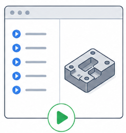
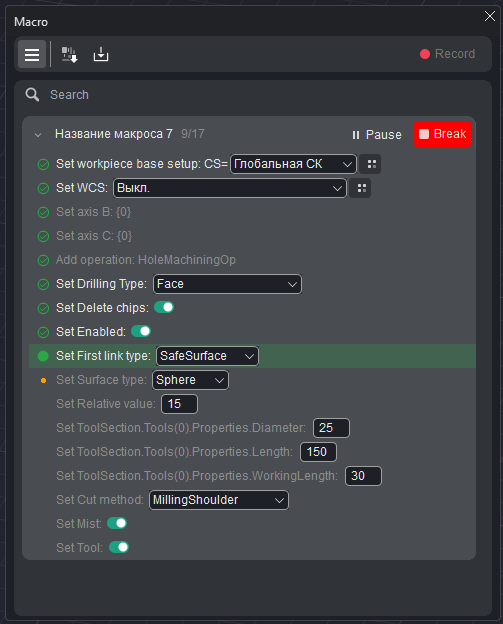

# マクロを実行

## 適用分野:

この章では、保存済みマクロの実行方法について説明します。具体的には、マクロの実行開始、必要な入力値の指定、実行状況の確認、一時停止、ブレークポイントでの停止、およびその実行時に限って値を変更して実行する方法を解説します。

### マクロの実行

- リストでマクロを探します（リストが長い場合は<strong>Search</strong>を使用します）。

- 必要に応じてマクロを展開し、今回の実行に使用する値を調整します。

- <strong>Run</strong>を押します。現在のプロジェクトに対して、マクロのステップが順番に再生されます。

### 実行前の必須入力

マクロに入力必須として設定された項目が未入力の場合、マクロは実行されません。必要に応じてマクロを展開し、今回の実行で使用する値を変更します。「<strong>実行</strong>」をクリックすると、マクロは現在のプロジェクトに対して、記録されたステップを順番に実行します。

### 実行状況の確認

マクロの実行中は、進行状況が次のように表示されます。

- <strong>現在のステップ</strong>には、緑の点が表示されます。

- <strong>完了した</strong>ステップには緑のチェックマークが付き、<strong>まだ実行されていない</strong>ステップは薄く表示されます。

- マクロ名の横に、<strong>現在 / 合計</strong>形式のカウンタ（例：<strong>9/17</strong>）で進捗が表示されます。

### 一時停止と再開

マクロの実行中は、「<strong>実行</strong>」ボタンの機能が変わります。実行中にこのボタンをクリックすると、現在のステップの完了後にマクロが<strong>一時停止</strong>します。一時停止中は、ボタンの表示が「<strong>続行</strong>」に変わり、クリックするとマクロの実行を再開できます。

### ブレークポイントで停止

マクロを特定のステップで停止したい場合は、そのステップにブレークポイントを設定します。

1. ステップの左側にある<strong>ステータス点</strong>をクリックします。もう一度クリックすると、ブレークポイントは解除されます。なお、現在実行中のステップにはブレークポイントを設定できません。

2. マクロの実行がブレークポイントに到達すると、自動的に一時停止し、「<strong>続行</strong>」ボタンが表示されます。

3. 実行結果を確認した後、「<strong>続行</strong>」をクリックすると、マクロの実行が再開されます。

ブレークポイントは、初めてマクロを実行する際に、ステップごとの動作を確認しながら検証するために使用します。

### 実行時のみ値を変更

保存済みのマクロを編集しなくても、1回の実行に限って動作を変更できます。マクロを一覧で展開し、各項目の値を変更した後、「<strong>実行</strong>」をクリックします。入力した値はその実行時のみ有効であり、マクロ自体には保存されません。変更内容を恒久的に反映したい場合は、マクロを編集して保存してください。

> >
> マクロの実行中は、削除することはできません。
