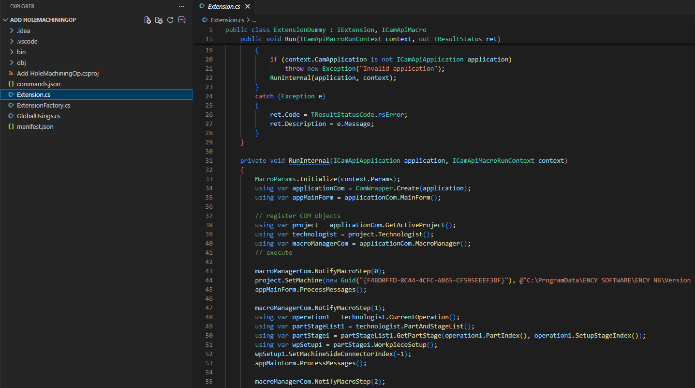
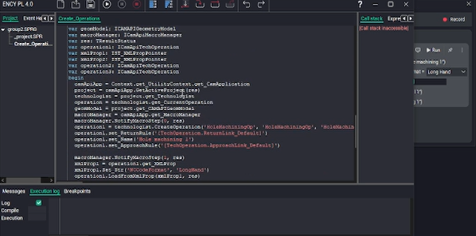

# Editing the code

## Application area:

Each macro is a small extension generated by the system from the recorded steps. Recording covers the common cases, while the generated source code is a fully functional extension.

Opening it is appropriate for:

- going beyond the capabilities of recording — adding custom logic, loops, or conditions;

- studying the CAM system API by means of a concrete, runnable example;

- creating a new extension from a known-good template rather than an empty file.

### .NET and Spr

The language is selected when the macro is saved and is retained by the macro. [Details](102459.md)

<strong>.NET</strong>.The macro is generated in <strong>C#</strong> and built as a.NET extension against the CAM system API. Selected for development of the macro in <strong>C#</strong> or use of the wider <strong>.NET</strong> ecosystem.

<strong>Spr.</strong> The macro is generated in <strong>Spr</strong>, the built-in scripting language of CAM system, and opens in the built-in <strong>Spr</strong> editor. Selected when work is performed in <strong>Spr</strong>.

Both options are run in the same manner from the macro list; the difference lies only in the source code being edited.

### Opening a macro in an editor

1. In the macro list, open the <strong>"…"</strong> menu of the macro and select <strong>Open in editor</strong>.

2. The system opens the generated source code of the macro — the C# source for a <strong>.NET</strong> macro, or the `.spr` script in the <strong>Spr</strong> editor.

3. Make the changes and save.

The generated source code of a <strong>.NET</strong> macro — the C# `Extension.cs` file together with the project files (`commands.json`, `manifest.json`, and the `.csproj`):

The generated code of a <strong>Spr</strong> macro — the script opened in the Spr editor:

### How edits take effect

- A <strong>Spr</strong> macro is run directly from its script, so saving the edited script is sufficient.

- A <strong>.NET</strong> macro is run from a compiled file, so C# edits take effect after the macro is rebuilt. The build-environment check analogous to the one described in applies. [Details](102459.md)

### Source code location

The macro source code and its human-readable step list are placed together in the macro folder, inside the personal CAM system folder under `macros`. Keeping the folder as a whole ensures that the macro and its source code remain synchronized.
