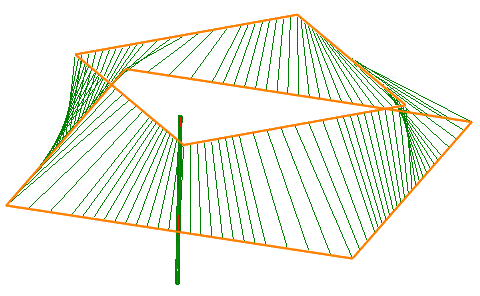
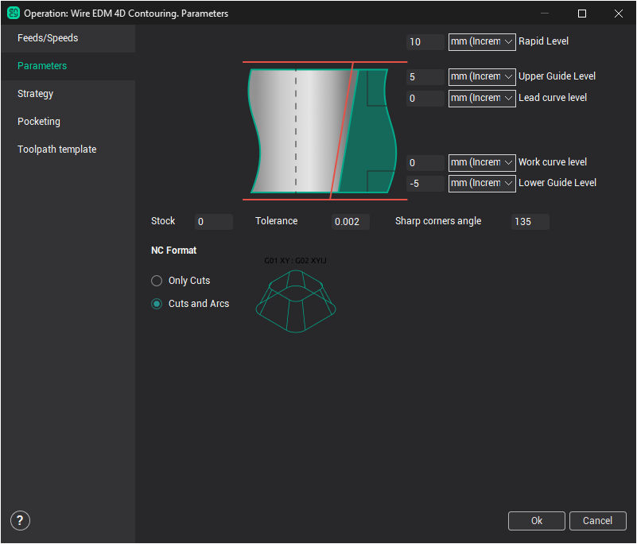

# Wire EDM 4d Contouring

The `Wire EDM 4d Contouring` operation is designed for wire path generation along two flat contours simultaneously. One of these contours moves the lower guide of the wire EDM machine, to put it more precisely – it moves the working (XY) contour plane. The second contour moves the upper guide of the wire EDM machine – the leading (UV) contour. Thus, in operation the upper and lower wire ends can move on different paths.



Specific options for every operation are defined in the operation parameters window on the **Parameters** page.



There is available following operation properties:

- **Working levels**:

- **Rapid Level** – defines the Z level where the rapid moves are performed. Its must be positioned above all working levels so that the rapid moves are performed at a height that is clear of fixtures etc.
- **Upper Guide Level** – defines the Z level for the upper guide of the wire EDM machine.
- **Lead curve level** – defines the Z level of the upper leading (UV) contour.
- **Work curve level** – Usually the Z level of the working (program) contour.
- **Lower Guide Level** – defines Z level for the lower guide of the wire EDM machine

- **Stock** – value of the additional remaining stock that is to be used for all contours in operation. Calculation method for the value is dependant on the selected [Compensation type](10238.md) from the **Strategy** page. Compensation value for each pass is the sum of [Offset Value](10237.md) from `Feeds/Speeds` page and the **Stock** value. The system will create an equidistant curve based on this value in the [Computer](10238.md), [Both](10238.md) and [Reverse Both](10238.md) compensation types. In [Control](10238.md) type the value will placed in the register with the [Offset Code](10237.md) number from `Feeds/Speeds` page.

- **Tolerance** is a calculation tolerance that defines the maximum deviation of the wires approximate path from the ideal. If the tolerance is set too high, then the calculation time could be excessive, conversely, if the tolerance is set too low, then unacceptable gouges may start to appear on the part.

- **NC Format** – on this panel can be selected one of two formats for the G-code:

- **Only Lines** – all arcs in the source contours will be approximated to linear segments (**Lines**). The G-code will contain only linear moves. NC-blocks in this case simultaneously contain coordinates of the lower contour (X, Y) and the upper contour (U, V). NC-block will look like the following way:

```
G01 X65.852 Y-89.422 U-3.902 V19.616
```

- **Lines and Arcs** – G-code can contain linear segments and arcs. Usually the NC-block in this format consist of two parts, which are separated by colon. On the left part of the block are the moves for the lower contour and on a right are the moves for the upper contour. NC-block will look like the following way:

```
G03 X60. Y90. I-30. J0. : G03 X60. Y70. I-10. J0.
```
