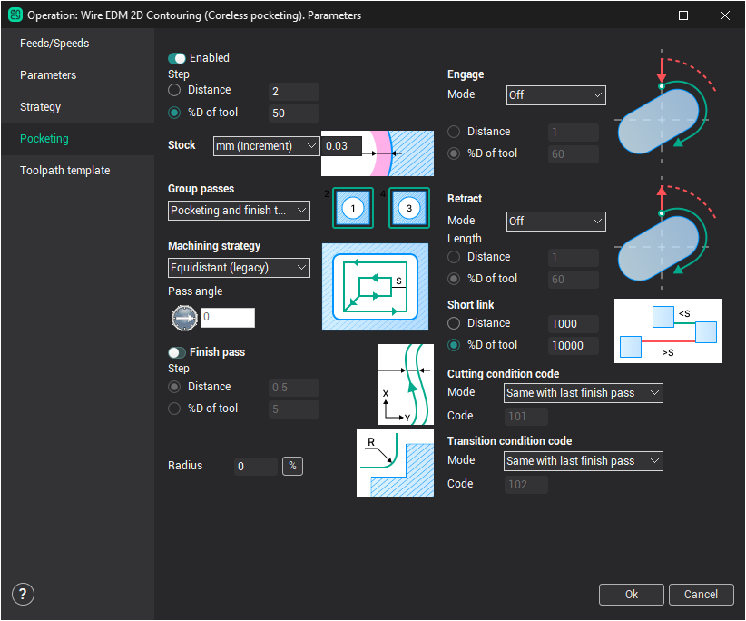
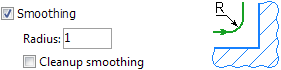

# Pocketing parameters

To enable a pocketing set the appropriate checkbox in the wire EDM operation parameters window on the Pocketing page.

 This stock is relative to the

**Machining strategy** allows you to define the shape of the wire path. When choosing the "equidistant" strategy the shape of the working passes will repeat the form of the original contours. If "parallel" strategy selected, then the working passes will be parallel lines. In the latter case, you can optionally specify the angle of these parallel lines in the plan.

**Machining step** determines the distance between two adjacent work passes. For convenience, the step value can be defined in several ways.

- Distance. The value is given an absolute value and does not change when you change other settings.
- %D of wire. The actual step size is specified percentage of the wire diameter and, therefore, varies by changing the wire.

If you enable **Finish pass** a little additional stock will be left on the part. It will be removed by the last finishing pass, which always runs along the initial contour (at equidistant). This allows, for example, to remove the scallops after parallel roughing passes (if you specify a parallel machining strategy) and get higher quality of finished surface. This stock is relative to the base stock for finishing.

The **Stock** parameter allows you to specify the value of the material, which should be left to machine with finishing passes along the contour. Stock can also provide the necessary reserve to compensate the difference between the wire diameter and the size of the burned material. It can be defined in several ways.

- Absolute. In this case, the stock specified in the current units of the system (millimeters or inches) and is relative to the source contour specified in the job assignment.
- Increment. When using the relative method of defining the stock, it is also specified in current units (millimeters or inches), however it is measured based on the number of finishing passes along the contour and the [offset](10237.md) given to them. In addition the radius of the wire is added.
- %D of wire. Stock, as in the Absolute case, is relative to the source contour specified in the job assignment. However, its value is given as a percentage of the wire diameter.

The **Smooth radius** provides a rounding of the wire path when machining internal corners. This reduces vibration and increases machining speed. The "Radius" specifies the radius of the circular arcs that are added to the trajectory in the corners. Separately, you can point to the need to perform smoothing on the last pass.

If the operation includes both the rough passes (pocketing) and finishing passes along the contour, you can additionally specify in what order should perform the machining. **Group passes** parameter is designed for this. If you select "Pocketing and finish together" moving on to the next contour will not be made until the fully machined this contour. If you select "Pocketing and finish separately", the first rough pocketing of all pockets will be made, and only then finishing passes along the contours will be performed.

The **Short link** parameter defines a method for constructing the transition when connecting work passes. When the connecting points of the wire path are located at the distance greater than specified value, then the transition is performed on the rapid feed with the breaking of wire. Otherwise, the transition is performed on the shortest distance without breaking the wire at the special specified transition feed (transitions cutting condition code).

Machining conditions for wire EDM pocketing can be set separately for working passes and transitions. As with contouring cutting conditions are determined by a special code of machining conditions. According to it, the CNC control of the machine determines specific cutting parameters from the table. There are two ways to specify the cutting condition code.

- Condition code. In this case, given a specific number of code.
- Same with the first finish pass. When selecting this option condition code is automatically taken from the [cutting conditions table](10237.md) for finishing passes along contours and will be same with the code of the first finishing pass.

Approach and Return options allow you to specify the mode and the value of the approach to the beginning of the pass, or return from the end of the pass for wire EDM pocketing separately. In the Mode field you can select the method to construct it.

- Off. Approach and return are not built.
- Normal. Constructed by normal to the working pass.
- Tangent. Constructed by tangent to the working pass.

If the approach / return is enabled then its size can be set either in the current system units (millimeters or inches) or a percentage of the wire diameter.
