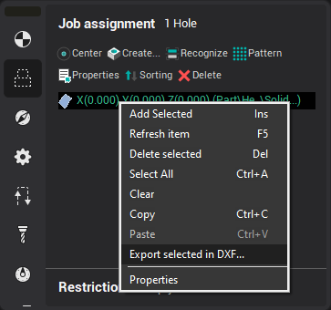

# Wire thread points

In the wire EDM machining operations trajectory typically begins from the pre-machined holes in the workpiece. If the holes already exist in the model of workpiece specified for operation, then the location for the entry of the wire will be determined automatically in places where there is no material. If the workpiece specified simply as solid piece of material without holes, it is possible to explicitly specify the holes through which should thread the wire. To do this you need to select desired wire EDM operation in the "Technology" mode and then select the "Holes" tab in the lower left corner of main window.

The holes can be added to this list by manually entering the coordinates, by selecting of geometric primitives, or automatically when recognition of 3D model. Working with this window is no different from filling [the list of holes for the Hole machining operation](705.md).

In addition, wire EDM operations support the mode of reverse engineering. If the operation cannot find suitable hole in this list at the calculation time, it automatically creates a new hole for drilling and adds it to the list. Then the holes from this list can be exported to an external file (DXF). Later this file with holes can be loaded into another project or another application, in which is performed the design of workpiece for machine this part.

To export a list of holes you can use the pop-up menu of this window or `File / Export / Export holes` main menu item.
