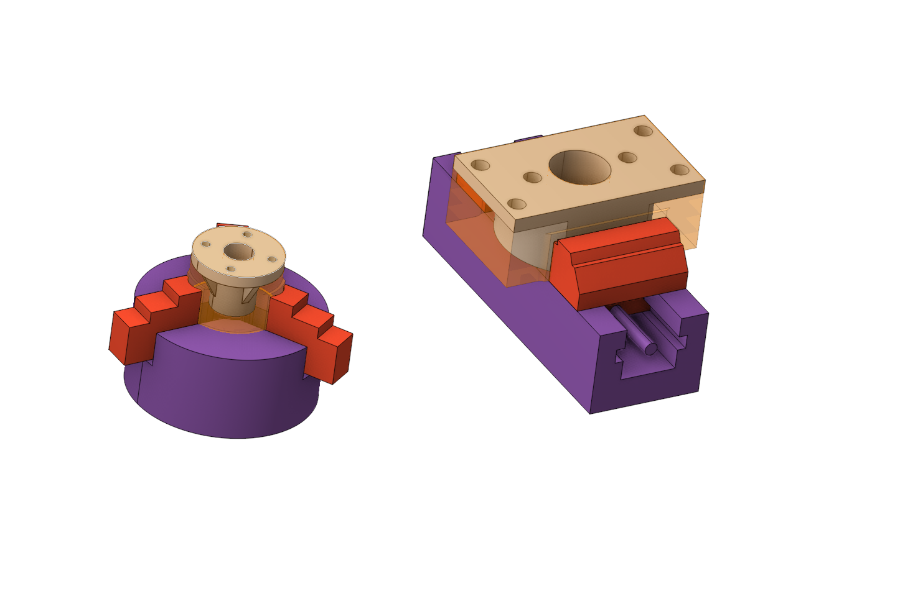
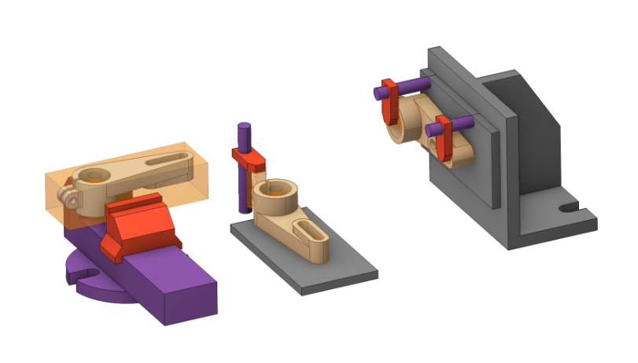

# Part (group)

 

## Application area:

This group is necessary for creating <strong>multi-part projects</strong>. These can be several different (design) parts or standard parts divided in the technology by operation, similar to a conveyor. To sort operations, use <strong>Sequencing mode.</strong> [Details](1029.md)

## Setup:

The <strong>Setup</strong> tab is used to configure the primary parameters of the project. This can involve the positioning of the part on the equipment, the coordinate system of the part, and more. [Details](1022.md)

## Transformations:

Parameter's kit of operation, which allow to execute converting of coordinates for calculated within operation the trajectory of the tool. [Details](10168.md)
