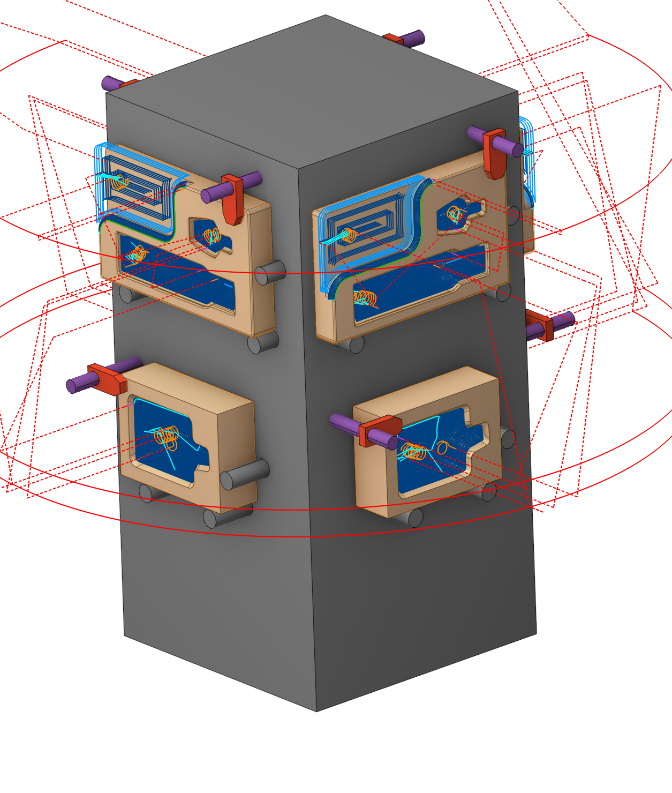
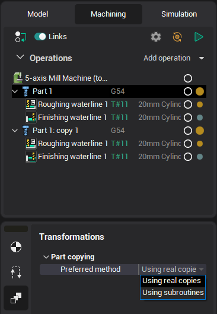
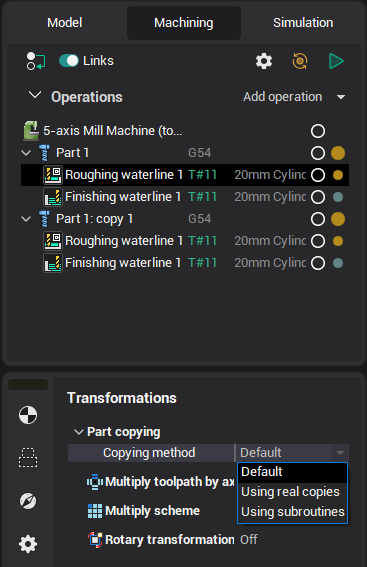

# Copy of part

## Application area:

<strong>Copy of part</strong> is the special kind of simple part. It's designed to prepare the project with the several identical parts. Usually it can be done with the next steps:

- Create the prototype <strong>part</strong>. Add operations, that are neccesary for the machining.
- Create <strong>copy of part</strong>. If the project contains more than one part then the copy of the current selected part will be used as prototype.
- Assign the <strong>workpiece setup</strong> and <strong>workpiece CS</strong> for the copy.

Copy of part is a group of operations, that is syncronized with the prototype group (part). It's not possible to add or delete the operation inside the copy. If an operation is created/deleted in the prototype part, then the copy of this operation will be created/deleted in all part copies. Copy of part contains inside the special operation copies. Operation copy doesn't calculate the toolpath itself. It just apply the toolpath of the prototype operation to the place of the part copy. So if reset the prototype operation then all copies of this operation will be reset. Recalculation of copies must be started manually.

There is the possibility to output the copies machining as the subroutine calls. The way of output is defined in the parameters of the prototype part. Before usage the subroutines be sure that your postprocessor supports it.

You can set individual copy parameters for each operation in the group.

## Setup:

The <strong>Setup</strong> tab is used to configure the primary parameters of the project. This can involve the positioning of the part on the equipment, the coordinate system of the part, and more. [Details](1022.md)

## Transformations:

Parameter's kit of operation, which allow to execute converting of coordinates for calculated within operation the trajectory of the tool. [Details](10168.md)
