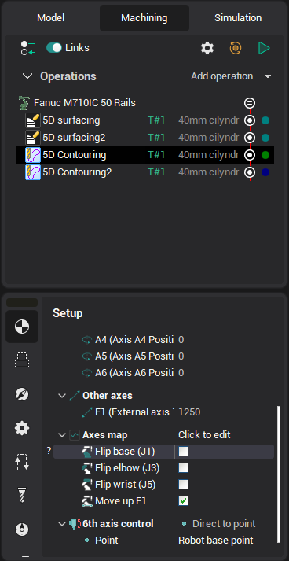

# Machining on industrial robots

CAM system can be used to program industrial robots (articulated) for cutting, milling, painting, welding and other applications. The programming process of an industrial robot is basically the same as one of a conventional [milling machine](10098.md), except the robot usually has 6 degrees of freedom (versus 5 degrees of freedom required to position a cutter relative to a workpiece) plus optionally additional degrees of freedom of various types of workpiece positioners (like rotary tables) and robot positioners (like rails). Therefore, when used with a robot CAM system operations offer additional set of parameters to control those excessive degrees of freedom (DOFs).

In addition to excessive degrees of freedom a robot can reach the desired position of the tool relative to the workpiece in several different states. The state to be used in the operation can be specified in the Operation Setup with the **flip base**, **flip elbow**, **flip wrist** checkboxes as well.

In this chapter the following robot programming features are covered:

[Setting the coordinate system of the tool and the workpiece](10262.md)

[Programming of the robot's 6th axis](10263.md)

[Programming of rails position](10264.md)

[Programming the rotary table](10265.md)

[Avoiding out-of-reach zones and singularities](10266.md)

[Programming robot's transitions (obsolete method)](10267.md)

The feature is available in the following [CAM system configurations](10390.md):

- Robots
- Master
- Pro
