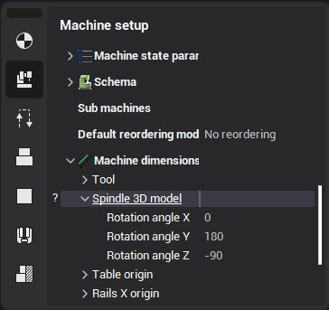
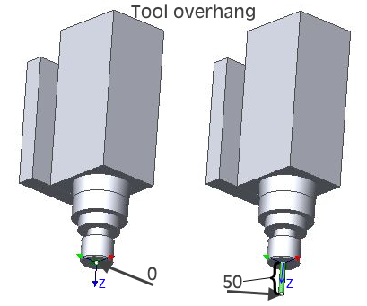
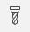
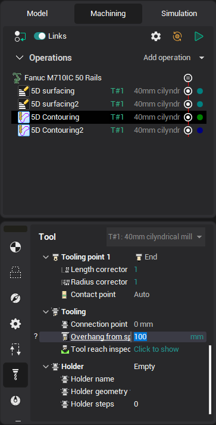
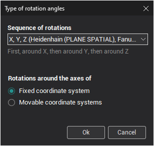
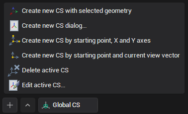
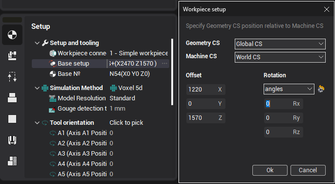
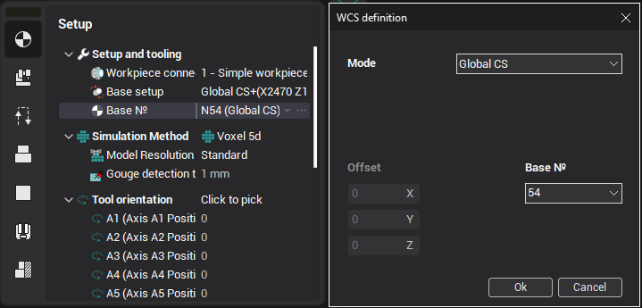

# Setting the coordinate system of the tool and the workpiece

When programming a robot it is necessary to define the tool and the workpiece coordinate systems (the Tool Frame and the User Frame).

Defining the tool coordinate system

The tool coordinate system is defined by specifying the origin and the rotation angles of the tool CS relative to the base robot flange coordinate system, and the tool overhang.

1. Set up the position and the orientation of the tool head for the project

- As the first step perform the calibration of the tool coordinate system on the real robot following the instructions from the robot's manual. Ensure the positive Z axis of the tool CS looks down the direction of the tool overhang after the calibration.
- In CAM system at the Technology tab select the robot node in the job tree and at the Machine setup tab in the inspector enter the values you've just obtained after the Tool CS calibration into the `Machine dimensions.Tool` fields (see the first picture below). The values of the rotation angles A, B, C (W, P, R) usually need to be updated only when the tool head configuration is changed (the tool head is either modified or replaced).
- If a tool was used when calibrating the robot (see the second picture), enter the tool length into the **Tool overhang** field, otherwise leave this field as 0.
- The `Spindle 3D model` parameters define the additional transformation of the tool head 3d model relative to the tool coordinate system (for visualization and simulation). They do not affect the orientation of the tool and the resulting toolpaths in any way.
- If you want the entered values were used as the default values for the current robot in all new projects, you have to edit the robot's.xml file. For example:

`X DefaultValue="134.83"/`).

 

2. Set the tool overhang for an operation

For every new tool you'll be using in the operations of the project you have to specify the tool overhang. To do so activate the **Tool** tab in the operation parameters inspector and click on the **Overhang** parameter (As shown in the picture below). The tool overhang (the lime dimension) and the three coordinates of the tool center point (TCP) in the tool flange coordinate system (X-red, Y-green, Z-blue) will be shown in the graphic view. You can edit the dimensions by clicking on them and entering the values with the keyboard or by the mouse wheel scrolling. All the four dimensions are interrelated, so when one of them is edited, the others are recalculated in such a way that only the tool overhang is changed.

Different ways of defining coordinate systems

Robots from different manufacturers may have different ways of defining the coordinate system rotation angles. For example, the Fanuc robots have the order of rotations first around the X axis, then around Y, then around Z, while the KUKA robots have the order of rotations first around the Z axis, then around Y, then around X.

In CAM system the correct order of rotations for the specific robot is used by default, but if you want to use a non-standard rotation scheme to define a coordinate system you can always do so by selecting the rotation scheme in the **Type of rotation angles** window which is available in the **Definition of new coordinate system**, **Spatial transformations** and **Workpiece setup** dialogs by pressing the corresponding button.

Defining the user coordinate system of the workpiece

Here is the recommended way.

1) On the real robot define the new user coordinate system by specifying three points on the workpiece (most robots support this way of defining a coordinate system). The first point is the CS origin, the second and the third points specify the directions of the X and Y axes. As the result you will get the id (the number) of the coordinate system and the coordinate system parameters XYZ ABC (WPR, RxRyRz, q1q2q3q4 ).

2) In CAM system create a new coordinate system using exactly the same approach you used on the actual robot:

- Create a new coordinate system by selecting the **Creation of CS by setting starting point CS and direction of X and Y axes** command and click the three points on the model of the workpiece you have just been using when defining the user coordinate system on the real robot.

- In the **Workpiece setup** dialog select the newly created coordinate system as the **Geometrical CS**. In the boxes for the Translation and the Rotation enter the values XYZ ABC (WPR, RxRyRz, q1, q2, q3, q4) obtained on the robot.
- In the **Workpiece CS** dialog select the newly created coordinate system for the `Mode (way of assignment):`. Enter the number of the coordinate system that will be used in the program into the **LCS number** box. (Default is 54, because it is the standard coordinate system of most machines).

After that the position of the workpiece and the fixtures in CAM system have to reflect the position of the real workpiece relative to the real robot.

It is recommended to set up the user workpiece coordinate system in the root of the job tree (the very first item with the robot icon and caption in the tree) rather than in operations.

3) The position of the user coordinate system can be saved in the robot.xml file as the default value for the new projects. It will simplify the further use of CAM system as newly imported models of parts will be placed in more predictable positions relative to the robot.
