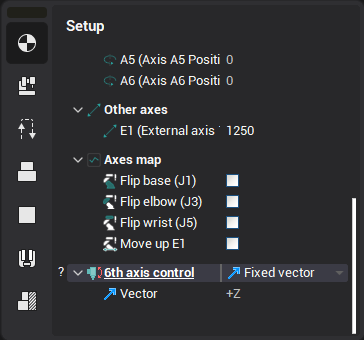
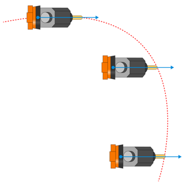
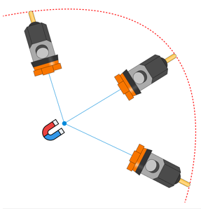
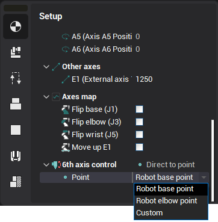
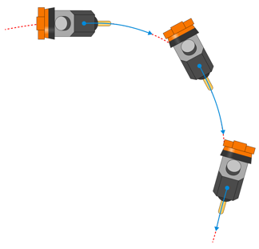
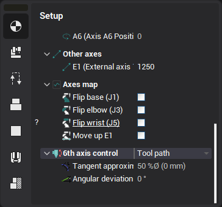

# Programming the robot's 6th axis

To position a rotating tool relative to the workpiece five degrees of freedom is enough, yet most of the robots have 6 degrees of freedom. The last 6th DOF is represented by an additional joint at the tool flange and is used to extend the robot's flexibility and the reach zone (by fixing the tool position and orientation and by changing the angle of the 6th joint the other joints of the robot are moving, and this helps avoid various types of kinematic and mechanical collisions when machining).

In CAM system there are two ways of programming the 6th axis:

- automatic,
- manual.

You can control it on the operation's properties inspector.

The <strong>automatic way</strong> is represented by the few modes of the <strong>6th axis control</strong> property.

- **Fixed vector**,
- **Direct to point**
- **Toolpath**.

<strong>Fixed vector 6th axis control mode</strong>

In this mode you define the axis (the 3d vector) along which the Z axis of the robot's tool flange (the tool flange vector) is aligned.

<strong>Direct to point 6th axis control mode</strong>

In this mode you specify a 3d point to which the robot's tool flange vector is directed during the machining.

The point can be either

- the robot base point, or
- the robot elbow point,
- or a custom point.

<strong>Toolpath 6th axis control mode</strong>

In this mode one axis of TCP is aligned with the toolpath tangent direction.

Optionally you can also define the <strong>Tangent approximation tolerance</strong> and the <strong>constant angular deviation</strong> relative to the tangent of toolpath at each point.

The <strong>manual way</strong> of programming the 6th axis is by using the [Robot Axes Map](10266.md) (also known as the Robot Extra Axes Optimizer). It is possible to combine both approaches: use the automatic law for the most of the toolpath and apply additional corrections to the 6th axis control in the Robot Axes Map.
