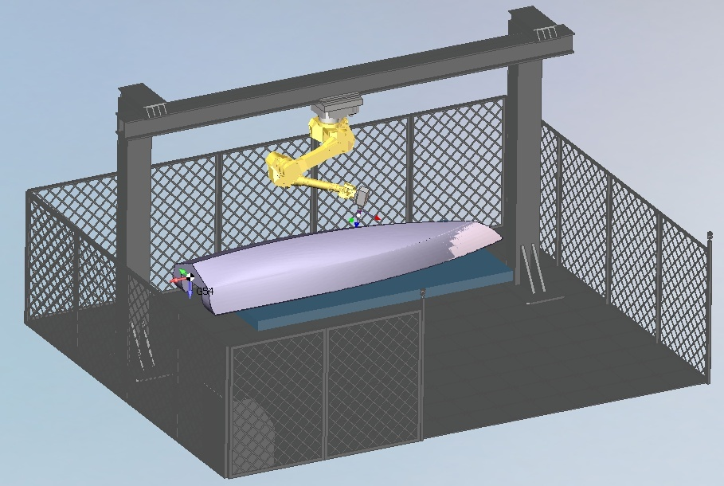
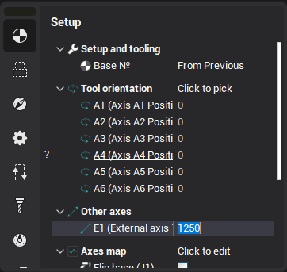

# Programming the rails position

Often to increase the reach zone of an industrial robot, the robot is mounted on rails. CAM system allows simultaneous control of up to 3 rail positioners.

If the kinematic scheme of a robotic cell contains a rail or multiple rails, the following parameters become available for each rail in the operation parameters.

1. The initial rail position for the operation (E1 (External axis 1 position) in the picture).

2. The Move Up rail axis mode check box (Move up E1 check box in the picture)

Move Up **the rail axis**

If this mode is enabled, the robot is automatically moved on the rail during machining in such a way that the current tool center programming point appears under the robot base zero point (or as close to it as possible).

Attention!

Having the tool center point just under the robot base zero point is not always optimal. This position may lead to singularities of the first joint. In this case it is necessary to adjust the rail position in the Robot Axes Map (adding an additional shift).
