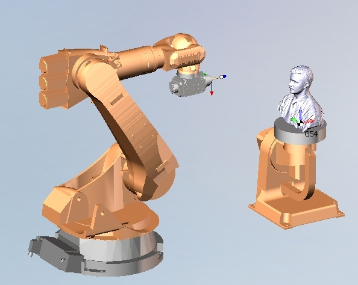
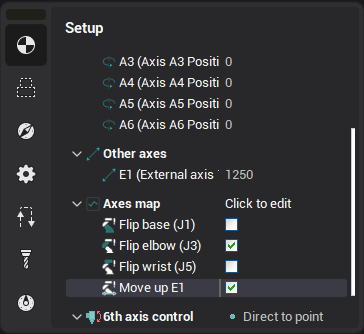
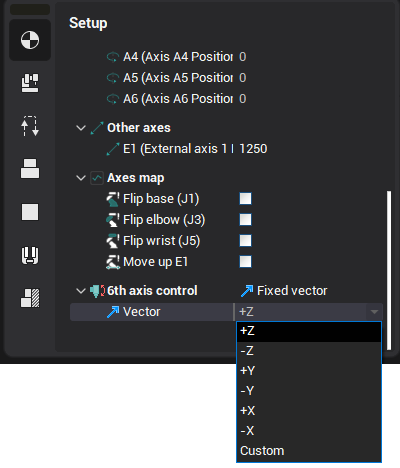
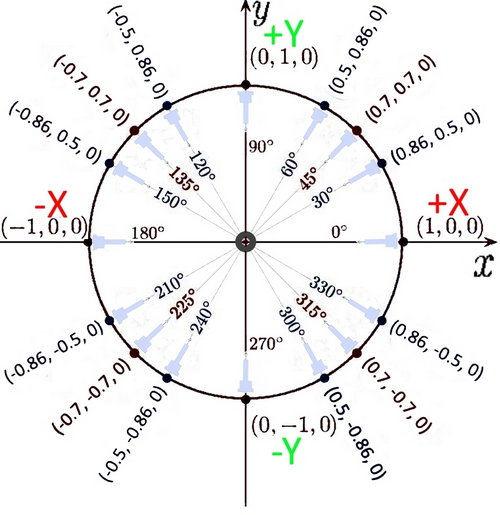

# Programming the rotary table

A robotic cell can be equipped with a rotary or a tilting rotary table which have one and two additional rotary axes respectively.

If the kinematic scheme of a robotic cell contains a rotary table, the following parameters become available in the operation setup.

1. The Rotary axes initial positions for the operation.
2. The Rotate **rotary axis** options.
3. The Flip table option.
4. Additional parameters for the rotary table control.

Rotate table parameters

The automatic table rotation feature allows to rotate table during the machining in such a way that the tool always stays on one side of the table. By using the **Rotary table vector** you can set on which side of the table the tool will be positioned (the direction vector of the tool axis to the center of the table in the global coordinate system of the robot).

In the diagram below the examples of a vectors for different angles are shown.

