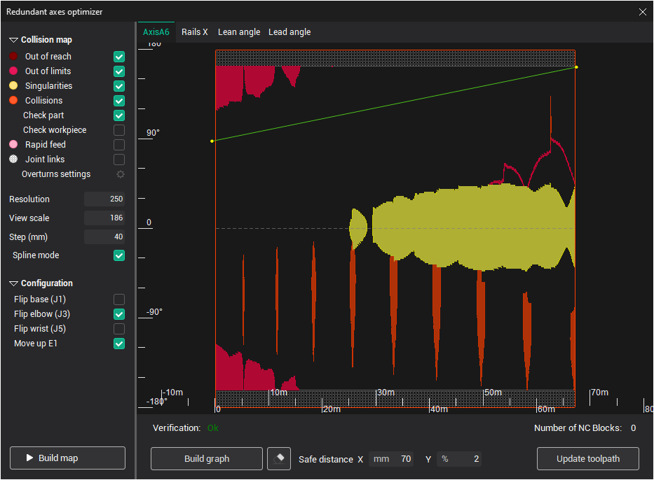
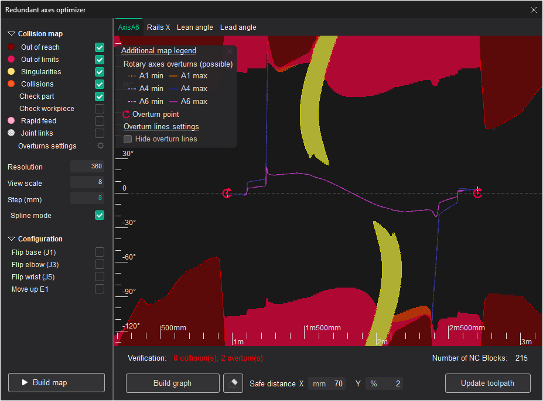
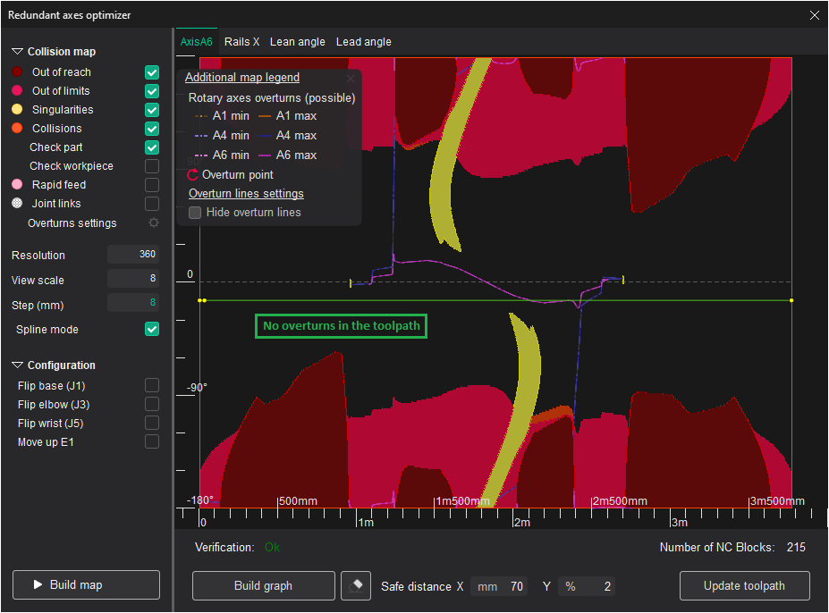
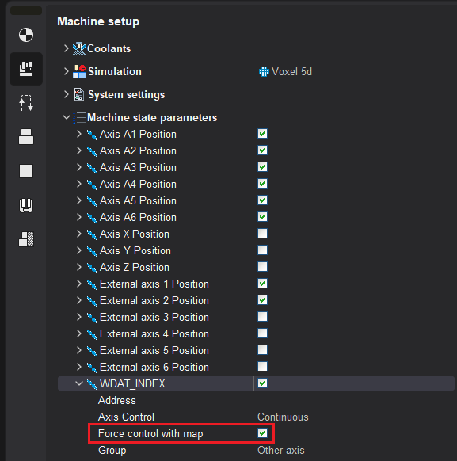
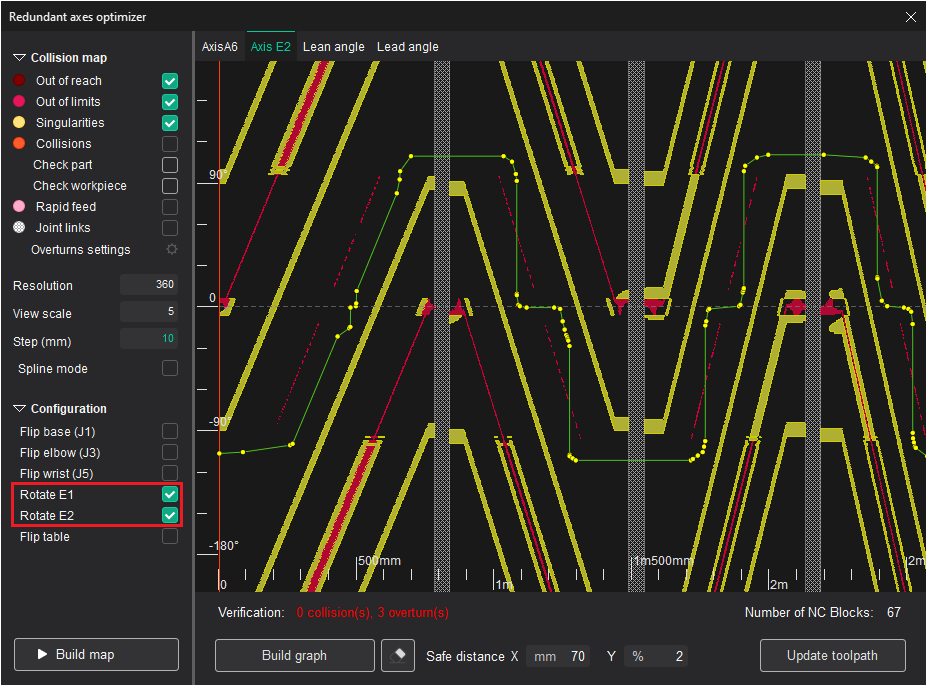
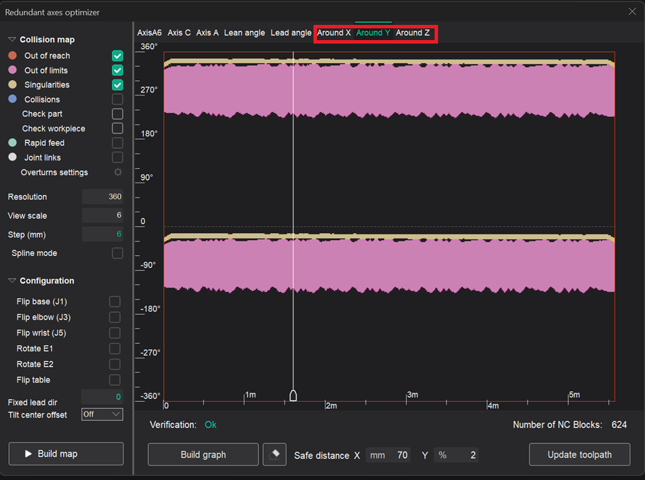
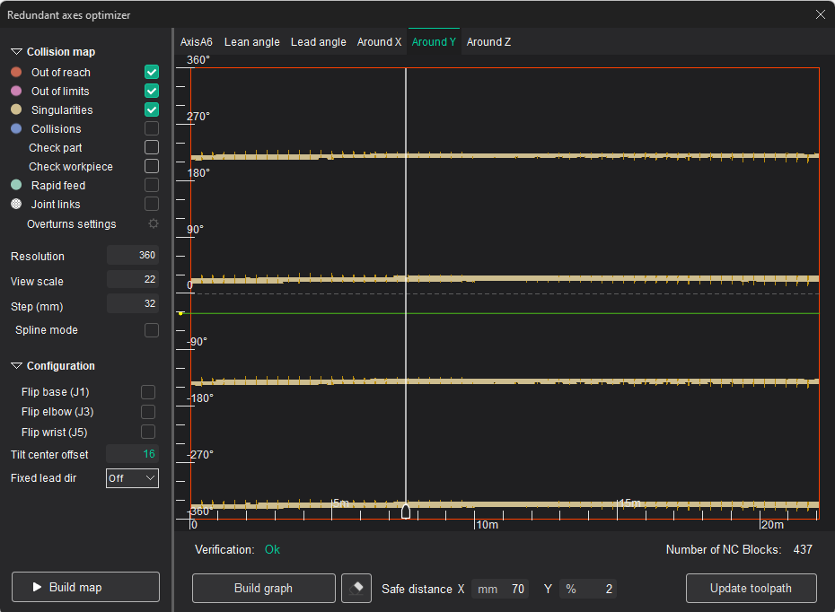
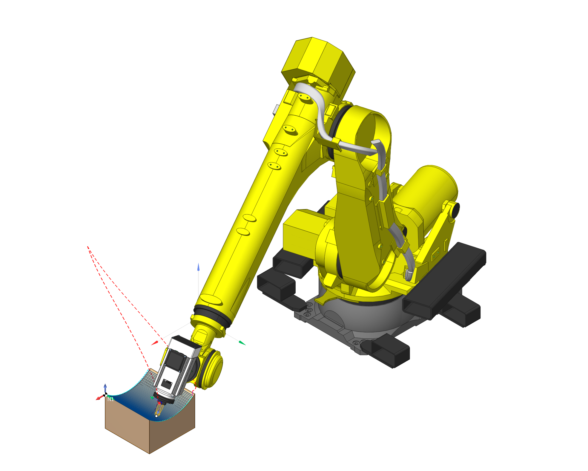
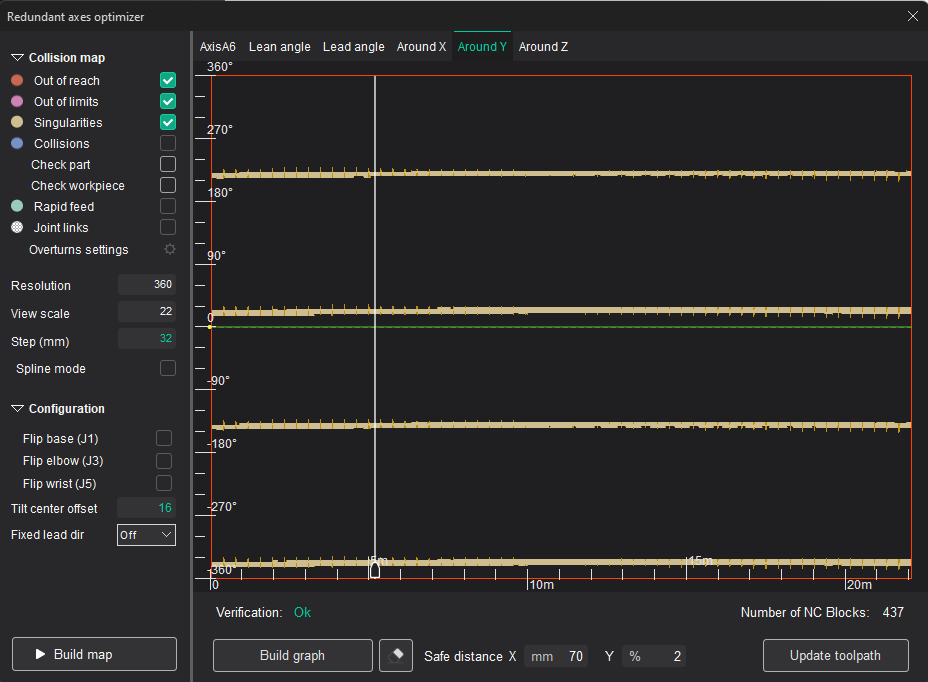
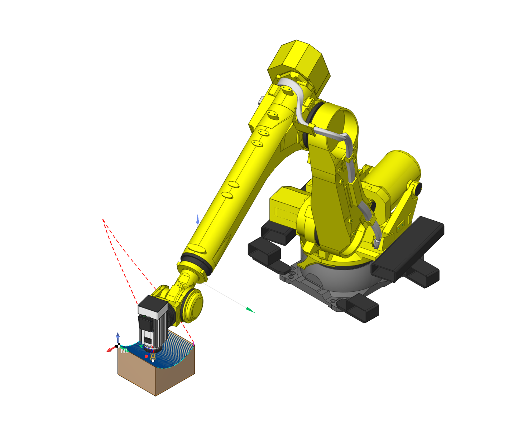

# Robot axes map



## Application area:

The Robot Axes Map allows to define manual and fine-tune automatic control laws for the excessive degrees of freedom of a robot (the 6th axis, the rails axes, the rotary table axes). The feature is available at the Operation Setup by pressing the ellipsis button next to the Robot axes map parameter.

The following axes/parameters can be controlled through axes map:

- Robot external axes (rotary table or rail). More precisely, these are the robot axes which affect the position of the tool or workpiece of the operation, and are not one of the joints (A1-A5 axes)
- Robot A6 axis
- Lead/Lean angle
- "C axis" of the 5-axis machine (see [here](10147.md) for more information)
- Arbitrary machine axis - with the special flag. See "<em>Arbitrary machine parameter control</em>" section for more info

### The principle of operation

<strong>Robot configuration</strong>

First you have to choose the robot configuration/state to be used in the operation. It's the same configuration/state that you can edit in the Operation Setup under the Robot Axes Map parameter. The robot configuration is defined by the "Flips" - the alternative positions of robot's joints (base, elbow, wrist) which allow the same position of the tool relative to the workpiece - and the modes of positioning of excessive axes such as rails and rotary tables (Move Up E1, Rotate E2).

#### Optimized axis

In the Optimized Axis combobox you select the axis that you define the control law for at the moment.

### Collision map

Collision map is the visual representation of collision zones in the toolpath. Along the X axis is the position of the tool on the toolpath from the beginning measured by length. Along the Y axis is the value of the optimized axis. The following types of collisions are detected.

1. Out of reach zones (maroon) are zones which the robot can not reach.
2. Out of limits zones (purple) are zones which the robot can reach but some of the robot's axes go out of its' defined limits.
3. Singularity zones (yellow) are zones where the robot's joints move at extreme speeds.
4. Collision zones (orange) are zones where the robot parts collide with each other or with the workpiece.

The map resolution can be set in the Resolution box as the amount of steps along the Y axis to be calculated.

To build or refresh the map hit the Build map button.

### Check part and workpiece

Under the 'Collisions' checkbox there are 2 checkboxes for specifying whether part and/or workpiece are accounted for in the collision detection. They are enabled only if the parent 'Collisions' checkbox is set to 'True'. It is advisable to switch them depending on the type of machining - cutting, additive machining, or welding.


### Axis control spline

The axis control law is defined as a spline curve. By default there is no spline. It means the optimized axis value either stays the same (in manual mode) or is controlled automatically (in the automatic mode) for the entire toolpath (the horizontal gray dashed line).

The goal is to create the nicest curve possible that passes through the collision-free white zone from left to right.

To create a new spline double-click on points in the empty space the spline has to pass through. Two points is enough. After the spline is created you can change it's shape by dragging the spline control points with the mouse, by deleting the control points (by right clicking on a point) or adding new points (just pull the spline with the mouse).

Use the Clear button to erase the spline.

Use the Build automatically button to build the collision avoiding spline automatically.

Verification

In this area the status of the current toolpath is displayed. If there are no collisions in the toolpath the green Ok is displayed, if there are any collisions, the number of collisions is displayed in red. The status is updated every time you change the axis control spline.

At the same time in the graphic view the collision zones in the actual toolpath curve are also marked with thick strokes of the corresponding collision type color.

You can either click on the empty space in the axes map or move the mouse while holding the left mouse button to position the tool to the corresponding position of the toolpath.

Regenerate toolpath

To apply the axis control law to the toolpath click the Regenerate toolpath button.

### Rotary axes overturns detection and avoidance

It is possible to use the redundant axis map to check for the potential problems in the toolpath caused by the rotary axes <strong>overturns</strong>. Overturns happen if the rotary axis reaches one of its limits and in order to continue machining it needs to do one full rotation (360<strong>°</strong>) forward or backward. In previous versions no information about the overturns was available to user because, despite the overturn, the axis always stays within its limits.

The light dashed and dark solid lines show the possible overturn locations in the toolpath in case the spline intersects with them. Different rotary axes, which can have overturns, have different line colors. The intersection doesn't always correspond to overturn; the true overturn locations are additionally highlighted on the spline as bold red points with the "overturn" sign. Also if there are overturns in the toolpath, their count is displayed in the "Verification" status bar. There can be 2 types of overturns:

- the overturn happens after the axis <strong>minimum</strong> is reached (shown with the <strong>dashed</strong> lines)
- after the axis <strong>maximum</strong> is reached (<strong>solid</strong> lines)

> Toggle the <strong>Show map legend</strong> check box to view the overturn lines color/style info and other additional map notations

 

<strong>Screenshot 1</strong>. The toolpath contains 2 overturns

<strong>Screenshot 2</strong>. The spline was moved lower, so there are no intersections with the overturn lines. As a result, there are no overturns in the toolpath now.

If the operation's toolpath contains overturns, you can try to <strong>avoid</strong> them by moving the spline so it doesn't intersect the given lines or the intersections are "fake" (the rotary axis value did not reach its limit yet in this point, but its value is equal to the axis min/max modulo 360<strong>°</strong>).

On the screenshot above, the spline was changed to a straight line, which doesn't intersect any of the blue/purple lines, which allowed to get rid of the overturns in the toolpath. Also changing the robot configuration (the "Flip elbow", "Flip wrist" parameters) might also help to avoid the overturns.

### Arbitrary machine parameter control

If you need to control the changes of an arbitrary parameter (defined as an axis in the machine schema), you can enable the <strong>Force control with map</strong> flag in the corresponding machine state parameter.

The flag is available for each machine state parameter in the <strong>Machine Setup → Machine state parameters</strong> section of the inspector. After this the axis will appear in the axes map window, and, as usual, you can define parameter value in each toolpath point using spline.



You can also set this flag directly in the xml-file of the machine in the **Machine state parameter**, which corresponds to the given axis.

```
                    Enabling axis control with the map in xml
<SCType ID="WDATPOS" Caption="WDAT_INDEX" type="TMachineStateParameter">
	...
	<ControlWithMap DefaultValue="True"/>
</SCType>
```

### Singularity avoidance for the 2-axis rotary table of the robot

Previously, If you needed to define the trajectory of a 2-axis rotary table of the robot, and both of the rotary table <strong>flips</strong> are enabled (commonly named as <strong>Rotate E1</strong> and <strong>Rotate E2</strong>), the resulting trajectory could contain singularity zones, causing very sharp changes of the rotary table state. That's why the special mode is enabled in the axes map in this case, similar to the [Axes map for 5-axis machines](10147.md). In this mode you need to define the trajectory only for one of the rotary table axes, the value for the other will be computed automatically to minimize the deviation from the tool normal defined by the operation.

The white vertical zones in the map correspond to the singularity zones. Using spline you can define the E2 axis trajectory there without abrupt changes.



### Rotate toolpath by LocalCS in Robot Map feature.

It allows you to construct rotation maps relative to a fixed coordinate system.



Below is an example of rotation of the axis Y.

 

 
