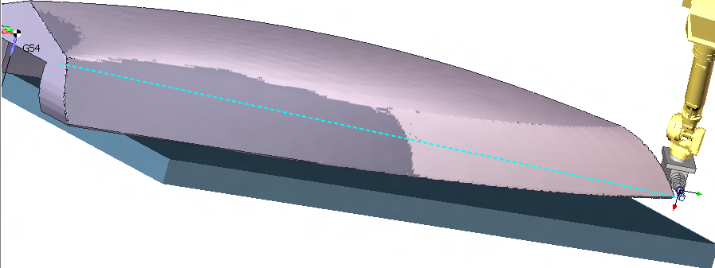
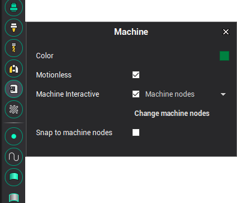
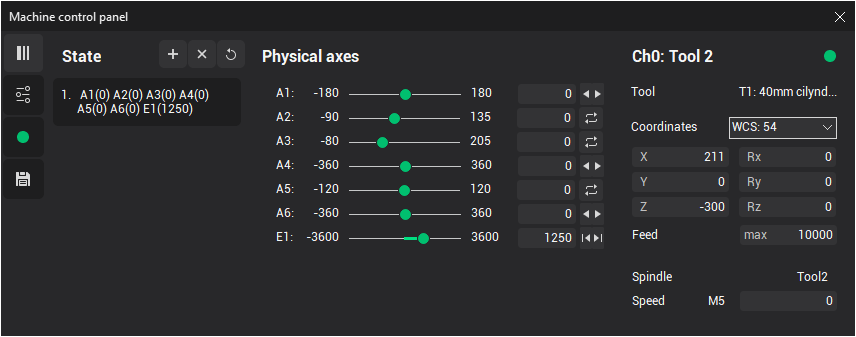
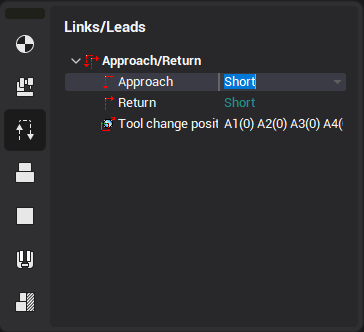
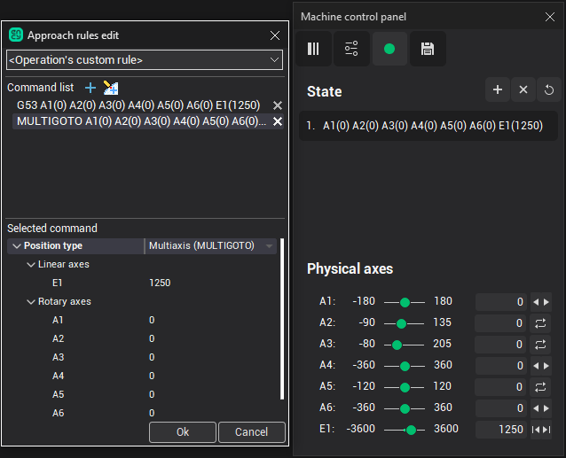

# Programming robot's transitions (obsolete method)

The programming of the robot's transitions between operations is done by specifying the Approach and Return points in the Operation Setup. It can be simply done through the [Motions editing toolbar](353.md) in Simulation mode.

Let's take a look at the following example.

After the operations had been calculated, the simulation has revealed that the transition between two operations gouges the part. To modify the transition the list of intermediate points the robot will pass through should be formed.

The best way of doing it is by using the Machine control panel.

But first, make sure the [Machine](10009.md) [Interactive](10009.md) mode is enabled.

At the **Simulation** tab select the last command of the first operation (5D Contouring) as shown in the picture below. To define the first control point drag the tool to the desired position with the mouse.

Then hit the **States panel visibility** button in the [Machine control panel](10008.md) to save the position into the memory.

Then repeat the steps to remember the rest of the intermediate transition points.

After that switch to the **Technology** tab, activate the first (5D Contour) operation in the job tree, and select `Custom...` from the Return parameter drop-down at the Operation Setup as shown in the picture below.

Ensure the **Machine control panel** is open. Select the first remembered control point in the Machine control panel. The robot should be positioned to the remembered state. Then press the **Add current state** button in the `Approach/return points list edit` window to add the current robot position as the return intermediate point as shown in the picture below.

If exact values of axes are not important then control points can be added directly without formation of the list.

Similarly the approach sequence of the second operation (5d Contouring2) can be defined.
