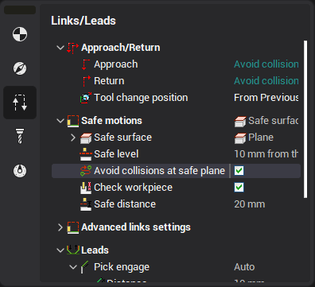
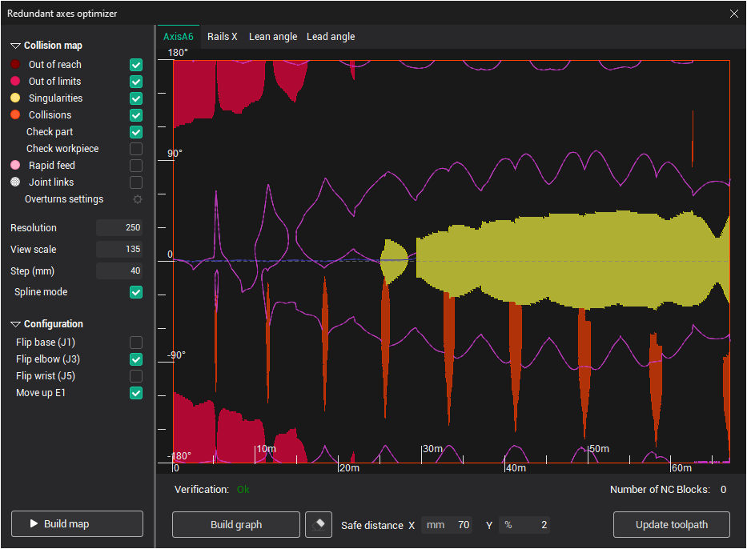
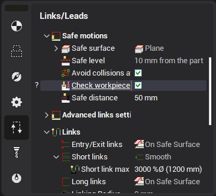
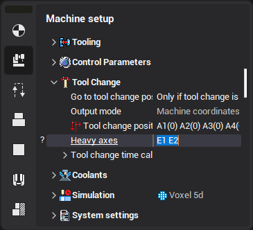

# The planning of the links

CAM system uses the collision avoidance algorithm to plan the rapid tool path between and inside the operations. The algorithm requires the reliable description of the robotic cell, because it is based on the collision checking between the machine nodes.

Switch on the <strong>Avoid collisions at safe plane</strong> to activate the algorithm inside the operation. The parameter <strong>Links safe distance</strong> defines the minimum allowed distance to the collision. This value must be minimal and enough. If it's too small then the tool path is not safe enough. If the safe distance is too long, then the link can not be built or the calculation time will be unacceptable.

## Supported operations

This option is available currently only for robots in the following operations (and their descendant operations, if not intentionally disabled):

- [Morph](10138.md)
- [Rotary finishing](10136.md)
- [5D Surfacing](10135.md)
- [5D contour and 6D contour](10129.md)
- [Welding 5D and Welding 6D](10271.md)
- [5D by meshes](10142.md)

## Link start and end points

It's important to assure that the start and end point of a link is located out of collision, else the incorrect tool path will be generated. It can be done with the extra axes optimizer. The grayed zones of the map are corresponding to the links. The restrictions are not shown in these zones. So the spline have to avoid all collisions.

## Workpiece collisions

By default, the algorithm only accounts for the part when checking collisions. To enable the collision avoidance between tool (or machine) and the workpiece, use the <strong>Check workpiece</strong> option.

## Exclude axes movement

The collision avoidance algorithm uses all the axes of the machine to search the way from start to the end point. If you want to exclude or minimize the motions by some axes, then these axes must be enumerated in the list of heavy axes of machine. If the link requires the motion by the heavy axes, then it's performed in 3 stages: The first is the motion to the tool change position, after that the motion of heavy axes and then the motion to the end point.

