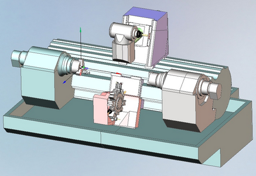
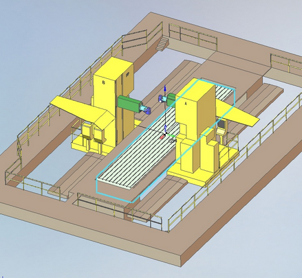
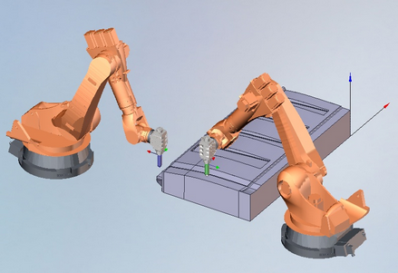
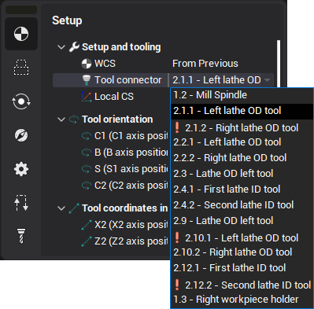
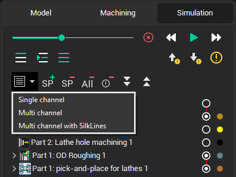
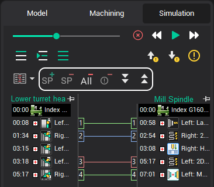
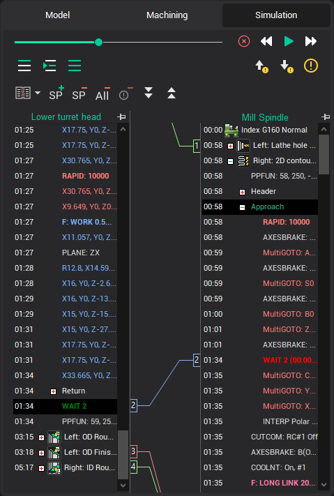

# Multi Task  Machining

Multitask machines (MTM) allow to work by few tools simultaneously. MTM can be very different. For example, a multi-task turn-milling center has few spindles or/and turret heads inside one housing. Sometimes a multi-task machine is two or more identical machines that work under one workpiece.

| multi-task turn-milling center |  |
|---|---|
| multi-task milling machine |  |
| two robots, working together |  |

With multitask machining every tool is controlled by it's own program. This program is called as channel of control. So the multitask machine has more than one channel. Sometime the task of program of multitask machine can be presented as a creation of the separate unrelated projects for every channel. This simplified approach is unacceptable if we must consider the results of one channel in another one, or if the channels work together in one place.

CAM system gives the possibility to program multichannel machines. To activate these features it's necessary to[load the kinematic scheme](341.md) of the multichannel machine. The standard package has the schema for the multichannel turn-milling center Index G160 and schema for double FPT milling machine. It's enough to test CAM system. Contact your dealer if you need the schema of your own equipment.

On the "Technology" page the programming process of the multichannel machine is the same like the process of programming single channel machine. User have to understand that the definition of the operation tool holder defines the channel of machining. User have to think about equal machining time for every channel.

On the "Simulation" page for the multitask machines there is the button to choose the simulation mode:

In the single channel mode the simulation is performed in series operation by operation. It this mode it is comfortable to analyze the tool path of a separate operation without care about other channels.

In multichannel mode the simulation is executed simultaneously in every channel like it will be executed on the real equipment. It this mode it's comfortable to check for the collisions with the taking care about motions in all channels. Detected collisions can be eliminated by the adding of sync points.

Multichannel mode with Silk lines is comfortable to add, remove and edit the sync points.

Sync points

The sync point suspends the execution of one channel until another channel will arrive the certain block. In many CNC the sync points are coded by M-codes. So if the M500 means the sync point, it must be written in more than 1 channel. The channel that arrives M500 first, will suspends the execution and wait until another channel arrives the same sync point. After that the both channels start to execute the next commands together.

The next buttons are used to insert or remove the sync points in CAM system.

To add the sync point, choose the commands that have to start together in every channel and press button "Add sync point". The "WAIT" will be inserted before the selected commands. In the channel, where the estimated time till the point is less, the WAIT will be written by red and the waiting time will be written in braces.

The list of sync points is the attribute of a project, not the attribute of operation. It gives the possibility to restore the sync points after the tool path recalculation. The restoring is based on the information about machine position. So the point will be restored correctly after the feed rate changing or after the approximation tolerance changing or after another changes, that don't affect the tool path too much. if the tool path was changed too much, then we recommend to reinsert the sync points.

To remove the sync point it's necessary to choose the "WAIT" command in any channel and click button "Delete sync point".

If some operation was deleted, disabled or moved after the insertion of sync points, then the situation is possible when a sync point can't be restored in every channel. These points are marked as "invalid". All invalid sync points can be removed by button "Delete invalid sync points".

To remove all sync points use the button "Delete all sync points".

See example of MTM using on YouTube:

[https://www.youtube.com/watch?v=52WkyXPuxEU](https://www.youtube.com/watch?v=52WkyXPuxEU)
