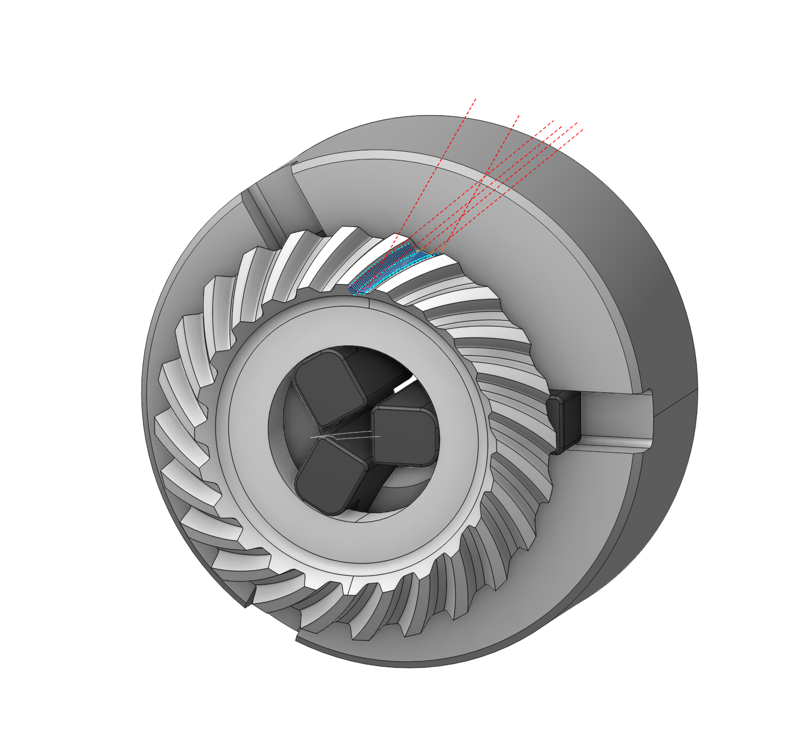
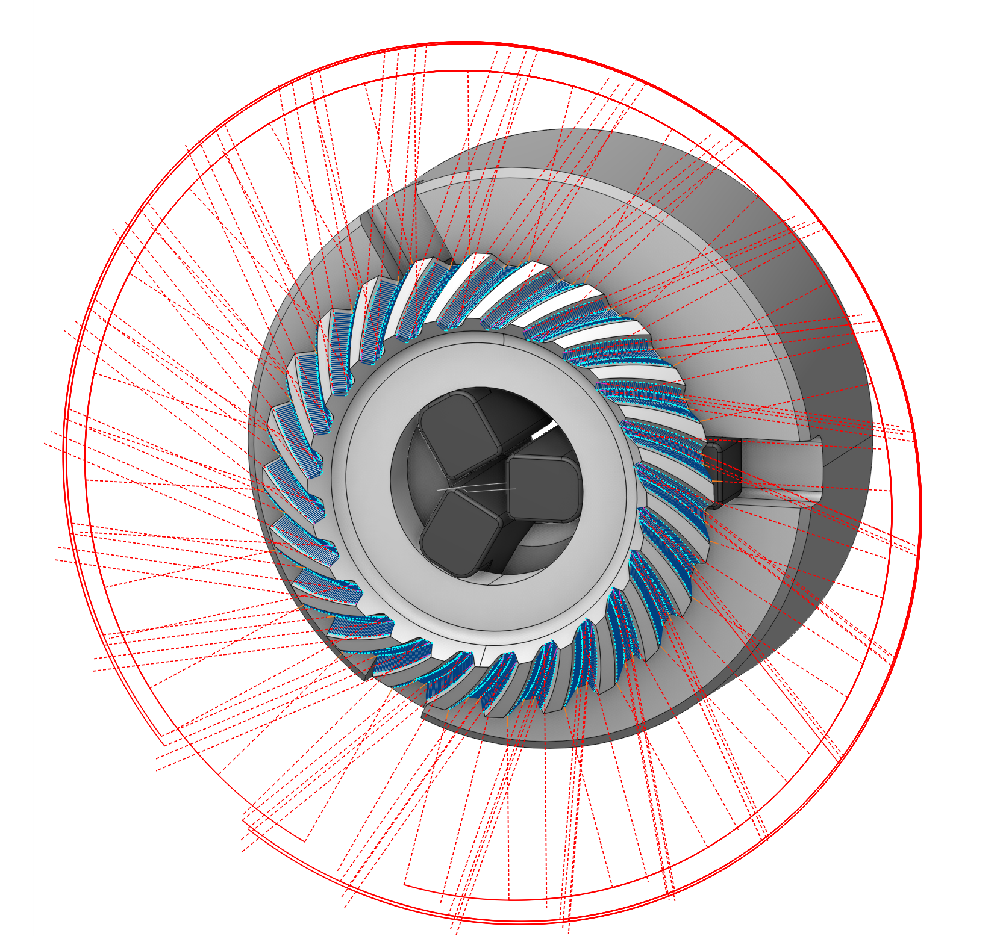

# Multiply Group

 

## Application area:

In this group, copying methods for trajectories are defined, which are then inherited by operations within this group. This approach allows operations to process individual detail elements, while the group ensures their automatic propagation to all standard elements according to established rules. The copying is carried out according to the rules of the Transformation tab. To sort operations, use <strong>Sequencing mode.</strong> [Details](1029.md)

## Setup:

The <strong>Setup</strong> tab is used to configure the primary parameters of the project. This can involve the positioning of the part on the equipment, the coordinate system of the part, and more. [Details](1022.md)

## Transformations:

Parameter's kit of operation, which allow to execute converting of coordinates for calculated within operation the trajectory of the tool. [Details](10168.md)
