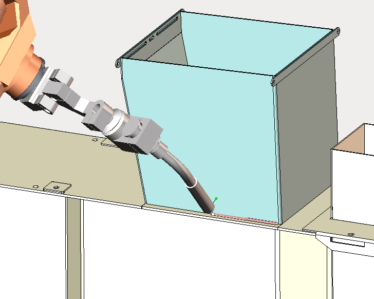
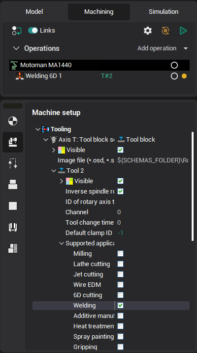

# Welding



To work with welding equipment is currently designed a [universal welding operation 5D](10271.md). It implements the functionality of automatic weld seam geometry calculation without reference to the particular type of welding equipment, ie it does not generate the specific commands to the laser, electric arc, gas burners, ultrasonic emitters etc.

In order for the welding operation has become available for the creation should be chosen machine or a robot that supports this type of machining. To ensure support of welding in machine settings need to be set for the tool holder corresponding checkbox as shown below.



Or you can write to the machine scheme for the tool holder lines similar to the following.

```
<SCType ID="WeldingToolHolder" Caption="Welding tool holder" Type="TToolHolderNode">
<SupportedToolTypes>
<Welder DefaultValue="true"/>
</SupportedToolTypes>
</SCType>
```

Setting up of operation to work with specific type of equipment can be made by writing in the postprocessor appropriate commands to control the equipment, or, if this is not enough, by the addition of a special operation on the basis of the Welding 5D operation, adapted to control specific equipment.
