# Welding 5D and Welding 6D

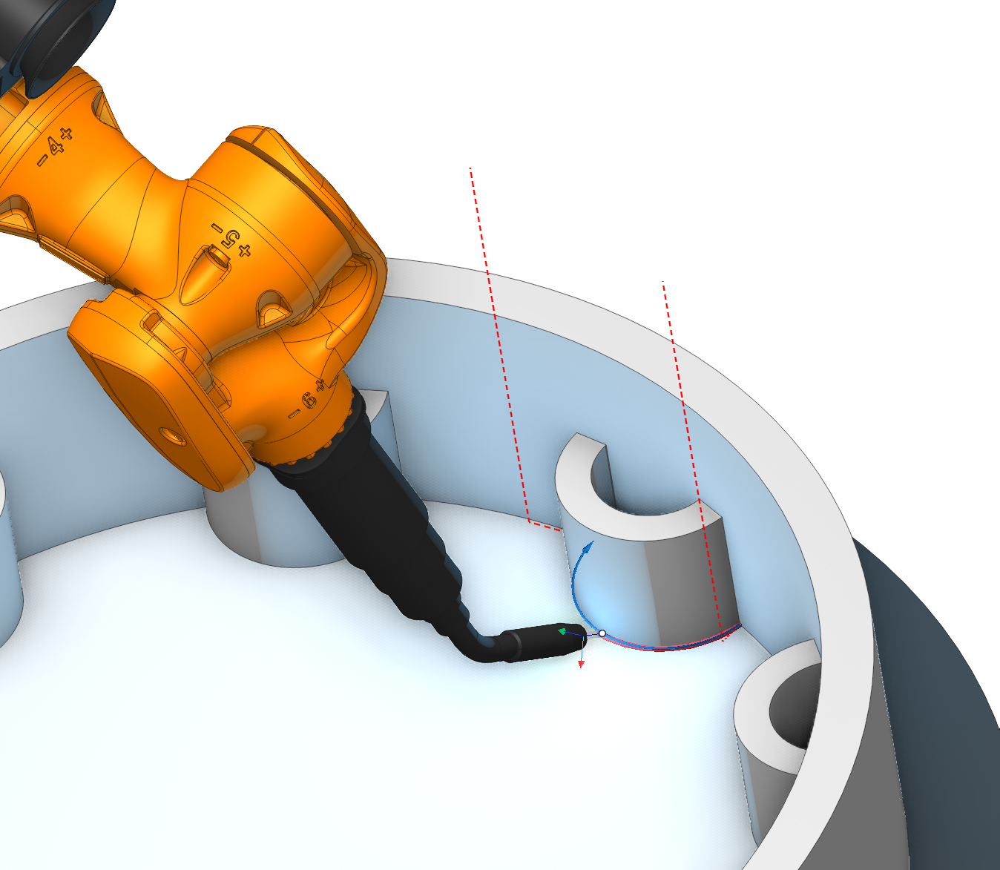

## Application area:

The Welding 5D and Welding 6D operations calculate the geometry of a weld seam automatically, without reference to a particular type of welding equipment. The operations do not generate equipment-specific commands to the laser, electric arc, gas burner, ultrasonic emitter, and so on; they produce the toolpath and the tool orientation along the seam.

The operations are used in the following cases:

- Continuous and intermittent welding of seams defined along edges between joined parts.
- Robotic and multi-axis welding, where the tool orientation must be maintained relative to the adjacent walls of the joint.
- Processes that require a specific stitch pattern (stitch, tack, or spot), configured through the Welding type parameter of Welding 6D.

Switch to the <strong>Simulation mode</strong> to visualize material deposition at the point where the welding head tip contacts the workpiece. The simulated layer thickness is determined by the tool's working length property; if this property is not defined or its value exceeds the tool diameter, the layer thickness equals the tool diameter.

The <strong>Effector On/Off</strong> command turns <strong>welding on and off.</strong> The command is set when the <strong>simulation type</strong> ([Details](100112.md)) is additive or paint, according to the selected <strong>Effective Feeds</strong>. For <strong>additive</strong> operations and <strong>welding</strong>, the command is set to automatic. [Details](https://docs.encycam.com/Inp/2/en/142669108.html)

### Setup:

The <strong>Setup</strong> tab is used to configure the primary parameters of the project. This can involve the positioning of the part on the equipment, the coordinate system of the part, and more. [Details](1022.md)

### Job assignment:

<strong>Weld seam.</strong> To define the welding path, it is sufficient to specify the edge between the welded parts. The system then automatically calculates the weld head orientation angles for each point along the generated curve. The calculation ensures that the weld head is positioned as close as possible to the centre of the gap between the adjacent walls of the welded components, while simultaneously preventing any collision with the walls.

<strong>5d Curve.</strong> The system generates the 5-axis tool path as the projection of the arbitrary curves on the part surface. In this case the tool contact point will move in touch with the surface. The passes can be shifted from the curve by the stock or by the levels. The tool axis is located perpendicular to the surface. [Details](10131.md)

<strong>Properties.</strong> Displays the properties of an element. It is possible to add the stock. You can also call this menu by double clicking on an item in the list.

<strong>Delete.</strong> Removes an item from the list

<strong>Restrictions.</strong> It allows you to restrict areas that should not be machined. [Details](101231.md)

### Strategy:

#### Tool contact point.

Tool Contact Point (TCP) is a specific location on a cutting tool that defines the primary interaction point between the tool and the workpiece surface or geometric entities during machining operations.

The parameters of this group are the same as in the <strong>5D Surfacing operation</strong>. [Details.](10135.md)

#### Multipass.

Enables welding of the seam in several passes.

Click here to expand..

<strong>Pass count.</strong> The number of passes for all weld seams in the operation. It's possible to define this parameter separately for every weld seam on the job assignment page.

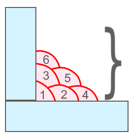

<strong>Pass.</strong> The parameters of the separate pass

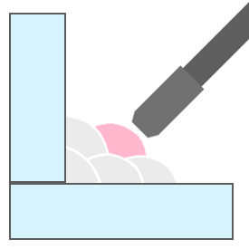

<strong>Axial offset.</strong> The distance from the main edge to the pass along the tool axis.

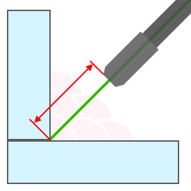

<strong>Side offset.</strong> Offset to side from edge to pass.

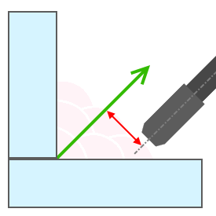

<strong>Lean offset.</strong> The additional inclination of the tool axis from the main direction.

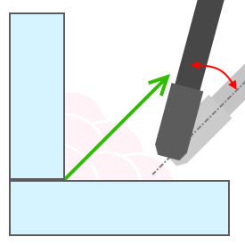

<strong>Offset return.</strong> Defines the return offset between passes.

#### Sorting.

Controls the sequence of toolpath passes during surface machining.

Click here to expand..

<strong>Start Point.</strong> Activating the flag permits the input of coordinates marking the starting point of working passes in surface machining.

 

<strong>Idling minimization.</strong> The order of the profiles machining is sorted to minimize the idle motions. Parameters of this feature are the same as in the <strong>2D Contouring operation</strong>. [Details.](404.md)

<strong>Machining direction.</strong> Сan be assigned in almost all operations, except for the curve machining operations. This allows the user to control the required milling type (climb or conventional) during the toolpath calculation process.

<strong>Climb.</strong> In machining refers to a cutting strategy where the tool moves in the same direction as the rotation of the workpiece. It typically results in less tool wear and a smoother finish compared to "Conventional" cutting, where the tool moves against the rotation of the workpiece. Climb cutting is often preferred when precision and surface finish are critical.

<strong>Conventional.</strong> Cutting in machining refers to a strategy where the tool moves against the rotation of the workpiece. This cutting method is used in machining operations, but it can result in more tool wear and a rougher finish compared to "Climb" cutting, where the tool moves in the same direction as the workpiece rotation. Conventional cutting is sometimes chosen when other factors, such as tool life or chip evacuation, are more important than surface finish.

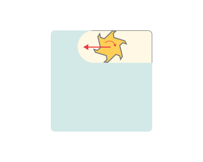

<strong>Both.</strong> Refers to the practice of using both "Climb" and "Conventional" cutting strategies during a machining operation. This approach can be employed to optimize tool performance, surface finish, and other machining factors depending on the specific requirements of different parts of the workpiece or different stages of the machining process. It allows for greater flexibility and control in achieving desired results in machining.

#### Tool orientation.

Controls tool axis orientation. The principal parameters of this function are the same as in the 5D Surfacing operation. [Details.](10135.md)

#### Welding type.

Selects the welding process type.

Click here to expand..

<strong>Seam welding.</strong> Continuous welding along the curve.

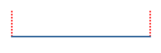

<strong>Stitch welding.</strong> Intermittent welding by stitches.

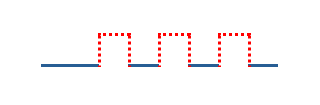

<strong>Tack welding.</strong> Small temporary welds that hold the parts together.

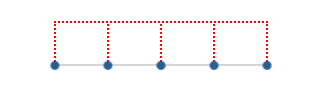

<strong>Spot welding.</strong> Welding at discrete points.

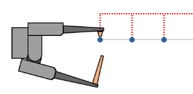

Here are the key parameters, the set of which may vary depending on the chosen <strong>Welding type.</strong>

<strong>Stitch length.</strong> Length of a single stitch.

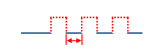

<strong>Start stitch length.</strong> Length of the first stitch.

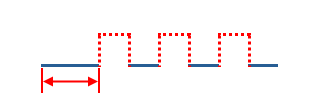

<strong>End stitch length.</strong> Length of the last stitch.

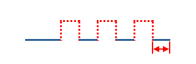

<strong>Spacing size.</strong> Defines how the spacing between stitches is set.

<strong>ISO spacing length.</strong> The size of the spacing itself is set.

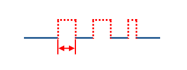

<strong>AWS center to center.</strong> Sets the distance between the centers of the stitches.

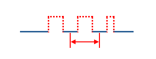

<strong>Even (stitch count).</strong> The number of stitches is set; the spacings are distributed evenly over the remaining length.

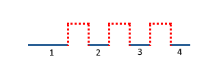

<strong>Spacing length, Center to center distance, Stitches count.</strong> The numeric value of the spacing, entered in the field below <strong>Spacing size</strong>. The meaning of the value depends on the selected <strong>Spacing size mode</strong>: for <strong>ISO spacing length</strong> it is the <strong>length</strong> of the gap between adjacent stitches; for <strong>AWS center to center</strong> it is the distance between the centers of adjacent stitches; for <strong>Even (stitch count)</strong> it is the number of stitches.

<strong>Adjustment.</strong> Alignment of the stitches along the contour.

<strong>from start.</strong>

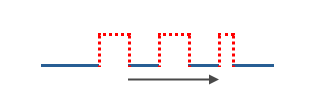

<strong>from center.</strong>

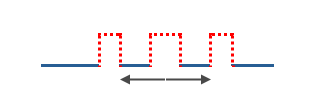

<strong>from end.</strong>

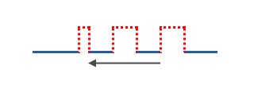

<strong>Auto resize spacing.</strong> The spacing between stitches is adjusted automatically so that whole stitches fit the contour length without a remainder, keeping the stitch length as specified.

<strong>Additional shift.</strong> Additional displacement of the stitches along the contour.

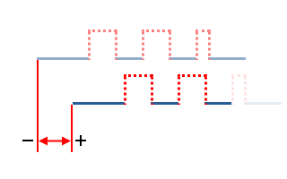

<strong>Invert stitches.</strong> Inverts the distribution of the stitches along the contour.

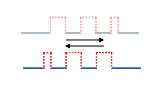

<strong>Retract distance.</strong> Distance of axial retraction from the contour at the transition between stitches.

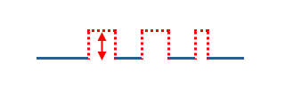

<strong>Points step.</strong> Step between points.

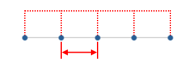

<strong>Delay at point.</strong> Dwell time at each point, in seconds.

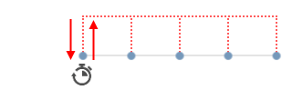

<strong>Effector axis id.</strong> ID of the machine axis that is the axis of the working body — the welding clamp.

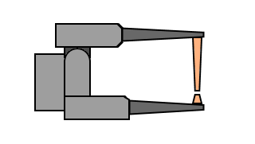

<strong>Value when off.</strong> Axis value in the off state.

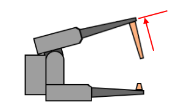

<strong>Value when On.</strong> Axis value in the on state.

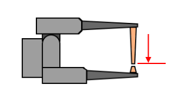

<strong>Pullback.</strong> When enabled, the tool travels back along the finished weld by a configurable distance before it lifts off, so residual energy stays over already-welded material and does not mark the clean surface — useful for laser welding, where the beam may not switch off instantly.

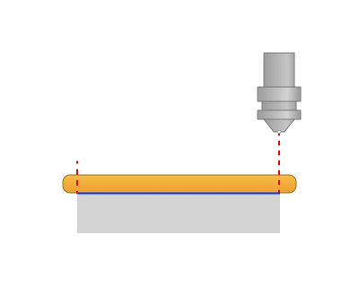 

<strong>Pullback distance.</strong> The distance the tool travels back along the finished weld, measured from the weld end point in the direction opposite to the welding direction.

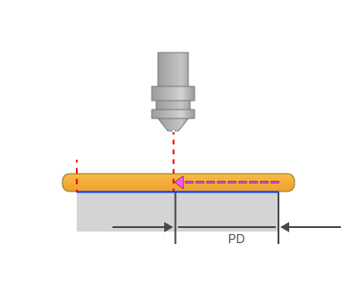

<strong>PD -</strong> Pullback distance

<strong>Dwell time.</strong> The dwell (hold) time at the pullback point before the tool lifts off, allowing the energy source to switch off fully while the tool is positioned over already-welded material.

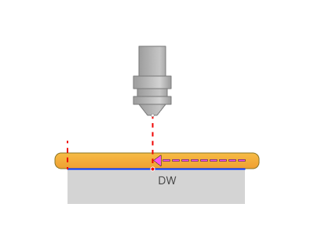

<strong>DW</strong> - Dwell time

#### Trimming.

Allows for the skipping of surfaces not intended for machining and allows for the extension of the toolpath.

Click here to expand..

<strong>Extend (+)/Trim (-) passes.</strong> With this setting, users can extend or trim the initial and final segments of the toolpath.

__Trim_(-)_passes.png)

<strong>Start</strong>. Entering a positive value, the system extends the start of the working passes of the toolpath by the specified amount. Entering a negative value shortens the beginning of the passes.

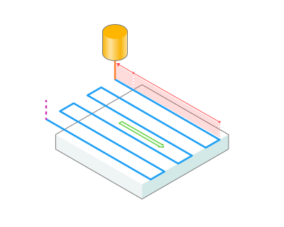

<strong>End</strong>. Entering a positive value, the system extends the end of the working passes of the toolpath by the specified amount. Entering a negative value shortens the end of the passes.

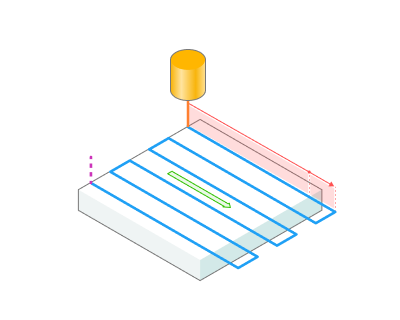

### Parameters:

This tab contains the main parameters for controlling the part, workpiece, fixture and other items, which allow you to change the trajectory. [Details](100112.md)

### Links/Leads:

In the Links/Leads tab, you define the parameters for rapid movements. These movements include tool approach from the tool change position, engage to the start of the working stroke, retraction after the final cutting motion, transitions between working passes, and return to the tool change point. You can configure the sequence of movements along the coordinates, the trajectory of these motions, and the magnitude of displacements.

Click here to expand..

<strong>Сonsists of:</strong>

<strong>Approach/Return.</strong> This group of parameters manages the tool movements from the tool change position to the start of the engage toolpathes, and back. [Details](100116.md).

<strong>Links.</strong> Defines the rules governing Entry/Exit links and links between work moves. [Details](100130.md).

<strong>Leads.</strong> Allows you to add additional engage and retract to the working moves using their feed. [Details](100136.md).

<strong>Safe motions.</strong> Defines the type of <strong>Safety Surface</strong> and the distance from the workpiece to it. This surface facilitates transitions between the processed surfaces or tool paths, and the first stage of approach or return occurs toward it. [Details](100117.md).

<strong>Advanced links settings.</strong> This group of parameters specifies the features of trajectory formation for primarily five-axis operations, considering optimal movements of rotational axes. [Details](100118.md).

<strong>Distances.</strong> Distances used in Links rules [Details](100140.md).

### Feeds/Speeds:

Using this dialogue the user can define the spindle rotation speed; the rapid feed value and the feed values for different areas of the toolpath. Spindle rotation speed can be defined as either the rotations per minute or the cutting speed. The defining value will be underlined. The second value will be recalculated relative to the defining value, with regard to the tool diameter. [Details](100142.md)

### Transformations:

Parameter's kit of operation, which allow to execute converting of coordinates for calculated within operation the trajectory of the tool. [Details](10168.md)

### Part:

A Part is a group of geometrical elements that defines the space to check for gouges. [Details](330.md)

### Workpiece:

A workpiece model of an operation defines the material to be machined. [Details](738.md)

### Fixtures:

As the Fixtures the fixing aids such as chucks, grips, clamps, etc., and the restriction areas of any other nature are usually specified. [Details](10283.md)
