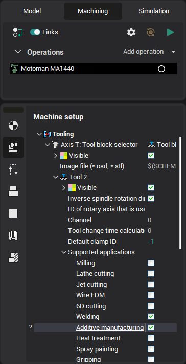

# Additive manufacturing

Additive manufacturing differs from the cutting process because the material is added to the workpiece instead of removing in the point of tool action. Cladding - a particular case of additive manufacturing which consist of melting the additional layer of metal or alloy on the surface of the workpiece. It allows, for example, to build on the surface of the workpiece the layer of material having specific characteristics: high hardness, strength, wear resistance, anti-friction properties, corrosion and heat resistance, etc. It allows also to restore the geometric dimensions of costly parts and tools, to repair blades, dies, molds, gears, shafts, etc.

Key features of cladding process are:

- minimal penetration into the base metal;
- minimal mixing of the added layer with the base metal;
- minimum of residual stresses and deformations in action zone;
- the size of stocks for the following machining can be reduced significantly.

There are different kinds of cladding.

- Manual arc welding with coated electrodes.
- Submerged arc welding by wires and ribbons.
- Arc welding by flux cored wire.
- Electroslag welding.
- Plasma surfacing.
- Laser cladding.
- Electron beam welding
- Induction cladding

Additive operations implemented in the CAM are universal, not tied to a particular cladding technology and type of used equipment. They only implement a geometry of the process, generate toolpath, which successively, layer by layer passes over specified surfaces, and reproduces them from the bottom upwards. Setting up of operation to work with specific type of equipment can be made by writing in the postprocessor appropriate commands to control the equipment, or, if this is not enough, by the addition of a special operation on the basis of the universal additive operations, adapted to control specific equipment.

In order for the additive operations has become available for the creation should be chosen machine or a robot that supports this type of machining. To ensure support of additive operations it is need to set for the tool holder Additive manufacturing checkbox in machine settings as shown below.



Or you can write to the machine scheme for the tool holder lines similar to the following.

```
<SCType ID="AdditiveToolHolder" Caption="Additive tool holder" Type="TToolHolderNode">
<SupportedToolTypes>
<AdditiveTool DefaultValue="true"/>
</SupportedToolTypes>
</SCType>
```
