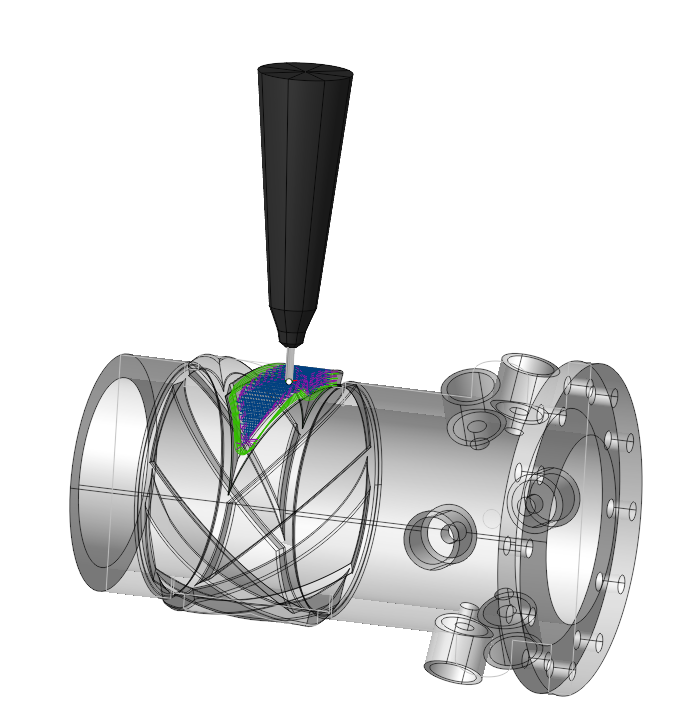

# Area cladding

## Application Area:

This operation deposits material onto an area enclosed by curves in the part. The user interface and job assignment of the operation is similar to the [Pocketing](256.md) operation.

The operation proceeds in several stages. Initially, select the base surface, on which cladding will be performed. To do this, click on "Base surface" button and then select desired surface on the screen. It can be plane, cylinder or body of revolution. The system automatically fills needed options, but if desired you can adjust the properties of the base surface, and then click "Yes." Now, to specify the local area, select the curves on the screen or edges of 3D model along the perimeter of desired area and add them by clicking "Add boss" button. Similarly pockets (holes) may be add into the previously created bosses. To limit the upper and lower levels you should select on the screen any geometrical element, lying at the desired level, and then press the "Top level" or "Bottom level" button respectively. The upper and lower levels you can set also by numerical values in the Properties inspector window.

### Job Assignment:

<strong>Base Surface.</strong> This is the surface on which the trajectory is constructed according to the curve projected onto it. [Details](10156.md)

<strong>Add Boss.</strong> Select the closed curve inside which to deposit the material. [Details](806.md)

<strong>Add Pocket.</strong> Select the closed curve outside of which the material should be deposited. This task only functions if a <strong>Boss</strong> is also specified in the <strong>Job Assignment</strong>. [Details](806.md)

<strong>Add Inversion.</strong> Indicates a closed area, inside which the machining rules will be reversed, i.e. processed areas will become unprocessed and vice versa. [Details](806.md)

<strong>Top Level.</strong> Specifying the top level of material deposition by model elements. [Details](10153.md)

<strong>Bottom Level.</strong> Specifying the bottom level of material deposition by model elements. [Details](10153.md)

<strong>Properties.</strong> Displays the properties of an element. It is possible to add the stock. You can also call this menu by double clicking on an item in the list. You can also modify the task type. When changing the task type to <strong>Ridge</strong> or <strong>Ditch</strong>, specify the <strong>Stock</strong> to define the element's thickness or width. [Details](806.md)

<strong>Delete.</strong> Removes an item from the list.

### Strategy:

#### Machining Strategy.

This parameter allows the user to achieve a required toolpath:

Click here to expand..

<strong>Type of Strategy:</strong>

<strong>Parallel</strong>. Fill the area within the <strong>Job Assignment</strong> using linear tool passes at a specified <strong>Angle</strong> to the chosen axis.

<strong>Offset</strong>. The tool paths are the lines equidistant to the curves of the <strong>Job Assignment</strong>.

<strong>Step</strong>. It is the distance between the tool passes measured along the <strong>Base Surface</strong>.

<strong>Parallel Passes Stock</strong>. The system extends the processing area outward from the selected curve (with a positive parameter value) or inward (with a negative parameter value).

<strong>Smooth Radius.</strong> The system rounds the internal corners in the processing area with the specified radius.

Gap to Prevent Overlapping. When processing a closed contour, leave a gap at the junction of the start and end of the contour to prevent layer overlap. The gap should be approximately equal to the diameter of the melting spot.

<strong>Angle</strong>. It is t he angle between the X-axis in the selected coordinate system and the tool path direction in the <strong>Parallel</strong> strategy.

<strong>Number of Fill Repetitions</strong>. The count of a dditional tool passes on each layer.

<strong>Angular Step</strong>. The angle of the additional pass relative to the preceding pass.

<strong>Turn Angle Between Layers</strong>. The angle for tool passes on the current layer in relation to the preceding layer.

<strong>Offset Pass Count.</strong> The tool passes count along the <strong>Job Assignment</strong> contour. If the count is more than one, the system generates equidistant paths with the defined <strong>Offset Pass Step</strong>. Allows to enhance the quality of the outer surface.

<strong>Offset Pass Step</strong>. The distance between equidistant passes in the toolpath along the <strong>Job Assignment</strong> contour.

<strong>Passes Order</strong>. Defines the order of passes at level from outside to inside or conversely. If <strong>Zigzag</strong> is selected then the order will change from level to level.

<strong>Parallel Passes Sorting</strong>. Controls the order of work passes during multi-area cladding.

<strong>By Regions</strong>. When filling each layer, the system forms each area separately from the others.

<strong>Sequentally</strong>. When the work pass covers multiple areas, cladding happens in several areas during a single pass.

Machining direction. Specifies the direction of tool paths.

<strong>Forward.</strong> With the <strong>Parallel</strong> strategy, tool passes follow the <strong>Angle</strong>. With the <strong>Offset</strong> strategy, the path proceeds counterclockwise.

<strong>Backward.</strong> With the <strong>Parallel</strong> strategy, tool passes oppose the <strong>Angle</strong>. With the <strong>Offset</strong> strategy, the path proceeds clockwise.

<strong>Zigzag</strong>. Tool passes alternate direction with each string.

<strong>Fill Thin Zones.</strong> With the flag enabled, the system attempts to fill gaps left unfilled by the given step size.

#### Machining levels:

It defines the range along tool axis for the machining.

Click here to expand..

<strong>Top Level.</strong> The level at which the final pass is made.

<strong>Bottom Level.</strong> Drag the plane with the mouse or drag the plane centre circle and use 'Smart snap' to align with a feature or, click on the dimension in the graph view to set the desired bottom level for machining. If the text in the field is green in colour, the level is calculated automatically as the top of the part, wokpiece and fixtures. To return to the automatic mode, simply clear the field and press 'Enter'.

<strong>Depth Step</strong>. Material cladded in one pass along the tool axis between the <strong>Top</strong> and <strong>Bottom levels</strong>.

Initial depth. The depth of first level.

<strong>Side Angle.</strong> The slope angle of the deposited surface walls.

#### Trimming:

Allows for the skipping of surfaces not intended for machining and allows for the extension of the toolpath. The parameters of <strong>Trimming</strong> are the same as in the <strong>Waterline Roughing operation</strong>. [Details.](736.md)

#### Transformations.

A dialogue for transforming the toolpath. The parameters of <strong>Transformations</strong> are the same as in the <strong>2D Contouring operation</strong>. [Details.](404.md)

### Parameters:

This tab contains the main parameters for controlling the part, workpiece, fixture and other items, which allow you to change the trajectory. [Details](100112.md)

### Links/Leads:

In the Links/Leads tab, you define the parameters for rapid movements. These movements include tool approach from the tool change position, engage to the start of the working stroke, retraction after the final cutting motion, transitions between working passes, and return to the tool change point. You can configure the sequence of movements along the coordinates, the trajectory of these motions, and the magnitude of displacements.

Click here to expand..

<strong>Сonsists of:</strong>

<strong>Approach/Return.</strong> This group of parameters manages the tool movements from the tool change position to the start of the engage toolpathes, and back. [Details](100116.md).

<strong>Links.</strong> Defines the rules governing Entry/Exit links and links between work moves. [Details](157862569.md).

<strong>Leads.</strong> Allows you to add additional engage and retract to the working moves using their feed. [Details](100149.md).

<strong>Safe motions.</strong> Defines the type of <strong>Safety Surface</strong> and the distance from the workpiece to it. This surface facilitates transitions between the processed surfaces or tool paths, and the first stage of approach or return occurs toward it. [Details](100117.md).

<strong>Advanced links settings.</strong> This group of parameters specifies the features of trajectory formation for primarily five-axis operations, considering optimal movements of rotational axes. [Details](100118.md).

<strong>Distances.</strong> Distances used in Links rules [Details](100140.md).

### Transformations:

Parameter's kit of operation, which allow to execute converting of coordinates for calculated within operation the trajectory of the tool. [Details](10168.md)

### Part:

A Part is a group of geometrical elements that defines the space to check for gouges. [Details](330.md)

### Workpiece:

A workpiece model of an operation defines the material to be machined. [Details](738.md)

### Fixtures:

As the Fixtures the fixing aids such as chucks, grips, clamps, etc., and the restriction areas of any other nature are usually specified. [Details](10283.md)
