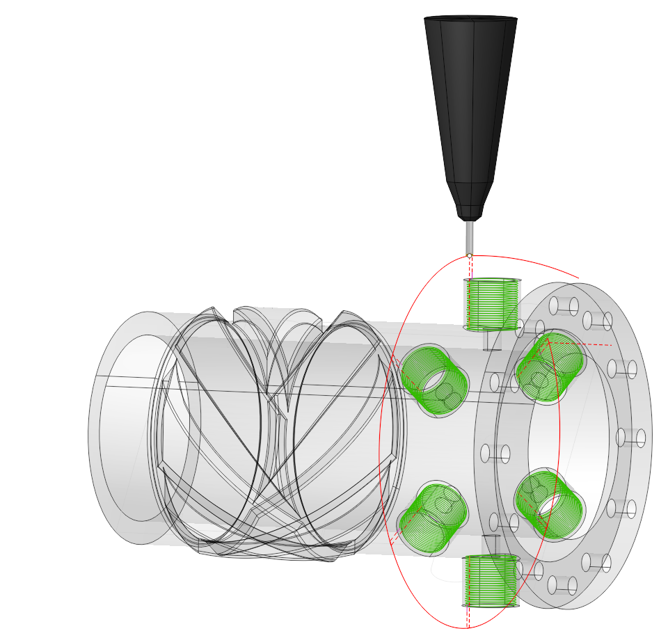

# Curve cladding

## Application Area:

Additive operations that generates toolpath along curves defined inside job assignment from the bottom to top. It is useful for thin-walled models. Source curves can be placed on a plane, cylinder or body of revolution. And when the "Project toolpath onto the part" option is enabled, cladding in general can be made on the surface of an arbitrary shape. It can generate layer by layer like toolpath or helix spiral.

The operation proceeds in several stages. Initially, specify a base surface on which cladding will be performed. To do this, click on "Base surface" button and then select desired surface on the screen. It can be plane, cylinder or body of revolution. The system automatically fills needed options, but if desired you can adjust the properties of the base surface, and then click "Yes." Now, to specify the local geometry, select the curves on the screen or edges of 3D model along the perimeter of desired area and add them by clicking "Curve" button. To limit the upper and lower levels you should select on the screen any geometrical element, lying at the desired level, and then press the "Top level" or "Bottom level" button respectively. The upper and lower levels you can set also by numerical values in the Properties inspector window.

### Job Assignment:

<strong>Base Surface</strong>. This is the surface on which the trajectory is constructed according to the curve projected onto it. [Details](10156.md).

<strong>Curve</strong>. Set the toolpath along the selected curve <strong>.</strong> [Details](707.md).

<strong>Pocket</strong>. A typical prismatic or turn-milling part consists of many simple shapes.To simplify this task, we can recognize the parts elements in a 3d model and automatically convert them to basic job assignment items, such as job zones and machining levels. Selecting the pocket bottom causes the system to automatically use the pocket boundary as the curve and determine the <strong>Top</strong> and <strong>Bottom levels</strong> according to the pocket levels. [Details](10154.md).

<strong>Top Level.</strong> Specifying the top level of material deposition by model elements. [Details](10153.md).

<strong>Bottom Level.</strong> Specifying the bottom level of material deposition by model elements. [Details](10153.md).

<strong>Properties.</strong> Displays the properties of an element. It is possible to add the stock. You can also call this menu by double clicking on an item in the list.

<strong>Delete.</strong> Removes an item from the list.

### Strategy:

#### Machining Levels.

It defines the range along tool axis for the machining. This parameter group works similarly to the <strong>Area Cladding operation</strong>. [Details](10273.md).

#### Helical Machining.

Machining of a contour using a helical motion.

Click here to expand..

<strong>Initial Level.</strong> With the flag set, the first pass occurs along the base surface without helical ascent. Otherwise, the passes proceed along the helical path starting from the initial point.

<strong>Smooth by radius.</strong> When choosing an <strong>Inintial Level</strong>, a smooth transition is created in the area where the slope of the spiral intersects with a flat area.

#### Roughing Passes.

Toolpath is offset in plane by the 'Roughing passes' thickness amount. Additional passes are added to the contour by the value specified in the parameters with the specified number of steps. This parameter group works similarly to the <strong>2D Contouring operation</strong>. [Details](404.md).

#### Corners smoothing.

When there is a sudden change of the tool direction, the milling control performs deceleration before starting the turn, and then accelerates again. This fact can lead to vibrations and high tool and milling machine wear. The problem can be solved if the toolpath has very few or no breaks. For this reason, in the system there is the toolpath smoothing function using the defined radius for machining inner or outer corners of the model. This parameter group works similarly to the <strong>2D Contouring operation</strong>. [Details](404.md).

#### Sorting.

Controls the sequence of toolpath passes during the surface machining. This parameter group works similarly to the <strong>2D Contouring operation</strong>. [Details](404.md).

#### Transformations.

A dialogue for transforming the toolpath. This parameter group works similarly to the <strong>2D Contouring operation</strong>. [Details](404.md). When the <strong>Project toolpaht onto the part</strong> option is active, the initial toolpath formed on the base surface is projected onto the 3D model that is specified as the part of the operation.

### Parameters:

This tab contains the main parameters for controlling the part, workpiece, fixture and other items, which allow you to change the trajectory. [Details](100112.md)

### Links/Leads:

In the Links/Leads tab, you define the parameters for rapid movements. These movements include tool approach from the tool change position, engage to the start of the working stroke, retraction after the final cutting motion, transitions between working passes, and return to the tool change point. You can configure the sequence of movements along the coordinates, the trajectory of these motions, and the magnitude of displacements.

Click here to expand..

<strong>Сonsists of:</strong>

<strong>Approach/Return.</strong> This group of parameters manages the tool movements from the tool change position to the start of the engage toolpathes, and back. [Details](100116.md).

<strong>Links.</strong> Defines the rules governing Entry/Exit links and links between work moves. [Details](157862569.md).

<strong>Leads.</strong> Allows you to add additional engage and retract to the working moves using their feed. [Details](100149.md).

<strong>Safe motions.</strong> Defines the type of <strong>Safety Surface</strong> and the distance from the workpiece to it. This surface facilitates transitions between the processed surfaces or tool paths, and the first stage of approach or return occurs toward it. [Details](100117.md).

<strong>Advanced links settings.</strong> This group of parameters specifies the features of trajectory formation for primarily five-axis operations, considering optimal movements of rotational axes. [Details](100118.md).

<strong>Distances.</strong> Distances used in Links rules [Details](100140.md).

### Transformations:

Parameter's kit of operation, which allow to execute converting of coordinates for calculated within operation the trajectory of the tool. [Details](10168.md).

### Part:

A Part is a group of geometrical elements that defines the space to check for gouges. [Details](330.md)

### Workpiece:

A workpiece model of an operation defines the material to be machined. [Details](738.md)

### Fixtures:

As the Fixtures the fixing aids such as chucks, grips, clamps, etc., and the restriction areas of any other nature are usually specified. [Details](10283.md)
