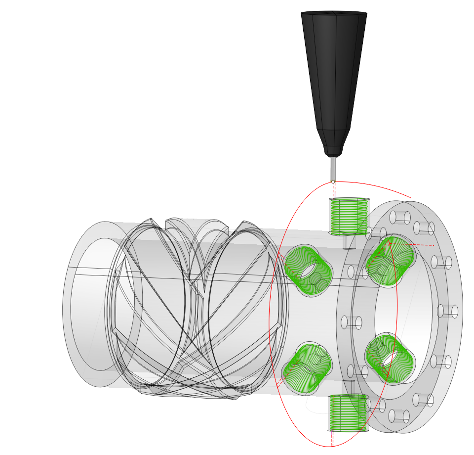

# カーブクラッディング

## 適用分野：

ジョブ割り当て内で定義されたカーブに沿って、下方向から上方向へとツールパスを生成する積層オペレーションです。薄肉モデルに適しています。元となるカーブは、平面、円筒、または回転体上に配置できます。また、「ツールパスをパーツに投影」オプションを有効にすると、任意の形状のサーフェスにクラッディングを行うことができます。レイヤーごとのツールパス、またはらせん形状のツールパスを生成できます。

オペレーションは複数の段階で進行します。最初に、クラッディングを実行する 基準サーフェスを指定します。これを行うには、「基準サーフェス」ボタンをクリックし、画面上で目的のサーフェスを選択します。基準面には、平面、円筒面、または回転体を指定できます。必要なオプションはシステムによって自動的に設定されますが、必要に応じて基準面のプロパティを調整し、「はい」ボタンをクリックします。次に、図形を指定するために、画面上で、目的の領域の外周に沿ったカーブまたは3Dモデルのエッジを選択し、「カーブ」ボタンをクリックして追加します。上限および下限高さを設定するには、画面上で目的の高さに位置する任意の要素を選択し、それぞれ「上部高さ」または「底部高さ」ボタンを押します。上限および下限高さは、プロパティインスペクターウィンドウで数値を入力して設定することもできます。

### ジョブ割り当て：

<strong>基準サーフェス</strong> 投影されたカーブに基づいて、ツールパスを作成する基準サーフェスです。 [詳細を見る](10156.md)

<strong>カーブ</strong> 選択したカーブに沿ってツールパスを設定します。 [詳細を見る](707.md)

<strong>ポケット</strong> 一般的なプリズム形状や旋削・フライス加工のパーツは、多くの単純形状から構成されています。この作業を簡略化するために、3Dモデル内のパーツの要素を認識し、加工領域や加工高さなどの基本的なジョブ割り当て項目に自動変換できます。ポケットの底面を選択すると、システムは自動的にポケットの境界をカーブとして使用し、ポケット深さに基づいて<strong>上部高さ</strong>と<strong>底部高さ</strong>を決定します。 [詳細を見る](10154.md)

<strong>上部高さ</strong> モデル要素を使用して、素材を付加する上限高さを指定します。 [詳細を見る](10153.md)

<strong>底部高さ</strong> モデル要素を使用して、素材を付加する下限高さを指定します。 [詳細を見る](10153.md)

<strong>プロパティ</strong> 要素のプロパティを表示します。ストックを追加することも可能です。リスト内の項目をダブルクリックして、このメニューを開くこともできます。

<strong>削除</strong> リストから項目を削除します。

### 加工設定：

#### 加工高さ：

工具軸に沿った加工範囲を定義します。このパラメーターグループは <strong>エリアクラッディングオペレーション</strong>と同様に機能します。[詳細を見る](10273.md)

#### ヘリカル加工

ヘリカル（らせん状の）動作によって輪郭を加工します。

詳細を表示

<strong>最初の高さ</strong> フラグを有効にすると、最初のパスはヘリカル上昇を行わず、基準サーフェスに沿って実行されます。無効の場合は、パスは開始点から始まり、ヘリカルパスに沿って実行されます。

<strong>半径の円滑化</strong> <strong>最初の高さ</strong> を選択すると、らせんの傾斜部と平坦部が交わる領域に、滑らかな移行部分が生成されます。

#### 荒加工パス

ツールパスは、「荒取りパス」で指定した厚さ分だけ平面にオフセットされます。パラメータで指定した値とステップ数に基づき、輪郭に追加のパスが生成されます。 このパラメータグループは、 <strong>2D輪郭加工</strong>と同様に動作します。[詳細を見る](404.md)

#### コーナーの円滑化

工具の方向が急激に変化する場合、フライス制御は回転開始前に減速し、その後再び加速します。この現象は、振動や工具およびフライス盤の摩耗を大きくする可能性があります。ツールパスの途切れを極力減らすことで、この問題は解決できます。そのため、本システムには、モデルの内側または外側のコーナーを加工する際に、設定された半径を使用してツールパスを滑らかにする機能が搭載されています。このパラメータグループは <strong>2D輪郭加工</strong>と同様に動作します。[詳細を見る](404.md)

#### 並べ替え

サーフェス加工中のツールパスの順序を制御します 。このパラメータグループは<strong>2D輪郭加工</strong>と同様に動作します。[詳細を見る](404.md)

#### 変換：

ツールパスを変換するためのダイアログです。このパラメータグループは<strong>2D輪郭加工</strong>と同様に動作します。[詳細を見る](404.md) <strong>ツールパスをパーツに投影</strong>オプションが有効な場合、基準サーフェス上に生成された初期ツールパスは、オペレーションのパーツとして指定された3Dモデル上に投影されます。

### パラメータ

このタブには、部品、ワーク、治具、およびその他の軌跡に影響を与える要素を制御するための主要なパラメータが含まれており、ツールパスを変更できます。 [詳細を見る](100112.md)

### リンク／リード

リンク／リードタブでは、早送り動作のパラメータを設定します。これらの移動には、工具交換位置からのアプローチ、切削パス開始点までの位置決め、最終切削後の退避動作、各パス間の移行移動、および工具交換位置への復帰が含まれます。座標軸ごとの動作順序、各移動の軌跡、および移動量を設定できます。

詳細を表示

<strong>次の項目で構成されます。</strong>

<strong>アプローチ／リターン</strong> このパラメータグループは、工具交換位置から切込み開始パスへの工具の移動、および戻りの動作を管理します。[詳細を見る](100116.md)

<strong>リンク</strong> 進入／退出リンクおよび加工パス間のリンクに関するルールを設定します。[詳細を見る](157862569.md)

<strong>リード</strong> 移動動作に対して、送り速度を使用して追加の突き込みおよび退避を追加できます。 [詳細を見る](100149.md)

<strong>安全な動作</strong> <strong>安全サーフェス</strong>のタイプとワークから安全サーフェスまでの距離を設定します。加工サーフェスまたはツールパス間の移行を円滑にし、アプローチまたはリターンの最初の段階は、このサーフェスに向かって行われます。[詳細を見る](100117.md)

<strong>高度なリンク設定</strong> ここのパラメータグループは、主に5軸加工において、回転軸の最適な動きを考慮した軌道形成の特徴を指定します。[詳細を見る](100118.md)

<strong>距離</strong> リンクのルールで使われる距離です。 [詳細を見る](100140.md)

### 変換：

[オペレーション内で計算された工具軌跡に対して座標変換を行うためのパラメータグループです 。 詳細を見る](10168.md)

### パーツ：

パーツは、食い込みをチェックする領域を定義する幾何要素のグループです。[詳細を見る](330.md)

### ワーク：

オペレーションのワークモデルは、加工する素材を設定します。[詳細を見る](738.md)

### 治具：

治具には通常、チャック、グリップ、クランプなどの固定補助具と、その他の種類の制限領域を指定します。[詳細を見る](10283.md)
