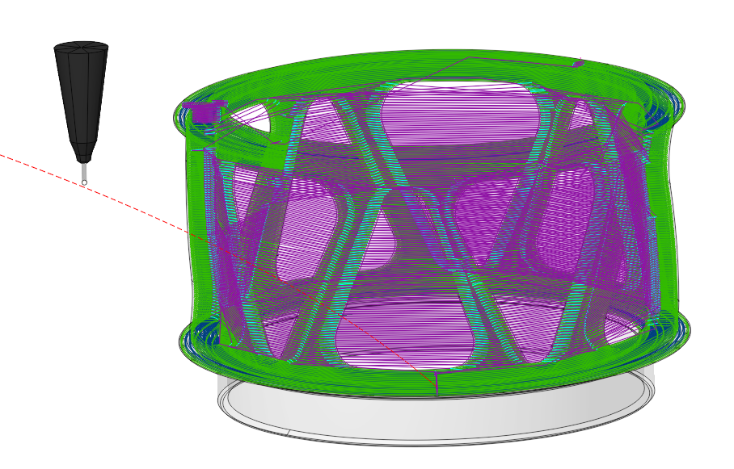

# Cladding 3D

## Application Area:

This is an additive manufacturing operation that uses a 3D model as input. It is similar to <strong>[Roughing Waterline](736.md)</strong> operation except that it works from the bottom to top. It intersects source model layer by layer and generates toolpath to fill calculated intersection area for each level. Operation has Parallel and Offset strategies to fill the area. By default the whole part is the model to machine. If you want to grow local geometry only then you need to add desired faces to the job assignment. System automatically fills top and bottom levels by defined geometry, but if you want to limit the upper and lower levels manually then you should select on the screen any geometrical element, lying at the desired level, and then press the "Top level" or "Bottom level" button respectively. The upper and lower levels you can set also by numerical values in the Properties inspector window.

### Job Assignment:

<strong>Faces.</strong> Select various surfaces of the part that constrain the material fill area. The system will calculate the trajectory based on the chosen surfaces.

<strong>Pocket.</strong> Select the pocket bottom. The system will create the adjacent pocket walls considering the stock specified in the item <strong>Properties</strong>. [Details](10154.md)

<strong>Job Zone.</strong> Select the curves or edges of the part that define the material fill area. [Details](10151.md)

<strong>Restrict Zone.</strong> In addition to <strong>Job Zones</strong> in system you can use <strong>Restrict Zones</strong> to specify the workpiece areas that have not to be machined in the current operation. [Details](10152.md)

<strong>Top Level.</strong> Specifying the top level of material deposition by model elements. [Details](10153.md)

<strong>Bottom Level.</strong> Specifying the bottom level of material deposition by model elements. [Details](10153.md)

<strong>Properties.</strong> Displays the properties of an element. It is possible to add the stock. You can also call this menu by double clicking on an item in the list.

<strong>Delete.</strong> Removes an item from the list.

### Strategy:

#### Machining Strategy.

This parameter group allows the user to achieve a required toolpath. It works similarly to the <strong>Area Cladding operation</strong>. [Details](10273.md).

#### Machining levels:

It defines the range along tool axis for the machining. This parameter group works similarly to the <strong>Area Cladding operation</strong>. [Details](10273.md).

#### Trimming:

Allows for the skipping of surfaces not intended for machining and allows for the extension of the toolpath. The parameters of <strong>Trimming</strong> are the same as in the <strong>Waterline Roughing operation</strong>. [Details.](736.md)

### Parameters:

This tab contains the main parameters for controlling the part, workpiece, fixture and other items, which allow you to change the trajectory. [Details](100112.md)

### Links/Leads:

In the Links/Leads tab, you define the parameters for rapid movements. These movements include tool approach from the tool change position, engage to the start of the working stroke, retraction after the final cutting motion, transitions between working passes, and return to the tool change point. You can configure the sequence of movements along the coordinates, the trajectory of these motions, and the magnitude of displacements.

Click here to expand..

<strong>Сonsists of:</strong>

<strong>Approach/Return.</strong> This group of parameters manages the tool movements from the tool change position to the start of the engage toolpathes, and back. [Details](100116.md).

<strong>Links.</strong> Defines the rules governing Entry/Exit links and links between work moves. [Details](157862569.md).

<strong>Leads.</strong> Allows you to add additional engage and retract to the working moves using their feed. [Details](100149.md).

<strong>Safe motions.</strong> Defines the type of <strong>Safety Surface</strong> and the distance from the workpiece to it. This surface facilitates transitions between the processed surfaces or tool paths, and the first stage of approach or return occurs toward it. [Details](100117.md).

<strong>Advanced links settings.</strong> This group of parameters specifies the features of trajectory formation for primarily five-axis operations, considering optimal movements of rotational axes. [Details](100118.md).

<strong>Distances.</strong> Distances used in Links rules [Details](100140.md).

### Transformations:

Parameter's kit of operation, which allow to execute converting of coordinates for calculated within operation the trajectory of the tool. [Details](10168.md).

### Part:

A Part is a group of geometrical elements that defines the space to check for gouges. [Details](330.md)

### Workpiece:

A workpiece model of an operation defines the material to be machined. [Details](738.md)

### Fixtures:

As the Fixtures the fixing aids such as chucks, grips, clamps, etc., and the restriction areas of any other nature are usually specified. [Details](10283.md)
