# Cladding 5D operation

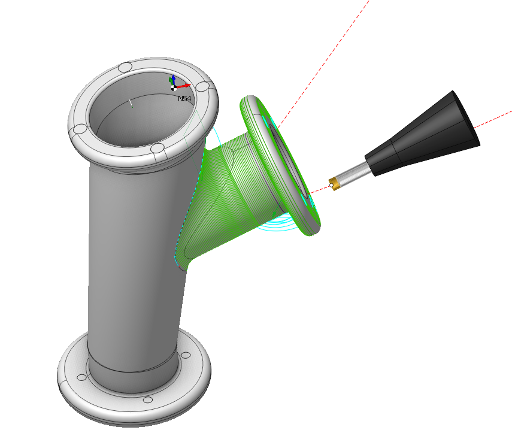

## Application Area:

Operation "Cladding 5D" allows to deposit material layer on the surface of a part using strategies from <strong>[5D Surfacing operation](10135.md)</strong> operation, because this operation is based on it. Generally, this operation uses it as a foundation but employs some new strategies for toolpath constructing and tool orientation planning. It generates intricate spatial forms using 3D models as a basis.

### Job Assignment:

<strong>Machining Surfaces.</strong> Select various surfaces of the part as the working task. The system will calculate the trajectory based on the chosen surfaces.

<strong>First Curve.</strong> For the <strong>Parallel to Curve</strong> strategy, this feature specifies curves for parallel passes computations. Additionally, in the <strong>Morphing Between Two Curves</strong> and <strong>Spiral Between Two curves</strong> strategies, it specifies the <strong>First Curve</strong> <strong>.</strong> You can select one or multiple, not necessarily connected, curves or edges.

<strong>Second Curve.</strong> The system uses it in the <strong>Morphing Between Two Curves</strong> and <strong>Spiral Between Two curves</strong> strategies. It specifies the <strong>Second Curve</strong><strong>.</strong> You can select one or multiple, not necessarily connected, curves or edges.

<strong>Tilt Curve.</strong> This is the curve that the tool axis vector aims at when setting <strong>Tool Orientation</strong> specification <strong>Through Curve.</strong>

<strong>First Surface.</strong> This feature serves as the <strong>First Surface</strong> in a <strong>Morph Between Two Surfaces</strong> and <strong>Spiral Between Two Surfaces</strong> strategies, facilitating the morphing process to create toolpath lines.

<strong>Second Surface.</strong> This feature serves as the <strong>Second Surface</strong> in a <strong>Morph Between Two Surfaces</strong> and <strong><strong>Spiral Between Two Surfaces</strong></strong> strategies, facilitating the morphing process to create toolpath lines.

<strong>Surfaces for projection.</strong> These are the surfaces intended for machining onto which the toolpath transfers when enabling the <strong>Project Toolpath onto the Part</strong> option in the <strong>Strategy</strong> tab.

<strong>Job Zone.</strong> Use the job zone to trim the passes outside the specified 2d containment areas. The plane of the containment area is defined by the initial tool orientation. [Details](10151.md).

<strong>Restrict Zone.</strong> In addition to <strong>Job Zones</strong> in system you can use <strong>Restrict Zones</strong> geometry from curves and edges to specify the workpiece areas that s hould avoid machining in the current operation. [Details](10152.md)

<strong>Properties.</strong> Displays the properties of an element. It is possible to add the stock. You can also call this menu by double clicking on an item in the list.

<strong>Delete.</strong> Removes an item from the list.

### Strategy:

#### Strategy:

This parameter allows the user to achieve a required toolpath:

Click here to expand..

<strong>Type of Strategy:</strong>

Click here to expand..

<strong>Spiral Between Two curves</strong>. First, preliminary passages are generated like the <strong>Morph</strong> strategy in the <strong>5D Surfacing operation</strong>. [Details.](10135.md) Then each pass is converted into a spiral by gradual ascent to the next pass as it approaches the end.

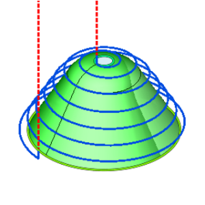

<strong>Spiral Between Two Surfaces</strong>. The tool paths take the form of a spiral, starting on the <strong>First Surface</strong>, ending on the <strong>Second Surface</strong>, and wrapping around the contour of the <strong>Machining Surfaces</strong>.

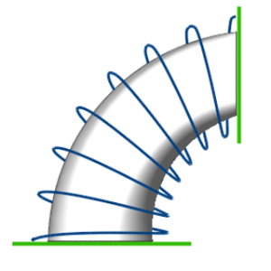

Other strategies are the same as in the <strong>5D Surfacing operation</strong>. [Details.](10135.md)

<strong>Step</strong>. The thickness of material cladded in one pass.

<strong>Adaptive Step.</strong> This parameter adjusts the distances between tool passes according to the curvature radius of the surface to maintain uniform scallop height after surface machining. [Details](113.md).

<strong>Offset Job Surfaces</strong>. When the flag is active, the system generates the toolpath with considering the tool radius.

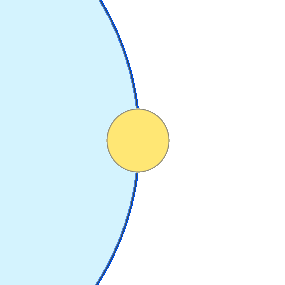 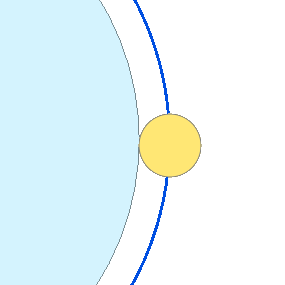

<strong>Calculate Based on Tool Center.</strong> Flagging switches the mode that involves first offsetting the surfaces for machining by the tool profile for 3-axis machining or along the surface normal by the tool radius for 5-axis machining, and then calculating toolpath curves on these offset surfaces. In another mode, the system initially generates tool path as curves on the machined surfaces. Then, it positions and orient the tool relative to the calculated curves to keep the tool's contact point with the machined surface constant.

<strong><strong>Comparison of the toolpath based on the center and the tool contact point:</strong></strong>

<strong>Calculation based on tool contact point:</strong>

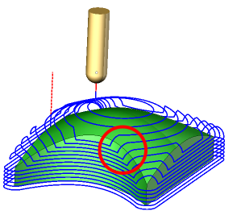

In this mode the work passes are generated by calculating curves on the machining surfaces as the first step and then positioning and orienting the tool relative to the calculated curves in such a way that the point of contact of the tool with a machining surface stays the same. It is desirable, for example, when smooth surfaces are machining, or doing flank milling.

<strong>Calculation based on tool center:</strong>

In this mode the work passes are generated in such a way that at first the machining surfaces are being offset either by the tool shape itself for 3 axis machining or by the tool radius along the surface normal for 5 axis machining and only then the sections of the offset surfaces are calculated. For example, for the Parallel to plane strategies it means that the generated work passes all lie on parallel planes. Another advantage of this mode is that not only the surfaces themselves but the edges between machining surfaces are taken into account.

<strong>Cladding Side</strong>. This parameter controls the positioning of toolpath lines relative to the geometry of the Job Assignment. It operates when the <strong>Offset job surfaces</strong> parameter is active.

<strong>Inside</strong>. The toolpath is built inside the Job Assignment.

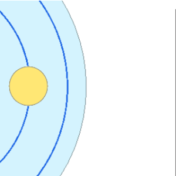

<strong>Outside</strong>. The toolpath is built outside of the Job Assignment.

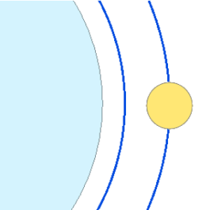

Gap to Prevent Overlapping. When processing a closed contour, leave a gap at the junction of the start and end of the contour to prevent layer overlap. The gap should be approximately equal to the diameter of the melting spot. It allows to avoid the passage of the tool in the same place several times, as a result of which the height of layer can exceed the specified size. For this, the toolpath is shortened at the end of each curve by the specified value.

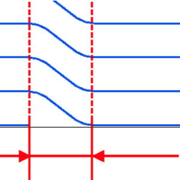

Other properties of the <strong>Strategy</strong> are the same. as the <strong>Strategy</strong> parameters in the <strong>5D Surfacing operation</strong>. [Details.](10135.md)

#### Tool Orientation:

Controls tool axis orientation.

Click here to expand..

<strong>Perpendicular to Pass Plane.</strong> The tool axis is perpendicular to the middle plane of the pass.

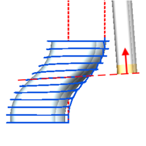

<strong>Along curve</strong>. The tool axis is set along the tangent to the <strong>Tilt Curve</strong> in point where it intersects the middle plane of the pass.

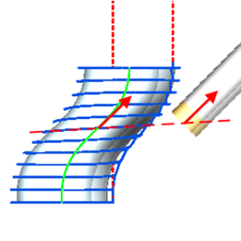

Other <strong>Tool Orientation</strong> strategies and their parameters are the same as the <strong>Tool Orientation</strong> strategies in the <strong>5D Surfacing operation</strong>. [Details.](10135.md)

#### Additional passes.

Allows to set specific machining conditions for initial and last layers: the height of cladding and the feed of the layer (on the <strong>Speeds</strong> page)

Click here to expand..

<strong>First Step</strong>. The first layer will be executed with the specified step. It may be necessary, for example, to provide better adhesion to the substrate.

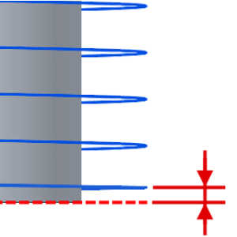

<strong>Start planar pass.</strong> Before the ascending spiral, a complete pass will be made along the curve in the initial plane.

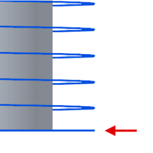

<strong>Final planar pass</strong>. The final segment of the spiral trajectory executes as a planar curve on the final plane.

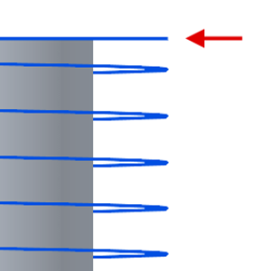

#### Edge Side

Enable the <strong>Calculate Based on Tool Center</strong> parameter to activate the option. This option selects one of the two sides adjacent to the selected curve in the Job Assignment. The system offsets the machined surfaces along the normal to the chosen side during the tool center path calculation.

Click here to expand..

<strong>Alternative Side for First Curve</strong>. Use the tool center calculation by offsetting the machined surfaces normal to the alternate side of the <strong>First Curve</strong>.

<strong>Alternative Side for Second Curve</strong>. Use the tool center calculation by offsetting the machined surfaces normal to the alternate side of the <strong>First Curve</strong>.

#### Direction Along Curve.

Specifies the tool movement direction along work passes.

Click here to expand..

<strong>Forward</strong>. Cladding only in forward direction is enabled.

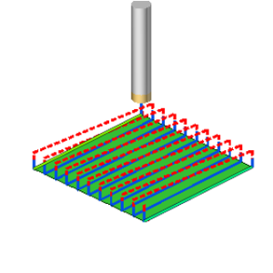

<strong>Backward</strong>. Cladding only in backward direction is enabled.

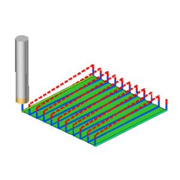

<strong>Both.</strong> Cladding in both directions is allowed.

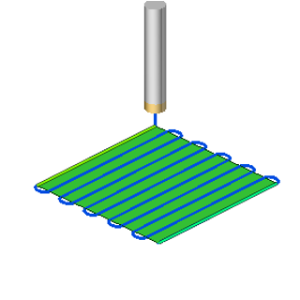

#### Sorting:

Controls the sequence of toolpath passes during surface machining. This parameter group works similarly to the <strong>5D Surfacing operation</strong>. [Details](10135.md).

#### Limit Rotation Angles:

When the flag is set, it specifies the limit values of the tool's angular position relative to the specified axis. This parameter group works similarly to the <strong>5D Surfacing operation</strong>. [Details](10135.md).

#### Job zone.

Enables additional modification of the working area initially selected on the <strong>Job assignment</strong> tab. This parameter group works similarly to the <strong>5D Surfacing operation</strong>. [Details](10135.md).

#### Corners smoothing.

When there is a sudden change of the tool direction, the milling control performs deceleration before starting the turn, and then accelerates again. This fact can lead to vibrations and high tool and milling machine wear. The problem can be solved if the toolpath has very few or no breaks. For this reason, in the system there is the toolpath smoothing function using the defined radius for machining inner or outer corners of the model. This parameter group works similarly to the <strong>5D Surfacing operation</strong>. [Details](10135.md).

#### Solid Model.

This option automatically sorts the model with internal and external walls. The model must be solid!

Click here to expand..

Set the flag to execute the passes for the inner and outer wall formation of the model in a strict order.

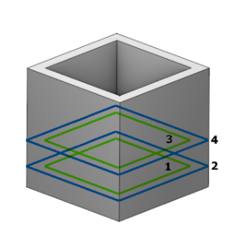

#### Roughing Passes.

Toolpath is offset in plane by the <strong>Roughing passes</strong> thickness amount. Additional passes are added to the contour by the value specified in the parameters with the specified number of steps.

Click here to expand..

<strong>Constant Step in XY Plane</strong>. Shape the trajectory to maintain equal step projections on the XY plane for both the X and Y axes. Use this option when forming tool passes angled to the XY plane.

<strong>Passes order.</strong> The choice of the order of cladding - from the outside in or inside out.

<strong>Inside to Outside</strong>. Conduct cladding passes starting from the inside and moving outward.

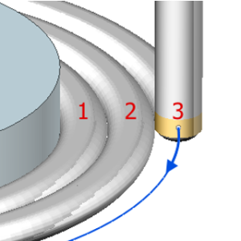

<strong>Outside to Inside</strong>. Conduct cladding passes starting from the outside and moving inwards.

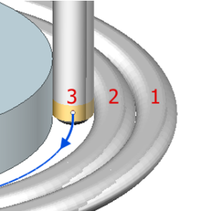

Zigzag. When this option is active, each subsequent layer reverses the direction of the roughing passes relative to the previous layer. It can help to get the toolpath without breaks, i.e. without having to switch off the feed of the material and transition on the rapid feed.

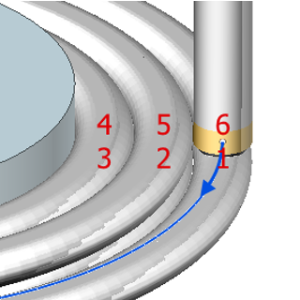

Other properties of the <strong>Roughing Passes</strong> are the same. as the <strong>Roughing Passes</strong> parameters in the <strong>5D Surfacing operation</strong>. [Details.](10135.md)

#### Project Toolpath onto the Part:

By setting the flag, the system generates tool paths for processing the surfaces identified as <strong>Surfaces for Projection</strong> in the <strong>Job Assignment</strong> by mapping the path derived from the <strong>Machining Surface</strong> onto the <strong>Surfaces for Projection.</strong> This parameter group works similarly to the <strong><strong>5D Surfacing operation</strong>.</strong> [Details](10135.md).

#### Trimming:

Allows for the skipping of surfaces not intended for machining and allows for the extension of the toolpath. This parameter group works similarly to the <strong><strong>5D Surfacing operation</strong>.</strong> [Details](10135.md).

### Parameters:

This tab contains the main parameters for controlling the part, workpiece, fixture and other items, which allow you to change the trajectory. [Details](100112.md)

### Links/Leads:

In the Links/Leads tab, you define the parameters for rapid movements. These movements include tool approach from the tool change position, engage to the start of the working stroke, retraction after the final cutting motion, transitions between working passes, and return to the tool change point. You can configure the sequence of movements along the coordinates, the trajectory of these motions, and the magnitude of displacements.

Click here to expand..

<strong>Сonsists of:</strong>

<strong>Approach/Return.</strong> This group of parameters manages the tool movements from the tool change position to the start of the engage toolpathes, and back. [Details](100116.md).

<strong>Links.</strong> Defines the rules governing Entry/Exit links and links between work moves. [Details](100130.md).

<strong>Leads.</strong> Allows you to add additional engage and retract to the working moves using their feed. [Details](100136.md).

<strong>Safe motions.</strong> Defines the type of <strong>Safety Surface</strong> and the distance from the workpiece to it. This surface facilitates transitions between the processed surfaces or tool paths, and the first stage of approach or return occurs toward it. [Details](100117.md).

<strong>Advanced links settings.</strong> This group of parameters specifies the features of trajectory formation for primarily five-axis operations, considering optimal movements of rotational axes. [Details](100118.md).

<strong>Distances.</strong> Distances used in Links rules [Details](100140.md).

### Transformations:

Parameter's kit of operation, which allow to execute converting of coordinates for calculated within operation the trajectory of the tool. [Details](10168.md).

### Part:

A Part is a group of geometrical elements that defines the space to check for gouges. [Details](330.md)

### Workpiece:

A workpiece model of an operation defines the material to be machined. [Details](738.md)

### Fixtures:

As the Fixtures the fixing aids such as chucks, grips, clamps, etc., and the restriction areas of any other nature are usually specified. [Details](10283.md)
