# 5Dクラッディング

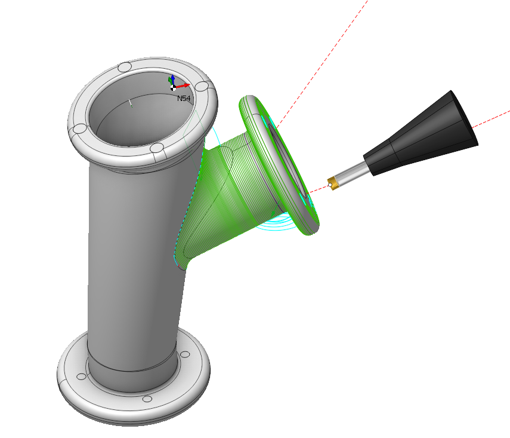

## 適用分野：

5Dクラッディングオペレーションは、 <strong>[5Dサーフェシング](10135.md)</strong>オペレーション方法を使用して、パーツの表面に材料を付加することができます。これは、5Dクラッディングオペレーションが5Dサーフェシングオペレーションをベースとしているからです。基本的には5Dサーフェシングオペレーションを基盤としていますが、ツールパスの生成や工具姿勢の設定には、いくつかの新しい方法が採用されています。3Dモデルをベースとして、複雑な立体形状を生成します。

## ジョブ割り当て：

<strong>加工面</strong> 加工対象としてパーツの各サーフェスを選択します。システムは、選択されたサーフェスに基づいて軌跡を計算します。

<strong>1番目のカーブ カーブに平行</strong> 方法では、平行パスを計算するための基準となるカーブを指定します。また、<strong>2つのカーブ間のモーフ</strong>および<strong>2つのカーブ間のらせん</strong>方法では、<strong>1番目のカーブ</strong> を指定します<strong>。</strong> 曲線またはエッジは、1つまたは複数選択できます。 これらは必ずしも接続されている必要はありません。

<strong>2番目のカーブ</strong> <strong>2つのカーブ間のモーフ</strong>および<strong>2つのカーブ間のらせん</strong>方法で使用され、基準となる <strong>2番目のカーブ</strong>を指定します。カーブまたはエッジは、1つまたは複数選択できます。これらは必ずしも接続されている必要はありません。

<strong>チルトカーブ</strong> <strong>工具の向き</strong>を<strong>カーブへ</strong>を指定した場合に、工具軸ベクトルを向ける対象となるカーブです。

<strong>1番目のサーフェス</strong> この機能は、<strong>2つのサーフェス間のモーフ</strong>および<strong>2つのサーフェス間のらせん</strong>方法における<strong>1番目のサーフェス</strong>として機能し、ツールパスラインを生成するためのモーフィング処理を補助します。

<strong>2番目のサーフェス</strong> この機能は、<strong>2つのサーフェス間のモーフ</strong>および<strong>2つのサーフェス間のらせん</strong>方法における<strong>2番目のサーフェス</strong>として機能し、ツールパスラインを生成するためのモーフィング処理を補助します。

<strong>投影用サーフェス</strong> <strong>加工設定</strong>タブで <strong>ツールパスをパーツに投影</strong>オプションを有効にした場合に、ツールパスが投影される加工対象サーフェスです。

<strong>ジョブゾーン</strong> 指定した2Dの制限領域の外側にあるパスをトリミングします。制限領域の平面は、初期の工具姿勢によって定義されます。[詳細を見る](10151.md)

<strong>制限領域 ジョブゾーン</strong>に加えて、カーブやエッジから構成される<strong>制限領域</strong>の要素を使用し、現在のオペレーションで避けるワークの領域を指定できます。[詳細を見る](10152.md)

<strong>プロパティ</strong> 要素のプロパティを表示します。ストックを追加することも可能です。リスト内の項目をダブルクリックして、このメニューを開くこともできます。

<strong>削除</strong> リストから項目を削除します。

## 加工設定：

### 加工設定：

このパラメータでは、目的のツールパスを生成するための設定を行います。

拡大

<strong>方法：</strong>

拡大

<strong>2つのカーブ間のらせん</strong> まず、<strong>5Dサーフェーシング</strong>オペレーションの <strong>モーフ</strong>方法と同様に、予備的なパスが生成されます。[詳細を見る](10135.md) 次に、各パスは、終点に近づくにつれて、次のパスへ向かって徐々に上昇することで、らせん状に変換されます。

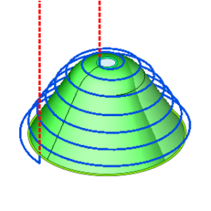

<strong>2つのサーフェス間のらせん</strong> ツールパスはらせん形状に生成され、<strong>1番目のサーフェス</strong>から始まり、 <strong>2番目のサーフェス</strong>で終わり、 <strong>加工サーフェス</strong>の輪郭に沿って巻き付くように進みます。

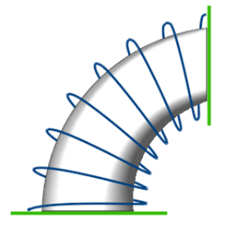

他の方法は、<strong>5Dサーフェシングオペレーション</strong>と同様です。[詳細を見る](10135.md)

<strong>ステップ</strong> 1回のパスでクラッディングする材料の厚さです。

<strong>アダプティブステップ</strong> サーフェス加工後のスキャロップ高さを均一に保つため、サーフェスの曲率半径に応じてツールパス間の距離を調整します。[詳細を見る](113.md)

<strong>加工面をオフセット</strong> このフラグを有効にすると、システムは工具半径を考慮したツールパスを生成します。

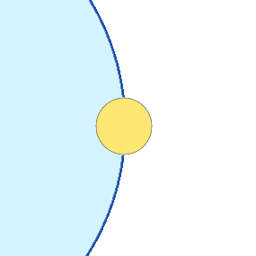 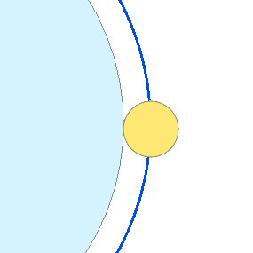

<strong>工具中心を基準に計算</strong> このフラグを有効にすると、3軸加工ではツールプロファイルに沿ってサーフェスをオフセットし、5軸加工では工具半径分だけサーフェスの法線方向にオフセットし、これらのオフセットされたサーフェス上でツールパス曲線を計算するモードに切り替わります。もう一方のモードでは、最初に加工サーフェス上のカーブとしてツールパスを生成します。次に、加工サーフェスと工具の接触点が一定に保たれるように、計算されたカーブに対して工具を位置と向きを決定します。

<strong>中心と工具接触点に基づくツールパスの比較：</strong>

<strong>工具接触点に基づいて計算</strong>

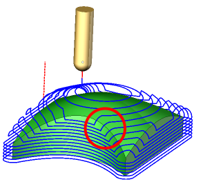

このモードでは、まず加工対象のサーフェス上で曲線を計算し、次に工具と加工対象のサーフェスとの接触点が変わらないように、計算されたカーブに対して工具を位置と姿勢を決定することで、加工パスを生成します。例えば滑らかなサーフェスの加工や、フランクミーリングを行う場合に適しています。

<strong>工具中心を基準に計算</strong>

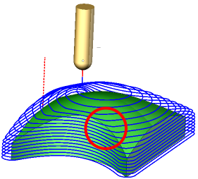

このモードでは、最初に加工面をオフセット（3軸加工の場合は工具形状自体に基づいてオフセット、5軸加工の場合は法線方向に沿った工具半径によるオフセット）し、その後にオフセットされたサーフェスの断面を計算する形で加工パスが生成されます。

例えば、平面平行方法では、生成される加工パスはすべて平行な平面上に配置されます。このモードのもう1つの利点は、加工対象のサーフェスだけでなく、加工サーフェス間のエッジも考慮されることです。

<strong>クラッディング側</strong> このパラメータは、ジョブ割り当てで指定した形状に対するツールパスラインの位置を制御します。 <strong>加工面をオフセット</strong>パラメータが有効な場合に機能します。

<strong>内側</strong> ジョブ割り当てで指定した形状の内側にツールパスを生成します。

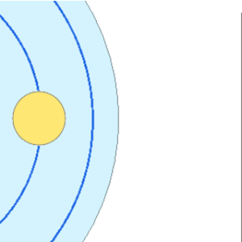

<strong>外側</strong> ジョブ割り当てで指定した形状の外側にツールパスを生成します。

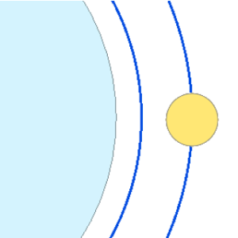

オーバーラップ防止のギャップ 閉じた輪郭を加工する際に、レイヤーの重なりを防ぐため、輪郭の開始点と終了点の接続部に隙間を設けます。この隙間（ギャップ）は、 溶融スポットの直径とほぼ等しく設定する必要があります。これにより、工具が同じ箇所を何度も通過して、レイヤーの高さが指定値を超えてしまうのを防ぐことができます。このため、各曲線の終端は、指定した値の分だけツールパスが短縮されます。

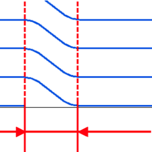

その他の<strong>加工設定</strong>のプロパティは、<strong>5Dサーフェシング</strong>オペレーションの<strong>加工設定</strong>パラメータと同様です。[詳細を見る](10135.md)

### 工具の向き：

工具軸の姿勢を制御します。

拡大

<strong>パス平面に垂直</strong> 工具軸は、加工パスの中央平面に対して垂直になります。

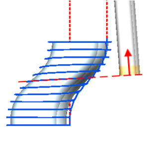

<strong>カーブに沿って</strong> 工具軸は、加工パスの中央平面が交差する点において、<strong>チルトカーブ</strong>の接線に沿って設定されます。

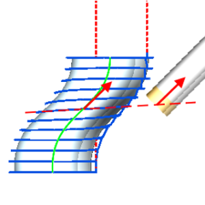

その他の<strong>工具の向き</strong>方法およびそのパラメータは、 <strong>5Dサーフェシング</strong>の<strong>工具の向き</strong>と同様です。[詳細を見る](10135.md)

### 追加パス

最初のレイヤーおよび最後のレイヤーに対して、クラッディングの高さやそのレイヤーの送り速度(<strong>送り速度設定</strong>ページで設定) などを設定できます。

拡大

<strong>最初のステップ</strong> 最初のレイヤーを指定したステップで形成します。例えば、基材への付着性を向上させるために必要となる場合があります。

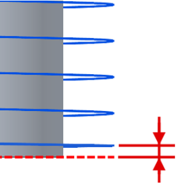

<strong>開始平面パス</strong> らせん状に上昇する前に、初期平面上でカーブに沿った完全な1周のパスを実行します。

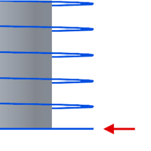

<strong>最終平面パス</strong> らせん状の軌道の最終区間を、最終平面上の平面カーブとして実行します。

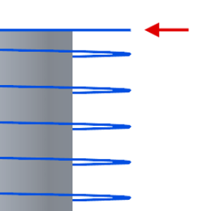

### エッジ側面

オプションを有効にするには、 <strong>工具中心を基準に計算</strong>パラメータを有効にします。このオプションは、ジョブ割り当てで選択したカーブに隣接する2つの側のうちのいずれか一方を選択します。システムは、工具中心経路の計算を行う際、選択した側の法線方向に沿って加工対象のサーフェスをオフセットします。

拡大

<strong>1番目のカーブの反対側 1番目のカーブ</strong>の反対側の法線方向に加工サーフェスをオフセットして、工具中心の計算を行います。

<strong>2番目のカーブの反対側 2番目のカーブ</strong>の反対側の法線方向に加工サーフェスをオフセットして、工具中心の計算を行います。

### カーブに沿った方向

加工パスに沿った工具の移動方向を指定します。

拡大

<strong>前方</strong> 順方向のクラッディングのみ有効にします。

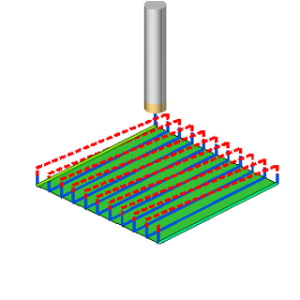

<strong>後方</strong> 逆方へのクラッディングのみ有効にします。

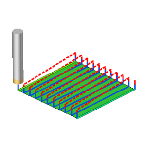

<strong>両方</strong> 両方向でのクラッディングを許可します。

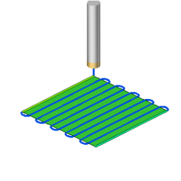

### 並べ替え

サーフェス加工中のツールパスの順序を制御します。 このパラメータグループは <strong>5Dサーフェシング加工</strong>と同様に動作します。[詳細を見る](10135.md)

### 回転角度制限：

このフラグを有効にすると、指定した軸に対する工具の角度位置の制限値を設定できます。 このパラメータグループは、 <strong>5Dサーフェシング加工</strong> と同様に動作します。 [詳細を見る](10135.md)

### ジョブゾーン

<strong>ジョブ割り当て</strong>タブで最初に選択した加工領域に対して、追加の変更を行うことが出来ます 。 このパラメータグループは、 <strong>5Dサーフェシング加工</strong> と同様に動作します。 [詳細を見る](10135.md)

### コーナーの円滑化

工具の方向が急激に変化する場合、フライス制御は回転開始前に減速し、その後再び加速します。この現象は、振動や工具およびフライス盤の摩耗を大きくする可能性があります。ツールパスの途切れを極力減らすことで、この問題は解決できます。そのため、本システムには、モデルの内側または外側のコーナーを加工する際に、設定された半径を使用してツールパスを滑らかにする機能が搭載されています。このパラメータグループは、 <strong>5Dサーフェシング加工</strong> と同様に動作します。 [詳細を見る](10135.md)

### ソリッドモデル

このオプションは、モデルを内壁と外壁に自動的に分類します。モデルはソリッドである必要があります。

拡大

このフラグを有効にすると、モデルの内壁および外壁を形成する加工パスが、決められた順序で実行されます。

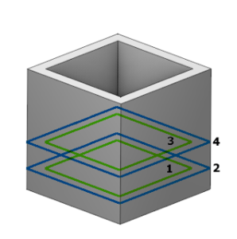

### 荒加工パス

ツールパスは、<strong>荒加工パス</strong> で指定した厚さの分だけ平面内でオフセットされます。パラメータで指定した値とステップ数に基づき、輪郭に対して追加のパスが生成されます。

拡大

<strong>XY 平面の一定のステップ</strong> XY平面への投影において、X軸とY軸の両方でステップ間隔が均等になるように軌跡を形成します。XY平面に対して傾斜したツールパスを生成する場合に、このオプションを使用します。

<strong>加工順序</strong> クラッディングの順序を、外側から内側へ、または内側から外側へのいずれかに設定します。

<strong>内側から外側</strong> 内側から開始し、外側へ向かってクラッディングのパスを実行します。

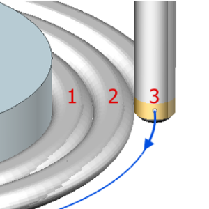

<strong>外側から内側</strong> 外側から開始し、内側へ向かってクラッディングのパスを実行します。

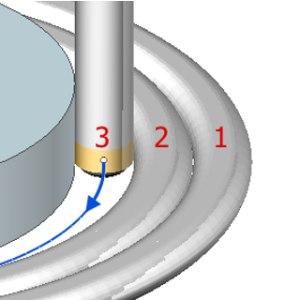

ジグザグ このオプションが有効な場合、各レイヤーの荒加工パスの進行方向が、前の層に対して反転します。これにより、材料の供給を停止したり早送り（ラピッド）で移動したりすることなく、途切れのないツールパスを生成することが可能になります。

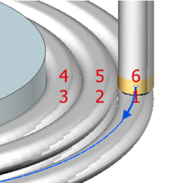

その他の<strong>荒加工パス</strong>のプロパティは、 <strong>5Dサーフェシング</strong>オペレーションの<strong>荒加工パスパラメータ</strong>と同様です。[詳細を見る](10135.md)

### ツールパスをパーツに投影

このフラグを設定すると、システムは<strong>加工面</strong>から導出されたパスを <strong>投影サーフェス</strong>にマッピングすることで、 <strong>ジョブ割り当て</strong> で <strong>投影サーフェス</strong> として指定されたサーフェスの加工用ツールパスを生成します。 このパラメータグループは、 <strong>5Dサーフェシング加工</strong> と同様に動作します。 [詳細を見る](10135.md)

### トリミング

加工対象外のサーフェスをスキップしたり、ツールパスを延長したりすることができます。このパラメータグループは、<strong>5Dサーフェシング加工</strong>と同様に動作します。[詳細を見る](10135.md)

## 変換：

オペレーション内で計算された工具の軌跡に対して座標変換を行うためのパラメータグループです。 [詳細を見る](10168.md)

## パーツ：

パーツは、干渉をチェックする空間を定義する幾何要素のグループです。[詳細を見る](330.md)

## ワーク：

加工のワークモデルは、加工する素材を設定します。[詳細を見る](738.md)

## 治具：

治具には通常、チャック、グリップ、クランプなどの固定補助具と、その他の種類の制限領域を指定します。[詳細を見る](10283.md)
