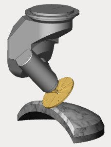
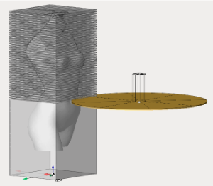

# Disc tool machining

This group of operations is designed for sawing and machining materials such as wood, stone and similar with a [disk tool](10278.md).

The <strong></strong><strong>Disc cutting 2D<strong></strong></strong> operation is primarily intended for sawing sheet materials, machining flat furniture facades, plates.

The <strong>Disc cutting 6D</strong> operation is designed for sawing both flat and volumetric parts. As a job assignment in this operation, both plane and spatial curves and edges of faces can be indicated.

The <strong></strong><strong>Disc Roughing</strong> operation is designed to prepare a stone body by applying cuts with a disk tool in the area where material needs to be removed and then manually remove the thinned layers of material by spalling, followed usually by finishing operation with the appropriate tool.

The disk tool operation group, like some other operation groups, is available under special license.

In order to use these operations the possibility of working with this group of operations must be specified in the machine schema. Thus, if the disc tool operation group is missing in the list of available operations, then the reason is either an incorrect licence, or the incorrect machine schema which cannot work with this group of operations.
