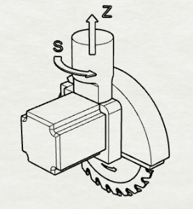
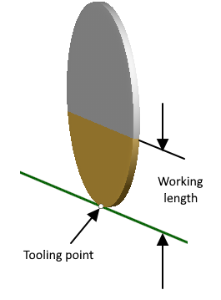
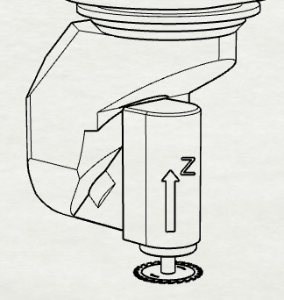
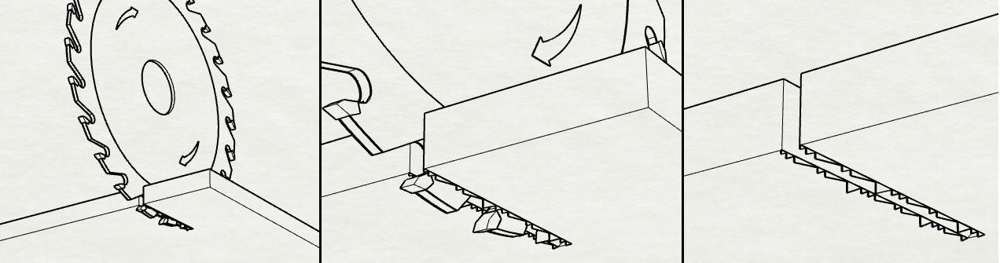
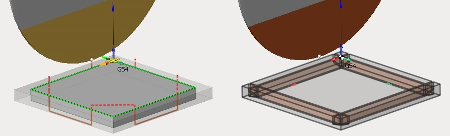
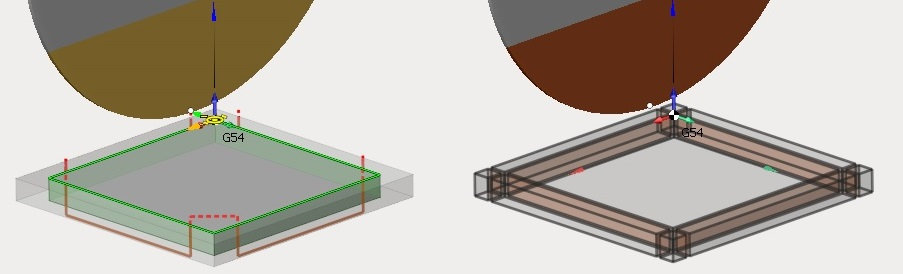
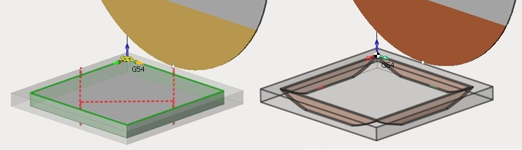
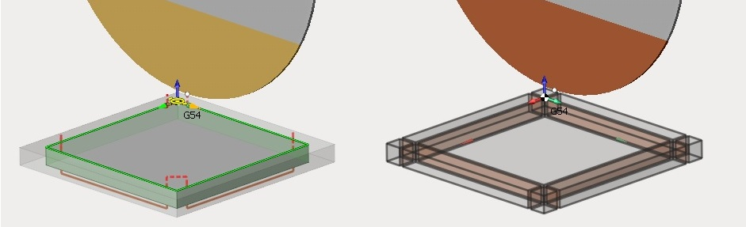

# Disc tool

Two tool types are available for disc tool operations depending on the type of mounting.

<strong>Saw Blade</strong>.

This type assumes having an axis S (for tool rotation around Z axis). The direction of Z axis is along the tool rotation plane.

The tooling point of a saw blade is located on the edge of the saw unlike a milling tool, where this point is located on the tool end on its rotation axis. Saw blade type tools have also 'Working length' parameter which defines the height of saw's working area. The rest of the tool is assumed to be covered by the hood. This parameter directly affects the toolpath which is generated so the non-working area of the tool is not used for the workpiece material removal.

<strong>Milling Tool</strong>.

Tools of this type are usual cutters with big diameter and low height. They are put in a spindle, axis S is not needed because its functionality is provided by other rotary axes of the machine. Tool's Z axis is directed along the rotation plane normal.

There is an important aspect the dist tool sawing operation. If it is sawing of a wooden panel or a marble slab in one pass (through-and-through), then on the edge of the panel in the area where saw blade teeth get out from the material (in the image below it's bottom edge) spalls and burrs can be formed (only spalls in case of marble).

To avoid this situation (lets consider two pass variant) first saw pass is done without getting out of material on the panel's bottom level (as such ensuring that top edge contains no defects because panel's top level will be the zone where saw's teeth enter the material), while the second pass is done with exit on bottom level but moving the tool in opposite direction (or same direction rotating the S axis for Saw Blade type tool). This allows for defectless bottom edge because, using this strategy, panel's bottom level in the second pass will be the zone of entering material for saw's teeth, while the top edge was formed in the first pass.

Next aspect to pay attention to is the concept of inner and outer corner overlap.

Outer corner overlap allows to increase the length of the contour along the faces for the specified amount. It can be necessary for removing workpiece chips along the faces of contour.

Lets consider an example. Suppose its needed to saw rectangular panel from the workpiece with stock.

If the "Outer corner overlap" is not used, then material chips will be removed from part only after all faces are traversed by the tool, because the trajectory is formed according to the specified contour, not accounting for the workpiece stock.

If overlap is used then material chips can be cut after a face is finished.

Another objective is during inner contour machining. Without changing overlap parameters toolpath trajectory will be limited by the saw profile touching the contour corner on workpiece top level.

Using overlap full contour of the part can be achieved on both top and bottom workpiece levels.

