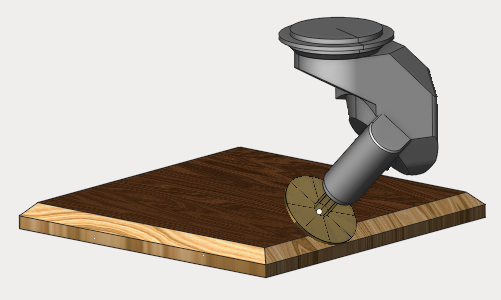
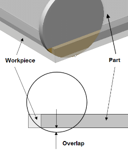
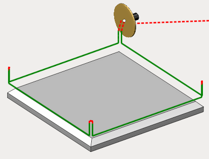
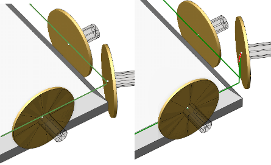
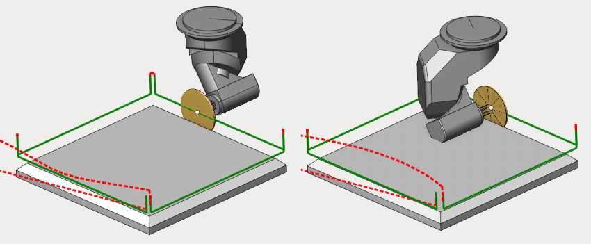
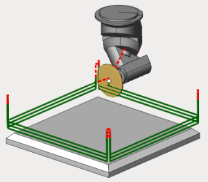
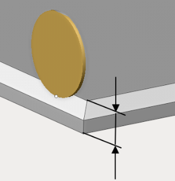
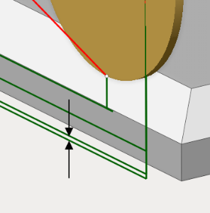
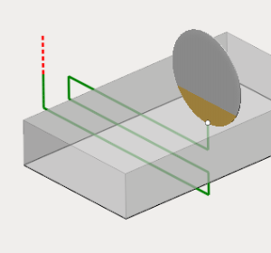
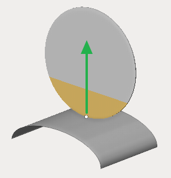

# Disc cutting 2D

The operation is designed for the sawing of sheet materials. The most parameters of the <strong>disc cutting 2D</strong> are the same that <strong>2D contouring</strong> operation has. The job assignment can be defined by the planar curves (profiles) or edges of the 3D model.

The job assignment is defined exactly the same way as it can be done in 2D contouring. Select the curve or the edge in the graphical view and press the <strong>Curve</strong> button. Firstly in the job assignment 3D model contours or edges are specified, along which the disc trajectory will be generated. To do so select a contour or an edge and then press the "Curve" button. Features for machining can be added the same way by selecting a surface on the 3D model and pressing the "Pocket" button, after that the selected surface borders will be added automatically as a job assignment. To limit top and bottom level select any geometrical item lying on required level and press the "Top level" or "Bottom level" button.

With the "Job assignment" tab open and given curves, you can also interactively select the direction of movement of the tool and its location relative to the curves (left/right) by left-clicking in the graphics window on the arrows on the curves.

Besides that the following parameters are available in the inspector

- <strong>Overlap</strong>. The parameter defines exceeding of the workpiece bottom level by the saw blade.

- <strong>Overlaps in corners</strong>. The parameter allows to specify the height on which the tool overturn will be done when changing side of the machined corner.

- <strong>Sharp corners</strong>. The parameter defines the angle limit for considering the corner sharp and during machining of which tool return is needed. On the image below is the passing the right angle (in the first case the sharp corner value is less than 90 degress, in the second one - greater).

- <strong>Sawing mode</strong>. It defines the sawing type - climb, conventional, back or front. <strong>Climb/conventional</strong> - ensures the respective cutting mode. When changing the contour direction, the saw will overturn and start to machine the part with the opposite side. <strong>Back/front side</strong> - the saw always machines the part using the specified side, regardless of the direction of the contour.

- <strong>Overlaps</strong>. Parameters specifying overlap value for outer and inner corners respectively.

- <strong>Layers (depth)</strong>. Defines the number of tool passes. Can be specified as a number of passes or automatically calculated from top and bottom machining level. Can also be specified in mm or as a tool diameter percent.

- <strong>Top and bottom part level</strong> - define the height of the part to machine.

- <strong>Z cleanup</strong>. The parameter defines the stock value before last pass.

- <strong>Sorting</strong>. When machining by layers after performing the first pass along the first contour, a transition is made to the first pass along the next contour. The transition to the second pass is made after all contours have been processed. When machining by cavities, at first all passes along the first contour are performed, then all passes along the second contour, and so on.
- <strong>Idle moves minimization.</strong> When it's enabled, the movement along the given features is performed in such a way that the total length of idle moves is minimal. Otherwise, the transitions forming on idle moves is carried out according to the order defined in the "Job assignment" tab.
- <strong>Zigzag</strong>. The tool drops down layer by layer and performs horizontal movements with alternating directions.

- <strong>Tool axis orientation</strong>. The parameter is used to determine the orientation of the tool axis on any part of the path. The direction of the axis can be fixed, normal to 4D and 5D surfaces, as well as normal to the base surface. It should be noted that, unlike standard milling cutter, the axis of the <strong>Saw blade</strong> type tool does not coincide with its rotation axis.

